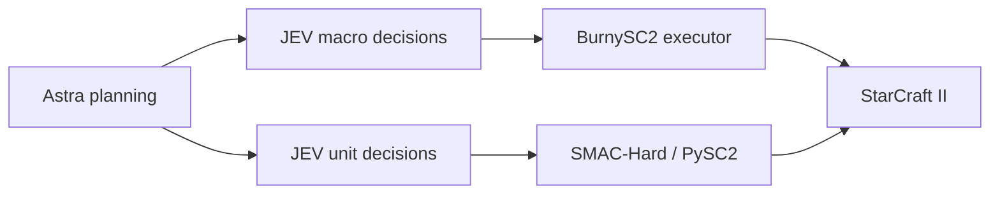

# JEV-Star

[English](#english) | [简体中文](#简体中文)

**StarCraft II macro (Protoss or Terran) and micromanagement with JEV action selection and optional GPT-6 Astra planning.**

**由 JEV 选择动作、可选 GPT-6 Astra 规划的星际争霸 II 宏观控制（Protoss 或 Terran）与微操。**

[Read the paper / 在线阅读论文](paper/PAPER.md) · [PDF](paper/JEV-Star.pdf) · [Video gallery / 视频展示](media/README.md) · [Citation / 引用](#citation)

## Videos / 视频

Play the full winning games directly below. **22.4 fps, original speed, complete matches.**

点击下方播放器即可观看完整胜局，**22.4 fps、原速播放**。

### M01 · Macro VeryHard / Elite victory / 宏观最高非作弊难度胜局

macro-v2.1 / Astra + JEV · 12:47.90

https://github.com/user-attachments/assets/5cab5e0a-e8c4-43b8-a504-96f916f73e2a

### M02 · Macro Easy victory / 宏观 Easy 胜局

earlier Astra + JEV macro · 15:04.20

https://github.com/user-attachments/assets/2beaa558-67d5-4b7f-8a8d-c29f4359ab36

### U01 · Micro mmmt victory / 微观 mmmt 胜局

C / P0 Astra + JEV / schema 7 · 00:21.43

https://github.com/user-attachments/assets/48b26ba0-63be-45c4-82a5-f4bb6814f73e

## English

JEV-Star brings full-game macro control and SMAC-Hard micromanagement into one repository. Each module has its own environment, action space, and experiment records:

| Module | Game interface | Model responsibilities | Current implementation |
| --- | --- | --- | --- |
| [Macro](macro/README.md#english) | LLM Play SC2 / BurnySC2 | Astra plans strategic phases; JEV selects economy, technology, production, and army actions | `macro-v2.3.0`; Protoss (73 actions) or Terran (71 actions) against the built-in AI of any race; real-time games |
| [Micro](micro/README.md#english) | PySC2 bundled with SMAC-Hard | Astra creates one plan per map; JEV selects actions for living units | `p0-v1`; 35 maps; fixed stepping with `realtime=False` |



### Videos and replays

The players at the top of this README show three complete winning games. [Media details and 22 original winning replays](media/README.md#english). Selected victories are shown separately from the complete evaluation results below.

### Quick start

The validated setup is **Windows, Python 3.10, and SC2 5.0.16.97563 installed for the Asia region (`kr`)**. Install the SC2 client separately; matches are created through the local SC2 API. The two modules use separate virtual environments to keep their SC2 SDK dependencies isolated.

Jev requests go to OpenRouter's TypeSafe-compatible endpoint, `https://openrouter.ai/api/v1/systemone`, model `typesafe/jev-1.13`. Set `OPENROUTER_API_KEY`, or an `openrouter:` line in `config.md`. Override the URL with `JEV_API_ENDPOINT` if needed.

```powershell
git clone https://github.com/sc2musa/Jev_Star.git
cd Jev_Star
py -3.10 scripts/setup_environment.py macro
py -3.10 scripts/setup_environment.py micro --video

$env:SC2PATH = 'C:\game\StarCraft II'
$env:OPENROUTER_API_KEY = '<your OpenRouter key>'
py -3.10 scripts/install_maps.py all
```

Alternatively, copy [config.example.md](config.example.md) to a local `config.md`. Git ignores the real key file. Astra planning uses an authenticated native Codex CLI installation; use `--codex-path` to specify its executable explicitly.

Before running macro games, launch the installed SC2 client once to generate `stableid.json`, then synchronize the BurnySC2 enums. Use the version of your installed client:

```powershell
& .\.venvs\macro\Scripts\python.exe -B scripts/sync_sc2_ids.py --game-version 5.0.16.97563
```

Run one macro game (Protoss by default; add `--race Terran` to play Terran):

```powershell
py -3.10 jev_star.py macro --planner codex --planner-effort medium --map 'Altitude LE' --opponent-race Zerg --difficulty Easy --game-time-limit 1200
py -3.10 jev_star.py macro --race Terran --planner codex --planner-effort medium --map 'Altitude LE' --opponent-race Zerg --difficulty Easy --game-time-limit 1200
```

#### Control panel

`scripts/live_view.py` serves a local page at <http://127.0.0.1:8765/> for starting and watching macro games without the command line. Choose race, opponent, difficulty, map, Astra effort, and time limit, then press **Start game**; **Stop game** interrupts the match and still writes its logs. The page shows Astra's current plan, Jev's recent choices, economy, the match result, and a notice when StarCraft II stops updating. On Linux, `scripts/jev-star-panel` starts the panel in the background (if needed) and opens it in the browser. The panel only accepts start/stop requests from its own page.

#### Linux (Wine/Proton)

Macro games also run on Linux with the Windows SC2 client under Wine or Proton. Point BurnySC2 at the Wine prefix and a launcher that runs `SC2_x64.exe` directly (BurnySC2's default `wine start` returns immediately, so the bot loses the process):

```bash
export SC2PF=WineLinux
export WINE=/path/to/wine-sc2   # script that execs Proton/Wine's wine binary on SC2_x64.exe
export SC2PATH="$HOME/Games/battlenet/drive_c/Program Files (x86)/StarCraft II"
python3 jev_star.py macro --race Terran --planner codex --planner-effort medium --map 'Altitude LE' --opponent-race Zerg --difficulty Easy
```

The control panel fills in these variables when it finds `.tools/wine-sc2` and the Battle.net prefix above. Run StarCraft II fullscreen: a large tiled window under Xwayland can flicker and stall the game on integrated graphics.

Run three micro episodes on `3m`:

```powershell
py -3.10 jev_star.py micro --map 3m --episodes 3 --planner codex --planner-effort medium --planner-timeout 180 --request-timeout 15 --max-requests 10000
```

Use `py -3.10 jev_star.py macro --help` or `micro --help` for all options. Relative paths in forwarded arguments are resolved inside `macro/` or `micro/`.

### Experiment status

Each micro version was evaluated on 35 maps with three episodes per map. JEV alone achieved **3 wins, 2 draws, and 100 losses**; the earlier Astra + JEV version achieved **6 wins, 1 draw, and 98 losses**; P0 Astra + JEV achieved **7 wins and 98 losses**. Excluding the two development maps, the three versions achieved **3/99, 3/99, and 7/99 wins**, respectively.

Earlier macro versions won two games against the non-cheating VeryHard/Elite AI. The subsequent version with expanded action coverage lost one game each against CheatVision and CheatMoney. `macro-v2.2.1` added termination on permanent billing errors. The current `macro-v2.3.0` adds Terran; its results are below. Macro has passed **240 offline regression tests** (Protoss behavior is unchanged) and micro **37**. These are small samples, not estimates of a stable win rate.

Jev calls cost about **$0.04 per million tokens** through OpenRouter (blended rate); a 10-minute macro game uses roughly 1.6M tokens, about $0.06. Astra planning runs on the Codex CLI subscription and is not included.

#### Terran results (`macro-v2.3.0`)

All games: Terran against the built-in Zerg AI, Astra planning at `medium` effort, Linux with the SC2 client under Proton. Games run on Altitude LE unless noted, with a 20-minute limit through T14 and 30 minutes afterwards. Each game ran with the fixes made after the one before it.

| Game | Opponent | Result | Game time | Jev input tokens | Changes in effect |
| --- | --- | --- | --- | --- | --- |
| T1 | Easy | Victory | 9:36 | 1.57M | First Terran executor |
| T2 | VeryHard | Victory | 13:58 | 2.33M | Batched building placement |
| T3 | VeryHard | Victory | 13:25 | 2.36M | Rejected spots and add-on slots kept free; spending a large bank |
| T4 | VeryHard | Victory | 10:17 | 1.79M | Bunker, SCV repair, supply reserve, Zerg guidance for Astra |
| T5 | **CheatVision** | **Victory** | 10:21 | 1.76M | Baneling dodging for Marines and SCVs; no gas workers as builders |
| T6 | **CheatVision** | **Victory** | 11:46 | 2.11M | None (test plan phase 1, commit `ddd0970`) |
| T7 | CheatVision | Defeat | 12:28 | 2.32M | None (test plan phase 1, commit `ddd0970`) |
| T8 | **CheatVision** | **Victory** | 12:21 | 2.18M | Gas balancing, 40-supply attack floor, Changeling targeting (restarted phase 1, game 1; commit `164e70b`) |
| T9 | **CheatVision** | **Victory** | 10:22 | 1.74M | None (restarted phase 1, game 2; commit `164e70b`) |
| T10 | **CheatVision** | **Victory** | 10:20 | 1.79M | None (restarted phase 1, game 3; commit `164e70b`) |
| T11 | **CheatVision** | **Victory** | 15:51 | 2.78M | Barracks recommended when minerals bank (phase 2, game 1, **Ancient Cistern LE**; commit `cb65b50`) |
| T12 | **CheatVision** | **Victory** | 11:33 | 1.90M | Batch training and four concurrent production buildings while banked (restarted phase 2, game 1, **Ancient Cistern LE**; commit `d9206cb`) |
| T13 | CheatVision | Tie (time limit) | 19:59 | 3.53M | None (restarted phase 2, game 2, **Ancient Cistern LE**; commit `d9206cb`) |
| T14 | CheatVision | Tie (time limit) | 19:59 | 3.68M | Scans against Lurkers, holding an attacked base, expansion recovery (restarted phase 2, game 1, **Ancient Cistern LE**; commit `b361c1b`) |
| T15 | CheatVision | Defeat | 17:01 | 2.97M | Reinforcements gather before joining an attack; army-mix guidance; 30-minute limit (**Ancient Cistern LE**; commit `2ca1641`, later reverted) |
| T16 | CheatVision | Defeat | 17:24 | 2.88M | None (**Ancient Cistern LE**; commit `2ca1641`, later reverted) |
| T17 | CheatVision | Defeat | 19:23 | 3.21M | Reinforcement grouping reverted (phase 2, game 1, **Ancient Cistern LE**; bot code `b361c1b`, commit `a9ef6e2`) |
| T18 | **CheatVision** | **Victory** | 15:01 | 2.41M | Attack only with 90 ready army supply, or 60 once maxed, against the cheating AIs (phase 2, game 1, **Ancient Cistern LE**; commit `fbe1a59`) |
| T19 | **CheatVision** | **Victory** | 21:53 | 3.87M | None (phase 2, game 2, **Ancient Cistern LE**; commit `fbe1a59`) |
| T20 | CheatVision | Defeat | 24:17 | 4.08M | None (phase 2, game 3, **Babylon LE**; commit `fbe1a59`) |
| T21 | CheatVision | Defeat | 21:26 | 3.61M | Builder path check; access-error retry (phase 2, game 4, **Babylon LE**; commit `d3b6bb2`) |
| T22 | CheatVision | Defeat | 17:56 | 3.09M | Home guard and recall; Engineering Bay, Armory and infantry upgrades on schedule (phase 3, game 1, **Babylon LE**; commit `c0f92cc`) |
| T23 | CheatVision | Defeat (stopped at 25:09, lost on the board) | 25:09 | 4.24M | Anti-Baneling schedule: Factory, Tech Lab, 2 Siege Tanks, 4 Widow Mines, Planetary Fortress (phase 3, game 1, **Babylon LE**; commit `15f4006`) |
| T24 | CheatVision | Defeat | 26:20 | 4.35M | None (phase 3, **Ancient Cistern LE**; commit `15f4006`); four maxed pushes at 11:22–18:11 each lost about 60 army supply without breaking the Zerg; Brood Lords from ~17:00, only 1–2 Vikings built; bases then fell |
| T25 | **CheatVision** | **Victory** | 22:15 | 4.12M | Disengaging, earlier sieging, Vikings against Brood Lords, money kept for due tech (phase 3b, game 1, **Ancient Cistern LE**; commit `cfda5dc`) |
| T26 | CheatVision | Defeat (stopped at 26:31, lost on the board) | 26:31 | 4.85M | Research uses the generic ability when required (phase 3b, game 2, **Ancient Cistern LE**; commit `648892f`) |
| T27 | CheatVision | Tie (time limit) | 29:59 | 6.40M | Fights measured where the army meets the enemy, Marines shoot Banelings, bio waits for the Siege Tanks (phase 3c, game 1, **Ancient Cistern LE**; commit `3521806`) |
| T28 | CheatVision | Defeat (stopped at 27:27, lost on the board) | 27:27 | 5.53M | Disengage only when the fighting units are at least 40% of the army; research uses the game's own ability (restarted phase 3c, game 1, **Ancient Cistern LE**; commit `3d10fa3`) |
| T29 | CheatVision | Tie (time limit) | 29:59 | 5.80M | Lanes between buildings for Siege Tanks (restarted phase 3c, game 2, **Ancient Cistern LE**; commit `c1fe19d`) |
| T30 | CheatVision | Defeat (stopped at 15:50, lost on the board) | 15:50 | 2.61M | Late-game counters with money and supply kept for them (phase 3d, game 1, **Ancient Cistern LE**; commit `fde2a28`) |
| T31 | CheatVision | Tie (time limit) | 29:59 | 5.61M | Comparison: the T18–T19 code, checked out unchanged (**Ancient Cistern LE**; commit `fbe1a59`) |
| T32 | **CheatVision** | **Victory** | 25:53 | 4.88M | Comparison: the T18–T19 code, 40-minute limit (**Ancient Cistern LE**; commit `fbe1a59`) |
| T33 | **CheatVision** | **Victory** | 31:07 | 5.76M | Baseline rebuild: `fbe1a59` code with four bug fixes, 40-minute limit (phase 3e, game 1, **Ancient Cistern LE**; commit `4bf68a8`) |
| T34 | CheatVision | Defeat | 20:15 | 3.30M | None (phase 3e, game 2, **Ancient Cistern LE**; commit `68b15e4`) |
| T35 | **CheatVision** | **Victory** (Zerg surrendered) | 18:39 | 3.21M | Building lanes removed; the baseline plays exactly like `fbe1a59` (phase 3e, game 3, **Ancient Cistern LE**; commit `b9dbf44`) |

One further VeryHard game was stopped by hand after the SC2 window stalled and is not counted. A CheatVision game on Ancient Cistern LE (commit `b361c1b`) was won in 10:01 but is also not counted: the Codex login stopped working mid-game (Astra's requests failed with authentication errors from 6:38), so Jev played mostly without plans; the control panel now shows "Astra unavailable" when this happens. A game on the reverted code (Ancient Cistern LE, commit `a9ef6e2`) was stopped at 12:29 when the Jev provider started refusing requests (HTTP 403, "RBAC: access denied"); it is not counted. A Babylon LE game on commit `1bae3ec` stopped the same way at 6:36 (HTTP 404) and is not counted either. OpenRouter began listing a new `typesafe/jev-router` the evening before; requests for `typesafe/jev-1.13` were still answered by `jev-1.13-20260917`, the version used in every game, but the provider briefly refused access twice. Access errors (401, 403, 404) are now retried for up to 60 seconds before a run stops. For comparison, the Protoss runs on the same machine the day before won three games against MediumHard and lost one against VeryHard.

T5 is the first win above VeryHard recorded in this repository; the earlier Protoss version lost its CheatVision and CheatMoney games. It is still a single game on one map against one race, so it is evidence, not a win rate.

T7 was lost: an early Zergling–Baneling attack (at least 25 Zerglings and 7 Banelings around 4:00–5:30) destroyed the Bunker, all Marines, and the natural; while rebuilding, 4 of 13–17 SCVs stayed on gas and 400–800 gas went unspent while minerals stayed under 100; and a 9:03 attack with about 30 army supply died, after which both bases fell. The fixes that followed (gas balancing, a 40-supply attack floor, and targeting Changelings) restart phase 1 of the test plan.

What changed the outcome: T2–T3 won despite losing bases to Zergling–Baneling pressure and banking minerals. After the Bunker, supply reserve, and Zerg guidance (T4), the bot kept both bases, never retreated, and grew to 48 SCVs by 10:00. With Baneling dodging (T5, 403 dodges) it lost no base against CheatVision and reached 60 SCVs and 161 supply by 10:00, with no failed orders.

#### Test plan for the cheating AIs

Before testing other opponent races, confirm the Zerg results. Keep settings and code fixed within a phase (record the commit of each game), play fullscreen on an otherwise idle machine, and do not count games stopped by hand or by a stall. If a bug forces a code change, fix it and restart that phase's count.

| Phase | Games | Goal |
| --- | --- | --- |
| 1. Repeat CheatVision | 5 against CheatVision Zerg on Altitude LE | At least 3 of 5 wins shows T5 was not luck. On commit `ddd0970` it went 2–1 (T5–T7); after the T7 fixes, 3–0 on `164e70b` (T8–T10), which meets the goal, so the remaining two games were skipped for phase 2 |
| 2. Other maps | 2 each on Ancient Cistern LE and Babylon LE against CheatVision Zerg | Placement and Bunker position work beyond one map. **Completed with the 90-supply attack rule: 2–2** (T18–T19 won on Ancient Cistern, T20–T21 lost on Babylon). On `cb65b50` it went 1–0 (T11); on `d9206cb` one win and one tie (T12–T13); on `b361c1b` one tie (T14); on `2ca1641` two defeats (T15–T16), then reverted to `b361c1b`. Restarted on the reverted code with a 30-minute limit and no further code changes during the phase |
| 3. Home defense and upgrades | 2 each on Babylon LE and Ancient Cistern LE against CheatVision Zerg, code frozen | Babylon losses fixed without losing Ancient Cistern. On `c0f92cc` one defeat on Babylon (T22); on `15f4006` one defeat on Babylon (T23). Babylon was deferred until the army's fighting improved; one defeat on Ancient Cistern (T24). **Phase 3 ends 0–3.** The army-fighting changes after it (disengaging, earlier sieging, Vikings against Brood Lords, money kept for due tech) start phase 3b |
| 3b. Army fighting | 2 each on Ancient Cistern LE and Babylon LE against CheatVision Zerg, code frozen | Pushes that go badly pull back instead of losing about 60 army supply each time; Vikings appear once Brood Lords do. On `cfda5dc`: 1–0 on Ancient Cistern (T25); on `648892f`: one defeat on Ancient Cistern (T26). **Ended at 1–1** once T26 showed the disengage rule measured fights around the army's center; the fixes start phase 3c |
| 3c. Baneling fights | 2 each on Ancient Cistern LE and Babylon LE against CheatVision Zerg, code frozen | Pushes keep more than half of their army against Baneling armies; the disengage rule fires only in real fights. On `3521806`: one tie on Ancient Cistern (T27). Restarted after it: the disengage rule's ratio test now needs at least 40% of the attacking army near the enemy, and research uses the game's own ability. On `3d10fa3`: one defeat on Ancient Cistern (T28); on `c1fe19d`: one tie (T29). **Ended at 0–1–1** (T27 tie before the restart): the bot is healthy at 20:00 in every game but loses the late game |
| 3d. Late-game counters | 2 each on Ancient Cistern LE and Babylon LE against CheatVision Zerg, code frozen | Vikings, Thors and Marauders appear once Brood Lords, Mutalisks and Ultralisks do, and pushes after 20:00 stop losing half the army. On `fde2a28`: one defeat on Ancient Cistern (T30), lost before any late-game unit appeared. Restarted with retreats limited to 8 seconds and a 120-supply attack floor before 12:00 unless maxed |
| 3e. Baseline rebuild | Branch `terran-baseline`: the `fbe1a59` bot code with only the builder path check, Jev access retry, research-ability fix and lanes for Siege Tanks; 40-minute limit, Ancient Cistern LE against CheatVision Zerg | Confirm the baseline (2 games), then add the later changes back one at a time, 2 games each, keeping only those that do not hurt. On `4bf68a8`: one win (T33), then one defeat (T34). The lanes between buildings were then removed so that the baseline plays exactly like `fbe1a59`; on `b9dbf44` one win (T35) |
| 4. CheatMoney | 3 against CheatMoney Zerg on Altitude LE | Extra enemy income; expect larger armies earlier |
| 5. CheatInsane | 3 against CheatInsane Zerg on Altitude LE | Extra income and full vision; the hardest built-in AI |

Before phase 2, T8–T10 still banked 600–1,600 minerals late in the game: Jev rarely chose an offered Barracks, and the plan's Barracks ceiling applied until 800 minerals. The large-bank override now starts at 600 minerals and recommends another Barracks to Jev.

T11 (Ancient Cistern LE) placed every building without an engine error, but banked up to 2,615 minerals between 9:00 and 12:00: only two production buildings could be under construction at once (Barracks was refused as already pending in 105 of 111 decisions), and one decision per second trains one unit, too few for about 14 production slots. With 600 or more minerals banked, a Marine, Marauder, Siege Tank, or Medivac choice now fills every free producer, and up to four production buildings may be under construction at once.

T13 reached 200/200 supply by 15:00 but did not finish Zerg before the 20-minute limit. Its attacks stalled against burrowed Lurkers with one Raven for detection and no scans; at 16:21 it retreated from an attacked base with 110 ready army supply under a defend plan; and it retried unreachable expansion sites (seven "couldn't reach target" failures), with two builders taken from gas. Orbital Commands now scan ahead of a fighting army when Lurkers were seen recently, a defend plan no longer retreats from an attacked base while the army is above the retreat threshold, and expansions skip rejected sites and use mineral workers.

T14 used every new fix (6 scans against Lurkers, retreat refused 144 times while holding a base, 175 batch-trained units) but ended in a second tie: five attacks each lost about half the army and turned back, while CheatVision rebuilt. New units walked to the fight one at a time, and by 19:00 the army was 18 Siege Tanks and 6 Marines. The next version made new units gather near home during an attack and leave in groups of about 8 supply, and asked Astra for about three Marines or Marauders per Siege Tank. It lost both games (T15–T16): first attacks of the same size as before ended with 15–21 ready army supply instead of 25–47, because the fighting army no longer received a steady stream of reinforcements, and Zerg counter-attacked into a weak home. Both changes were reverted, returning the bot to the T14 code (`b361c1b`). The remaining games keep the 30-minute limit, since a 20-minute tie with a maxed, five-base army says little about the result.

T15–T17 were lost the same way on two code versions, so the reinforcement change was not the cause. Replaying 40 logged decisions from the T12 win gave Jev's original choice every time, and Astra's latency, output size, and plans were unchanged, so neither model had changed. Before 8:00 the Zerg army looked alike in every game; what differed was the bot's first attack, at about 7:20–8:15 with 40–57 ready army supply: after it the army kept 25–47 supply in the wins and ties but 15–21 in the losses, and Zerg then reached Infestors, Lurkers, and Ultralisks. Against the cheating AIs the Terran bot now attacks only with at least 90 ready army supply (60 once total supply reaches 190), defending behind the Bunker and sieged Tanks and expanding until then. Phase 2 restarts on this version.

On Babylon LE (T20) the bot kept its bases through 20 minutes, but six buildings failed with "couldn't reach target": free spots walled in by terrain or its own buildings. All three Armory attempts failed, so it had no level 2–3 upgrades or Thors when 7 Ultralisks and 12 Mutalisks destroyed its Marine army at about 20:50. Placement now also checks, in one batched query, that the builder can walk to the spot. As a bug fix this does not restart phase 2.

T24 (Ancient Cistern LE) kept its economy: it was maxed with five or six bases and 76 SCVs from about 13:00 and rebuilt after every fight. But each of four maxed pushes (11:22, 13:28, 15:28, 18:11) lost about 60 of 90–108 ready army supply within about 20 seconds without breaking the Zerg army, the same weakness that lost on Babylon. From about 17:00 Zerg added Brood Lords; Astra asked for Vikings, but only one or two were built, and the bases fell from 19:00. Now an attacking army compares supply within 15 of its center: if the enemy there is 1.4 times stronger, or the attack has already cost 35% of the army and the enemy there is at least as strong, it moves away for 8 seconds, then defends, and cannot attack again for 45 seconds. Siege Tanks siege when ground enemies come within 15 instead of 13. Brood Lords (two Vikings each, up to 12) and Corruptors (one each) make Vikings, and a second Starport for six or more, recommended purchases; and while a scheduled or recommended purchase lacks only money, other purchases (except SCVs and Supply Depots) keep its cost back.

T25 (Ancient Cistern LE, the first game on these changes) won in 22:15. The disengage rule never fired, and that shows what the fights really were: when the first two pushes lost about 60 of 102–118 ready army supply, the visible Zerg army was only about 40–45 supply (Banelings, Roaches, Zerglings, Hydralisks, Infestors), and T24's four fights looked the same (40–56 visible supply, always with Banelings). The army is lost to Baneling and Fungal Growth splash on clumped Marines, not to a larger army; that is the next weakness to work on. The third push lost about 48 supply and the fourth kept 101–110 ready army supply from 18:30 while destroying one Zerg structure after another until the win. Vikings were recommended from 13:57 (up to 2 Brood Lords, 2 Corruptors and 3 Mutalisks seen) but mostly blocked by a maxed 200/200 supply or a busy Starport, so only one or two existed at a time. Vehicle and Ship Plating failed four times with NotSupported: this game version offers it only under its generic ability, and the executor sent the level-specific one; research now uses the generic ability when that is the one offered (a bug fix, so the phase continues).

T26 (Ancient Cistern LE) led at 9:00 (135 supply, 70 ready army supply) but repeated the pattern: five pushes from 97–121 ready army supply each lost about 50–65 supply. The disengage rule fired twice and showed a flaw in how it measures: it compares supply within 15 of the army's center, but a marching or split army has few units there. At 16:48 it counted 2 of our supply against 15 (after the army had already lost 52%), and at 20:52 7 against 38, six seconds into a push, while Zerg counter-attacked a base behind it. The bases fell from 6 to 1 between 20:49 and 26:00, and the game was stopped at 26:31. Fights need to be measured around the units actually fighting, and the Baneling splash problem remains the main weakness.

After T26 the disengage rule measures each fight where the army meets the enemy: enemy units within 12 of any of our attacking units (ignoring those at our own bases, which the recall covers) against our units within 17 of them. Marines and Marauders within 7 of a Baneling shoot the nearest one whenever their weapon is ready and step away (alternating sides) while reloading, instead of only stepping away. On the way to a fight, Marines and Marauders that are not fighting and are more than 6 closer to the target than the leading Siege Tank walk back to it, so the tanks arrive with the army and can siege.

T27 (Ancient Cistern LE) was the best-fought game so far but ended in a tie at the 30-minute limit. Marines fired 1,177 targeted shots at Banelings and stepped away 1,258 times, and bio walked back to the Siege Tanks 3,987 times. The first two pushes lost about 18 and 20 ready army supply instead of 50–65, and from 19:40 the bot held 200/200 supply, 95–111 ready army supply and 7–8 bases without losing a base. It could not finish Zerg in time, partly because the disengage rule fired seven times, five of them with 0–11% of the army lost: a few units at the front (2–22 supply) meeting 10–37 enemy supply pulled the whole army of about 100 supply back and blocked attacking for 45 seconds. When a push really did go badly (26:22–26:33, 105 to 59), the rule fired only after the loss. Vehicle and Ship Plating failed with NotSupported 15 times, from a second Armory, even with the generic-ability fix; research now takes its ability from the running game's upgrade data first, a NotSupported answer blocks the action for 2 minutes instead of 5 seconds, and the abilities the unit offered are logged. The disengage rule's ratio test now applies only when the units near the enemy are at least 40% of the attacking army; the loss test (35% lost and the enemy there at least as strong) is unchanged. Phase 3c restarts on this version.

T28 (Ancient Cistern LE) was lost differently from the earlier games. The disengage rule fired once, correctly (13:03, after 39% of the army was lost), and no research failed. Pushes still lost about 45 ready army supply each (10:23, 12:11, 15:46), more than T27's 18–20. The economy was worn down by base raids instead: bases lost at 13:59, 18:16 and 24:16 took the SCV count from 72 to 32 by 23:00. At 24:05 a full Zerg army (about 20 Banelings, 21 Zerglings, 5 Ultralisks, 8 Mutalisks, 4 Hydralisks, 3 Corruptors and then 5 Brood Lords) hit a base held by 120 ready army supply of 55 Marines and 11 Siege Tanks with no Vikings; the army fell to 45 and the last SCVs died. Two things to address: army composition against Ultralisks and Brood Lords (Marauders, Vikings, Thors), and SCV losses to raids. During the game many Siege Tanks were seen stuck between buildings far back in the main: placement kept add-on slots and build sites free but packed buildings side by side, so SCVs could reach every spot while tanks built inside the cluster could not get out. New buildings other than Supply Depots (which are lowered and walkable) now keep a 2-cell lane from existing buildings and free add-on slots. As a bug fix this does not restart the phase.

T29 (Ancient Cistern LE) ended in a tie at the 30-minute limit, with 195 supply, 8 bases and 56 SCVs; no Siege Tanks were reported stuck and only one placement failed. Pushes again lost heavily to Lurkers (10:34–11:05, 95 to 33 ready army supply; the first scan came at 10:53, after the Lurkers were first seen mid-fight, and there was no Raven) and to Banelings, Mutalisks, Infestors, a Viper and Brood Lords (16:45–17:17, 118 to 45). The disengage rule fired three times, at 35%, 64% and 53% lost: supply counts undervalue splash and spellcasters, so the enemy near the fight looked weaker than it was until most of the army was gone.

At 20:00 the bot was healthy in every Ancient Cistern game since phase 3 (T24–T28: 4–7 bases, 52–69 SCVs, 145–200 supply), and T24, T26 and T28 fell apart only after 22 minutes. Under the old 20-minute limit all of them would have been ties, like T13–T14; the 30-minute limit exposed a late-game weakness rather than the bot getting worse. From about 20 minutes the cheating Zerg fields Brood Lords, Ultralisks, Mutalisks, Infestors and Vipers, and Marines with Siege Tanks lose to it. Seen late-game units now make counters recommended (Vikings for Brood Lords and Corruptors, Thors for Mutalisks, Marauders with Barracks Tech Labs for Ultralisks), and while one is due, other army production keeps its money and supply free, so a maxed army refills with counters instead of Marines. Astra is told the same. Phase 3d tests this.

T30 (Ancient Cistern LE) was lost early, before any late-game unit appeared, so the counters never came into play. The first push at 10:11 lost 60 of 95 ready army supply to a Baneling-heavy army (about 50 visible supply); first pushes around 10:10–10:25 lost 46–62 supply in T28–T30, against 18 in T27, whose first push came at 12:29. At 12:22, just after the second push left with 104 ready army supply, Zerg (about 66 visible supply: 19 Banelings, 15 Zerglings, 10 Roaches, 7 Hydralisks, 3 Lurkers) took a base behind it, and Jev ordered a retreat that lasted from 12:23 to 13:19. Retreat gives move orders, so the army walked away under fire without shooting back and fell from 104 to 7; SCVs fell from 71 to 19 and the game was stopped at 15:50. Any retreat now turns into defense after 8 seconds (and retreating is refused for 20 seconds), so the army fights back at home; and against the cheating AIs an attack before 12:00 needs 120 ready army supply unless total supply has reached 190. Phase 3d restarts on this version.

No game won for five games after T25 raised the question of a regression. The models had not changed (every CheatVision game used `jev-1.13-20260917` and `gpt-6-astra`), so the T18–T19 code (`fbe1a59`) was checked out unchanged for two games on Ancient Cistern LE. T31 tied at 29:59 with the army in the Zerg main: 9 Zerg buildings fell after 25:00 and only tech buildings were still known. The limit was then raised to 40 minutes, and T32 won at 25:53. The old code's fights were no better (its pushes also lost 36–86 ready army supply each, and T32 lost a base at 11:16 and another at 16:25), but its economy was steadier: 55–56 SCVs at 9:00 against 49–54, it never collapsed after 20 minutes, it had 120–133 ready army supply at 20:00, and it ended both games with more than 23,000 minerals unspent. With T18–T19, the unchanged `fbe1a59` code has won three of four games on Ancient Cistern and tied the fourth one near a win. The later versions went 1 win, 2 ties and 4 losses (T24–T30). In T32, from about 22:30, the army's search target alternated between neighbouring expansion sites 8–15 times a minute while no Zerg building was known; the last buildings still fell at 25:53.

The next phase therefore starts from the `fbe1a59` bot code on the branch `terran-baseline`, keeping only four bug fixes (builder path check, Jev access retry, research ability with the NotSupported block, lanes between buildings for Siege Tanks; 204 offline tests on that branch). The later additions (tech schedule, home guard and recall, Baneling micro, disengage rule, late-game counters, retreat limit, early attack floor) remain on `main` and will be added back one at a time.

T33, the first baseline game, won at 31:07, a game the 30-minute limit would have called a tie. It had 57 SCVs at 9:00, and from 20:00 it held 200 supply, 106–108 ready army supply, 70–74 SCVs and 7–8 bases without losing a base. Its pushes still lost 45–50 ready army supply each, and Jev often retreated for about 30 seconds between pushes with no losses. Nine Zerg buildings fell between 20:00 and 30:00 and the rest by 31:07. It banked 1,230 minerals at 9:00, 11,700 at 20:00 and 35,470 at the end, so spending that bank is the first addition to test. Vehicle and Ship Plating still failed with NotSupported: the Armory offers `ARMORYRESEARCH_TERRANVEHICLEANDSHIPPLATINGLEVEL1`, yet the engine rejects both that command (the old code) and the game data's `ARMORYRESEARCHSWARM_…PLATINGLEVEL1` (the fix); the 2-minute block keeps this to one failed order every two minutes.

T34, on the same code, lost at 20:15. At 8:44 a Zerg attack of about 9 Banelings, 10 Roaches, 2 Infestors and 2 Hydralisks killed 29 of 39 Marines within seconds, while the bot had 2 Siege Tanks; a base fell at 9:13. The army was rebuilt to 85 ready army supply by 12:00, but the bot held only 2–4 bases and 42–43 SCVs, lost the army again by 16:00 and its bases from 17:07. Its early build matched T31–T33 (one Bunker, one Factory, no placement failures before 9:00; 33 SCVs and 2 Barracks at 6:00 against 36–41 and 3–4), so the lanes did not change it, but they are the only one of the four fixes that alters play. They were removed from the baseline, which now differs from `fbe1a59` only by the builder path check, the Jev access retry and the research fix (202 offline tests); the lanes will be tested later as an addition.

T35, on the baseline without lanes, won at 18:39 when the CheatVision AI offered to surrender and the offer was accepted in the game window; SC2 records that as a Victory. It had the strongest start of these games (31 ready army supply at 6:00, 72 at 9:00, 56 SCVs), attacked at 10:25 with about 103 ready army supply (losing about 65 but no base), and was maxed at 16:00 with 108 ready army supply, 70 SCVs and 6 bases. The surrender offer is a dialog in the game window; the SC2 API gives the bot chat messages but neither that dialog nor a way to accept it (the only surrender request makes our own player leave, a defeat).

Phase 2 showed what the 90-supply rule fixes and what it leaves open. Both Babylon losses followed the same pattern: while the army attacked, Zerg raided a base behind it (about 30 SCVs lost in T20, a base and 14 SCVs in T21), and the army fought the late game without level 2–3 upgrades (T20's Armory failed to build; T21 never planned one), losing about 60 supply in single fights. Two Siege Tanks now stay home during an attack, a raid on a base far from the army brings the army back, and an Engineering Bay, an Armory and infantry upgrades are recommended on a fixed schedule.

In T22 the upgrades came on time (Engineering Bay 5:37, Armory 6:45), but the army never reached the attack size: CheatVision brought 19 Banelings before 10:00 on Babylon (17–20 in T20–T21 as well) and destroyed a mostly-Marine defense with one or two Siege Tanks at 9:00 and again at 13:30. The schedule now also asks for a Factory with a Tech Lab by 5:30, two Siege Tanks by 6:30, and four Widow Mines by 7:00, and for a Planetary Fortress at the most exposed base once Banelings are seen; sieged Tanks and burrowed Mines now count toward those numbers.

For each game, record the result, game time, Jev tokens, the review items (failed orders, supply blocks, banked minerals, base losses, Baneling dodges), and any code change. After these phases, repeat phases 1–2 against Terran and Protoss opponents at VeryHard and then CheatVision.

[Experiments and version boundaries](docs/experiments.md) · [Architecture and data flow](docs/architecture.md) · [Logs and replays](docs/logs-and-replays.md) · [Paper PDF](paper/JEV-Star.pdf) · [Paper source and data](paper/README.md#english)

### Repository layout

```text
macro/       Macro controller, tests, and six ladder maps
micro/       Micro controller, PySC2/SMAC-Hard runtime, tests, and 35 maps
scripts/     Environment setup, map installation, SC2 enum synchronization, and the control panel
docs/        Architecture, experiments, cleanup notes, and source manifest
paper/       Current paper, LaTeX source, figures, and fixed analysis data
licenses/    Upstream licenses
jev_star.py  Unified command entry point for the two isolated environments
```

Run outputs are stored under each module's `jev_runs/` directory. Full events, generated replays and videos, virtual environments, credentials, and machine diagnostics are excluded from Git; the original research archives remain in the local workspace. Reviewed full-length videos under `media/videos/` and original winning replays under `media/replays/` are included. The README uses GitHub's native inline video players; original higher-bitrate recordings are also archived in Releases. The repository also includes the paper's fixed statistical tables. Excerpts do not replace complete original logs.

### Tests

```powershell
Push-Location macro
& ..\.venvs\macro\Scripts\python.exe -B -m unittest discover -s tests -p 'test_jev*.py'
Pop-Location
Push-Location micro
& ..\.venvs\micro\Scripts\python.exe -B -m unittest discover -s tests -p 'test_jev*.py'
Pop-Location
```

Tests use mocked interfaces and do not launch the game or call paid models. GitHub Actions runs the same two offline test suites. See the [cleanup record](docs/repository-cleanup.md) for the scope of the initial publication checks.

### Upstream sources

Macro is based on [LLM Play SC2](https://github.com/sc2musa/Large-Language-Models-play-StarCraftII). Micro is based on [SMAC-Hard](https://github.com/devindeng94/smac-hard) and its bundled PySC2. Original source notices and applicable licenses are retained; see [third-party notices](THIRD_PARTY_NOTICES.md) and the [source manifest](docs/source-manifest.json).

## 简体中文

JEV-Star 将完整对局的宏观控制与 SMAC-Hard 微操放在同一个仓库中维护。两个模块各有独立环境、动作空间和实验记录：

| 模块 | 游戏接口 | 模型职责 | 当前实现 |
| --- | --- | --- | --- |
| [宏观 macro](macro/README.md#简体中文) | LLM Play SC2 / BurnySC2 | Astra 阶段规划，JEV 选择经济、科技、生产和军队动作 | `macro-v2.3.0`；Protoss（73 个动作）或 Terran（71 个动作），对手为任意种族内置 AI；实时对局 |
| [微观 micro](micro/README.md#简体中文) | SMAC-Hard 自带的 PySC2 | Astra 每图一份计划，JEV 为存活单位选择动作 | `p0-v1`；35 张图；固定步进 `realtime=False` |


### 胜局视频与回放

本页上方可直接播放 3 场完整胜局。[视频说明与 22 份原始胜局 replay](media/README.md#简体中文)。这里展示选定胜局，完整实验成绩见下文。

### 快速开始

已验证环境为 **Windows、Python 3.10、SC2 5.0.16.97563 亚服 kr 安装**。SC2 客户端需自行安装；对局通过本地 SC2 API 创建。使用两个虚拟环境，避免不同 SC2 SDK 的依赖互相覆盖。

```powershell
git clone https://github.com/sc2musa/Jev_Star.git
cd Jev_Star
py -3.10 scripts/setup_environment.py macro
py -3.10 scripts/setup_environment.py micro --video

$env:SC2PATH = 'C:\game\StarCraft II'
$env:OPENROUTER_API_KEY = '<your OpenRouter key>'
py -3.10 scripts/install_maps.py all
```

也可将 [config.example.md](config.example.md) 复制为本地 `config.md`。实际密钥文件已被 Git 忽略。Astra 规划使用已登录的原生 Codex CLI；通过 `--codex-path` 可以显式指定它的路径。

宏观实战前，应启动一次安装好的 SC2 以生成 `stableid.json`，再同步 BurnySC2 枚举；版本号以实际客户端为准：

```powershell
& .\.venvs\macro\Scripts\python.exe -B scripts/sync_sc2_ids.py --game-version 5.0.16.97563
```

宏观一局（默认 Protoss；加 `--race Terran` 使用 Terran）：

```powershell
py -3.10 jev_star.py macro --planner codex --planner-effort medium --map 'Altitude LE' --opponent-race Zerg --difficulty Easy --game-time-limit 1200
py -3.10 jev_star.py macro --race Terran --planner codex --planner-effort medium --map 'Altitude LE' --opponent-race Zerg --difficulty Easy --game-time-limit 1200
```

#### 控制面板

`scripts/live_view.py` 在 <http://127.0.0.1:8765/> 提供本地页面，无需命令行即可开始和观看宏观对局。选择种族、对手、难度、地图、Astra 推理强度和时限后点击 **Start game**；**Stop game** 中断对局并照常写出日志。页面显示 Astra 当前计划、Jev 最近的选择、经济数据、比赛结果，以及 StarCraft II 停止更新时的提示。Linux 上可用 `scripts/jev-star-panel` 在后台启动面板（如尚未运行）并在浏览器中打开。面板只接受来自自身页面的开始/停止请求。

#### Linux（Wine/Proton）

宏观对局也可在 Linux 上通过 Wine 或 Proton 运行 Windows 版 SC2 客户端。需让 BurnySC2 使用 Wine 前缀，并提供直接运行 `SC2_x64.exe` 的启动脚本（BurnySC2 默认的 `wine start` 会立即返回，Bot 将失去进程）：

```bash
export SC2PF=WineLinux
export WINE=/path/to/wine-sc2   # 用 Proton/Wine 的 wine 直接执行 SC2_x64.exe 的脚本
export SC2PATH="$HOME/Games/battlenet/drive_c/Program Files (x86)/StarCraft II"
python3 jev_star.py macro --race Terran --planner codex --planner-effort medium --map 'Altitude LE' --opponent-race Zerg --difficulty Easy
```

控制面板在找到 `.tools/wine-sc2` 和上述 Battle.net 前缀时会自动设置这些变量。请全屏运行 StarCraft II：在集成显卡上，Xwayland 下的大尺寸平铺窗口可能闪烁并使游戏卡顿。

微观 `3m` 三局：

```powershell
py -3.10 jev_star.py micro --map 3m --episodes 3 --planner codex --planner-effort medium --planner-timeout 180 --request-timeout 15 --max-requests 10000
```

所有参数可通过 `py -3.10 jev_star.py macro --help` 或 `micro --help` 查看。转发参数中的相对路径以 `macro/` 或 `micro/` 为基准。

### 实验状态

微观每版 35 图 × 3 局：纯 JEV 为 **3 胜、2 平、100 负**，旧 Astra＋JEV 为 **6 胜、1 平、98 负**，P0 Astra＋JEV 为 **7 胜、98 负**。排除两张开发地图后，三版分别为 **3/99、3/99、7/99 胜**。

宏观历史版本已在非作弊的 VeryHard/Elite 难度取得两局胜利；随后动作补全版本在 CheatVision、CheatMoney 各一局失利。`macro-v2.2.1` 增加永久计费错误的停止机制。当前 `macro-v2.3.0` 新增 Terran，成绩见下文。宏观已有 **240 项离线回归通过**（Protoss 行为不变），微观 **37 项**。这些是有限样本，不是稳定胜率估计。

经 OpenRouter 调用 Jev 约 **每百万 token 0.04 美元**（综合费率）；10 分钟的宏观对局约 160 万 token，约 0.06 美元。Astra 规划使用 Codex CLI 订阅，不计入其中。

#### Terran 成绩（`macro-v2.3.0`）

全部对局：Terran 对内置 Zerg AI，Astra 规划强度 `medium`，Linux 上通过 Proton 运行 SC2 客户端。除注明外地图为 Altitude LE；T14 及之前时限 20 分钟，之后为 30 分钟。每局都包含上一局之后的修复。

| 对局 | 对手 | 结果 | 游戏时间 | Jev 输入 token | 生效的改动 |
| --- | --- | --- | --- | --- | --- |
| T1 | Easy | 胜 | 9:36 | 157 万 | 首个 Terran 执行器 |
| T2 | VeryHard | 胜 | 13:58 | 233 万 | 批量建筑选址 |
| T3 | VeryHard | 胜 | 13:25 | 236 万 | 避开被拒位置、保留附属建筑位置；积存矿物时继续花费 |
| T4 | VeryHard | 胜 | 10:17 | 179 万 | Bunker、SCV 修理、补给预留、Astra 对 Zerg 策略 |
| T5 | **CheatVision** | **胜** | 10:21 | 176 万 | Marine 与 SCV 躲避 Baneling；不再派采气 SCV 建造 |
| T6 | **CheatVision** | **胜** | 11:46 | 211 万 | 无（测试计划第 1 阶段，提交 `ddd0970`） |
| T7 | CheatVision | 负 | 12:28 | 232 万 | 无（测试计划第 1 阶段，提交 `ddd0970`） |
| T8 | **CheatVision** | **胜** | 12:21 | 218 万 | 瓦斯平衡、40 人口进攻下限、攻击 Changeling（重新计数的第 1 阶段第 1 局；提交 `164e70b`） |
| T9 | **CheatVision** | **胜** | 10:22 | 174 万 | 无（重新计数的第 1 阶段第 2 局；提交 `164e70b`） |
| T10 | **CheatVision** | **胜** | 10:20 | 179 万 | 无（重新计数的第 1 阶段第 3 局；提交 `164e70b`） |
| T11 | **CheatVision** | **胜** | 15:51 | 278 万 | 积存矿物时推荐 Barracks（第 2 阶段第 1 局，**Ancient Cistern LE**；提交 `cb65b50`） |
| T12 | **CheatVision** | **胜** | 11:33 | 190 万 | 积存时批量生产、最多同时建造四座生产建筑（重新计数的第 2 阶段第 1 局，**Ancient Cistern LE**；提交 `d9206cb`） |
| T13 | CheatVision | 平（时限） | 19:59 | 353 万 | 无（重新计数的第 2 阶段第 2 局，**Ancient Cistern LE**；提交 `d9206cb`） |
| T14 | CheatVision | 平（时限） | 19:59 | 368 万 | 扫描 Lurker、坚守受攻击基地、分矿恢复（重新计数的第 2 阶段第 1 局，**Ancient Cistern LE**；提交 `b361c1b`） |
| T15 | CheatVision | 负 | 17:01 | 297 万 | 新单位集结后再加入进攻；兵种比例建议；30 分钟时限（**Ancient Cistern LE**；提交 `2ca1641`，之后已撤回） |
| T16 | CheatVision | 负 | 17:24 | 288 万 | 无（**Ancient Cistern LE**；提交 `2ca1641`，之后已撤回） |
| T17 | CheatVision | 负 | 19:23 | 321 万 | 撤回援军集结（第 2 阶段第 1 局，**Ancient Cistern LE**；Bot 代码 `b361c1b`，提交 `a9ef6e2`） |
| T18 | **CheatVision** | **胜** | 15:01 | 241 万 | 对作弊 AI 仅在就绪部队 90 人口（满人口时 60）时进攻（第 2 阶段第 1 局，**Ancient Cistern LE**；提交 `fbe1a59`） |
| T19 | **CheatVision** | **胜** | 21:53 | 387 万 | 无（第 2 阶段第 2 局，**Ancient Cistern LE**；提交 `fbe1a59`） |
| T20 | CheatVision | 负 | 24:17 | 408 万 | 无（第 2 阶段第 3 局，**Babylon LE**；提交 `fbe1a59`） |
| T21 | CheatVision | 负 | 21:26 | 361 万 | 建造路径检查；访问错误重试（第 2 阶段第 4 局，**Babylon LE**；提交 `d3b6bb2`） |
| T22 | CheatVision | 负 | 17:56 | 309 万 | 留守坦克与回防；按时间表建造 Engineering Bay、Armory 并研究步兵升级（第 3 阶段第 1 局，**Babylon LE**；提交 `c0f92cc`） |
| T23 | CheatVision | 负（25:09 时手动停止，局面已输） | 25:09 | 424 万 | 反 Baneling 时间表：Factory、Tech Lab、2 辆 Siege Tank、4 个 Widow Mine、Planetary Fortress（第 3 阶段第 1 局，**Babylon LE**；提交 `15f4006`） |
| T24 | CheatVision | 负 | 26:20 | 435 万 | 无（第 3 阶段，**Ancient Cistern LE**；提交 `15f4006`）；11:22–18:11 四次满人口进攻，每次损失约 60 人口的部队而未能击溃 Zerg；约 17:00 起出现 Brood Lord，只造了 1–2 架 Viking；随后基地相继失守 |
| T25 | **CheatVision** | **胜** | 22:15 | 412 万 | 脱离不利交战、更早架坦克、以 Viking 对抗 Brood Lord、为到期科技预留资源（第 3b 阶段第 1 局，**Ancient Cistern LE**；提交 `cfda5dc`） |
| T26 | CheatVision | 负（26:31 时手动停止，局面已输） | 26:31 | 485 万 | 游戏要求时研究使用通用技能（第 3b 阶段第 2 局，**Ancient Cistern LE**；提交 `648892f`） |
| T27 | CheatVision | 平（时间上限） | 29:59 | 640 万 | 在部队与敌军接触处计算交战、Marine 射击 Baneling、生化部队等待 Siege Tank（第 3c 阶段第 1 局，**Ancient Cistern LE**；提交 `3521806`） |
| T28 | CheatVision | 负（27:27 时手动停止，局面已输） | 27:27 | 553 万 | 仅当交战单位至少占部队 40% 时才脱离；研究使用游戏自身的技能（重新计数的第 3c 阶段第 1 局，**Ancient Cistern LE**；提交 `3d10fa3`） |
| T29 | CheatVision | 平（时间上限） | 29:59 | 580 万 | 建筑之间为 Siege Tank 留出通道（重新计数的第 3c 阶段第 2 局，**Ancient Cistern LE**；提交 `c1fe19d`） |
| T30 | CheatVision | 负（15:50 时手动停止，局面已输） | 15:50 | 261 万 | 后期克制单位，并为其预留资源和人口（第 3d 阶段第 1 局，**Ancient Cistern LE**；提交 `fde2a28`） |
| T31 | CheatVision | 平（时间上限） | 29:59 | 561 万 | 对照：原样检出 T18–T19 的代码（**Ancient Cistern LE**；提交 `fbe1a59`） |
| T32 | **CheatVision** | **胜** | 25:53 | 488 万 | 对照：T18–T19 的代码，40 分钟上限（**Ancient Cistern LE**；提交 `fbe1a59`） |
| T33 | **CheatVision** | **胜** | 31:07 | 576 万 | 基线重建：`fbe1a59` 代码加四项错误修复，40 分钟上限（第 3e 阶段第 1 局，**Ancient Cistern LE**；提交 `4bf68a8`） |
| T34 | CheatVision | 负 | 20:15 | 330 万 | 无（第 3e 阶段第 2 局，**Ancient Cistern LE**；提交 `68b15e4`） |
| T35 | **CheatVision** | **胜**（Zerg 投降） | 18:39 | 321 万 | 移除建筑间通道；基线打法与 `fbe1a59` 完全一致（第 3e 阶段第 3 局，**Ancient Cistern LE**；提交 `b9dbf44`） |

另有一局 VeryHard 因 SC2 窗口卡顿被手动停止，不计入。另一局 Ancient Cistern LE 上的 CheatVision 对局（提交 `b361c1b`）以 10:01 获胜，但同样不计入：对局中 Codex 登录失效（6:38 起 Astra 请求出现认证错误），Jev 基本在没有计划的情况下作战；控制面板现在会在这种情况下显示“Astra unavailable”。另一局在撤回后的代码上（Ancient Cistern LE，提交 `a9ef6e2`）于 12:29 因 Jev 服务开始拒绝请求（HTTP 403，“RBAC: access denied”）而停止，不计入。提交 `1bae3ec` 上的一局 Babylon LE 于 6:36 以同样方式停止（HTTP 404），同样不计入。OpenRouter 在前一晚开始列出新的 `typesafe/jev-router`；对 `typesafe/jev-1.13` 的请求仍由各局所用的 `jev-1.13-20260917` 应答，但服务两次短暂拒绝访问。现在访问错误（401、403、404）会重试最多 60 秒后才停止运行。作为对照，前一天同一台机器上的 Protoss 对局三胜 MediumHard、一负 VeryHard。

T5 是本仓库记录中首次在 VeryHard 以上难度获胜；早先的 Protoss 版本在 CheatVision 和 CheatMoney 各负一局。但这只是一张地图、一个种族的一局，属于证据，不是胜率。

T7 失利：4:00–5:30 前后的 Zergling–Baneling 进攻（至少 25 只 Zergling、7 只 Baneling）摧毁了 Bunker、全部 Marine 和分矿；重建期间 13–17 个 SCV 中有 4 个仍在采气，积存 400–800 瓦斯而矿物始终低于 100；9:03 以约 30 人口部队进攻并全灭，随后两个基地都被摧毁。之后的修复（瓦斯平衡、40 人口进攻下限、攻击 Changeling）使测试计划第 1 阶段重新计数。

改变结果的因素：T2–T3 虽然获胜，但被 Zergling–Baneling 压制拆掉基地，并积存矿物。加入 Bunker、补给预留和对 Zerg 策略后（T4），Bot 保住两个基地、没有撤退，10:00 时达到 48 个 SCV。加入躲避 Baneling 后（T5，躲避 403 次），面对 CheatVision 没有损失基地，10:00 时达到 60 个 SCV 和 161 人口，且没有失败的指令。

#### 作弊难度测试计划

在测试其他对手种族之前，先确认对 Zerg 的成绩。同一阶段内保持设置和代码不变（记录每局的提交），全屏运行且机器保持空闲；手动停止或因卡顿中断的对局不计入。如果必须修改代码修复问题，修复后重新开始该阶段的计数。

| 阶段 | 对局 | 目标 |
| --- | --- | --- |
| 1. 重复 CheatVision | 在 Altitude LE 打 5 局 CheatVision Zerg | 5 局至少 3 胜，说明 T5 不是偶然。提交 `ddd0970` 上为 2 胜 1 负（T5–T7）；T7 修复后在 `164e70b` 上 3 胜 0 负（T8–T10），已达目标，其余两局跳过，进入第 2 阶段 |
| 2. 其他地图 | Ancient Cistern LE 和 Babylon LE 各 2 局 CheatVision Zerg | 选址和 Bunker 位置在其他地图同样有效。**采用 90 人口进攻规则后完成：2 胜 2 负**（T18–T19 在 Ancient Cistern 获胜，T20–T21 在 Babylon 失利）。`cb65b50` 上 1 胜 0 负（T11）；`d9206cb` 上 1 胜 1 平（T12–T13）；`b361c1b` 上 1 平（T14）；`2ca1641` 上 2 负（T15–T16），随后撤回至 `b361c1b`。在撤回后的代码上重新计数，时限 30 分钟，阶段内不再修改代码 |
| 3. 基地防守与升级 | Babylon LE 和 Ancient Cistern LE 各 2 局 CheatVision Zerg，代码冻结 | 修复 Babylon 的失利，同时不丢掉 Ancient Cistern 的胜局。`c0f92cc` 上 Babylon 1 负（T22）；`15f4006` 上 Babylon 1 负（T23）。在改进部队交战方式（接敌前架起坦克、及时脱离不利交战）之前暂缓 Babylon，本阶段继续在 Ancient Cistern LE 进行；Ancient Cistern 1 负（T24）。**第 3 阶段以 0–3 结束。**此后的部队交战改动（脱离不利交战、更早架坦克、以 Viking 对抗 Brood Lord、为到期科技预留资源）开启第 3b 阶段 |
| 3b. 部队交战 | Ancient Cistern LE 和 Babylon LE 各 2 局 CheatVision Zerg，代码冻结 | 进攻不利时撤出，而不是每次损失约 60 人口的部队；出现 Brood Lord 后生产 Viking。`cfda5dc` 上 Ancient Cistern 1 胜（T25）；`648892f` 上 Ancient Cistern 1 负（T26）。T26 表明脱离规则以部队中心计算交战后，本阶段**以 1–1 结束**；相应修复开启第 3c 阶段 |
| 3c. Baneling 交战 | Ancient Cistern LE 和 Babylon LE 各 2 局 CheatVision Zerg，代码冻结 | 面对 Baneling 部队时，进攻能保住一半以上部队；脱离规则只在真实交战中触发。`3521806` 上 Ancient Cistern 1 平（T27）。之后重新计数：脱离规则的比例条件现在要求敌军附近至少有进攻部队的 40%，研究使用游戏自身的技能。`3d10fa3` 上 Ancient Cistern 1 负（T28）；`c1fe19d` 上 1 平（T29）。**以 0 胜 1 平 1 负结束**（重新计数前还有 T27 一平）：每局 20:00 时 Bot 状态都良好，但输在后期 |
| 3d. 后期克制 | Ancient Cistern LE 和 Babylon LE 各 2 局 CheatVision Zerg，代码冻结 | 出现 Brood Lord、Mutalisk、Ultralisk 后相应生产 Viking、Thor、Marauder；20:00 后的进攻不再损失一半部队。`fde2a28` 上 Ancient Cistern 1 负（T30），在后期单位出现之前就输了。之后重新计数：撤退限制为 8 秒，12:00 前未满人口时进攻门槛为 120 |
| 3e. 基线重建 | 分支 `terran-baseline`：`fbe1a59` 的 Bot 代码，只加入建造路径检查、Jev 访问重试、研究技能修复和 Siege Tank 通道；40 分钟上限，Ancient Cistern LE 对 CheatVision Zerg | 先确认基线（2 局），再逐项加回后来的改动，每项 2 局，只保留不造成损害的改动。`4bf68a8` 上 1 胜（T33），随后 1 负（T34）。之后移除了建筑间通道，使基线的打法与 `fbe1a59` 完全一致；`b9dbf44` 上 1 胜（T35） |
| 4. CheatMoney | 在 Altitude LE 打 3 局 CheatMoney Zerg | 敌方额外收入，预计更早出现更大部队 |
| 5. CheatInsane | 在 Altitude LE 打 3 局 CheatInsane Zerg | 额外收入加全图视野，最难的内置 AI |

进入第 2 阶段前，T8–T10 在后期仍积存 600–1,600 矿物：Jev 很少选择已提供的 Barracks，而计划的 Barracks 上限要到 800 矿物才解除。现在积存矿物的放宽从 600 开始，并会向 Jev 推荐再建一座 Barracks。

T11（Ancient Cistern LE）所有建筑均未出现引擎错误，但 9:00–12:00 积存了多达 2,615 矿物：同时只能建造两座生产建筑（111 次决策中有 105 次 Barracks 因“已在建造”被拒），且每秒一次决策只能训练一个单位，不足以让约 14 个生产位忙碌。现在矿物积存达到 600 以上时，一次 Marine、Marauder、Siege Tank 或 Medivac 选择会让所有空闲的对应生产建筑同时生产，并最多可同时建造四座生产建筑。

T13 在 15:00 前达到 200/200 人口，但在 20 分钟时限内未能消灭 Zerg。进攻被钻地 Lurker 拖住，而侦测只有一台 Raven、没有扫描；16:21 在防守计划下、就绪部队 110 人口时从受攻击的基地撤退；并反复尝试无法到达的分矿位置（七次“无法到达目标”），其中两次选了采气 SCV。现在最近见过 Lurker 时 Orbital Command 会在交战部队前方扫描，防守计划下部队高于撤退阈值时不会从受攻击的基地撤退，分矿会跳过被拒位置并使用采矿 SCV。

T14 用上了全部新修复（6 次扫描 Lurker、坚守基地时 144 次拒绝撤退、175 个批量生产单位），但仍为平局：五次进攻每次损失约一半部队后撤回，而 CheatVision 不断补兵。新单位逐个走向战场，到 19:00 部队变成 18 辆 Siege Tank 和 6 个 Marine。下一个版本让新单位在进攻期间于基地附近集结、约 8 人口一组出发，并要求 Astra 保持约每辆 Siege Tank 三个 Marine 或 Marauder。该版本两局皆负（T15–T16）：规模相同的首次进攻结束时只剩 15–21 就绪人口（之前为 25–47），因为交战部队不再持续获得援军，随后 Zerg 反攻空虚的基地。这两项改动已撤回，Bot 回到 T14 的代码（`b361c1b`）。其余对局保留 30 分钟时限，因为满人口、五矿的 20 分钟平局难以说明结果。

T15–T17 在两个代码版本上以相同方式失利，说明援军改动并非原因。重放 T12 胜局中记录的 40 次决策，Jev 每次都给出原来的选择；Astra 的延迟、输出长度和计划也没有变化，因此两个模型都未改变。8:00 前各局的 Zerg 部队相似；差别在于 Bot 在约 7:20–8:15、以 40–57 就绪人口发起的首次进攻：胜局和平局在进攻后仍保有 25–47 人口，败局只剩 15–21，随后 Zerg 出现 Infestor、Lurker 和 Ultralisk。现在对作弊 AI，Terran Bot 只有在就绪部队至少 90 人口（总人口达到 190 后为 60）时才进攻，此前依靠 Bunker 和架起的坦克防守并继续扩张。第 2 阶段在此版本上重新计数。

在 Babylon LE（T20）上，Bot 在前 20 分钟保住了基地，但有六座建筑因“无法到达目标”失败：这些空位被地形或自己的建筑围住。三次 Armory 全部失败，因此当 7 只 Ultralisk 和 12 只 Mutalisk 在约 20:50 消灭其 Marine 部队时，它没有 2–3 级攻防升级，也没有 Thor。现在选址还会在同一批查询中确认建造的 SCV 能走到该位置。这属于错误修复，不会使第 2 阶段重新计数。

T24（Ancient Cistern LE）保住了经济：约 13:00 起以五到六个基地、76 台 SCV 满人口，每次交战后都能重建。但四次满人口进攻（11:22、13:28、15:28、18:11）每次都在约 20 秒内损失 90–108 就绪部队人口中的约 60，却没能击溃 Zerg 部队，这与 Babylon 的失利原因相同。约 17:00 起 Zerg 加入 Brood Lord；Astra 要求生产 Viking，但只造了一到两架，19:00 起基地相继失守。现在进攻中的部队会比较其中心 15 范围内的人口：若该处敌军强 1.4 倍，或本次进攻已损失 35% 的部队且该处敌军至少一样强，部队会先撤离 8 秒，再转为防守，并在 45 秒内不能再次进攻。地面敌人进入 15（原为 13）范围时 Siege Tank 即架起。发现 Brood Lord（每只 2 架 Viking，最多 12 架）和 Corruptor（每只 1 架）时会推荐生产 Viking，需要六架以上时还推荐第二座 Starport；当按时间表或推荐的购买只差资源时，其他购买（SCV 和补给站除外）会预留其费用。

T25（Ancient Cistern LE，这些改动后的第一局）在 22:15 获胜。脱离规则从未触发，这也说明了交战的真实情况：前两次进攻在 102–118 就绪部队人口中损失约 60 时，可见的 Zerg 部队只有约 40–45 人口（Baneling、Roach、Zergling、Hydralisk、Infestor），T24 的四次交战也一样（可见 40–56 人口，每次都有 Baneling）。部队是被 Baneling 和 Fungal Growth 对扎堆 Marine 的溅射打垮的，而不是输给更大的部队；这是下一步要解决的弱点。第三次进攻损失约 48 人口；第四次从 18:30 起保持 101–110 就绪部队人口，接连摧毁 Zerg 建筑直至获胜。13:57 起推荐生产 Viking（最多同时见到 2 只 Brood Lord、2 只 Corruptor、3 只 Mutalisk），但多数时候因人口满 200/200 或 Starport 忙碌而无法生产，同时只有一到两架。Vehicle and Ship Plating 四次因 NotSupported 失败：此游戏版本只以通用技能提供该研究，而执行器发送的是分级技能；现在当游戏只提供通用技能时，研究会使用通用技能（属于错误修复，本阶段继续）。

T26（Ancient Cistern LE）在 9:00 领先（135 人口，70 就绪部队人口），但重复了同样的模式：五次从 97–121 就绪部队人口发起的进攻各损失约 50–65 人口。脱离规则触发了两次，并暴露了其计量方式的缺陷：它比较部队中心 15 范围内的人口，但行进中或分散的部队在那里只有很少单位。16:48 时它只算到我方 2 人口对敌方 15 人口（此时部队已损失 52%），20:52 时为 7 对 38，进攻开始仅 6 秒，而 Zerg 正在反击后方基地。20:49 至 26:00 间基地从 6 个降到 1 个，比赛在 26:31 停止。交战强弱需要以实际交战的单位为中心来计算，Baneling 溅射仍是主要弱点。

T26 之后，脱离规则在部队与敌军接触之处计算交战：我方进攻单位 12 范围内的敌军（不含我方基地附近的敌军，由回防处理）对比这些敌军 17 范围内的我方单位。距 Baneling 7 以内的 Marine 和 Marauder 在武器就绪时射击最近的 Baneling，装填时（左右交替）后撤，而不再只是后撤。前往交战途中，未在交战且比最前方 Siege Tank 更接近目标 6 以上的 Marine 和 Marauder 会退回坦克处，使坦克与部队同时到达并能架起。

T27（Ancient Cistern LE）是迄今交战表现最好的一局，但在 30 分钟上限时打平。Marine 对 Baneling 进行了 1,177 次定点射击、1,258 次后撤，生化部队 3,987 次退回 Siege Tank 处。前两次进攻只损失约 18 和 20 就绪部队人口（此前为 50–65），19:40 起保持 200/200 人口、95–111 就绪部队人口和 7–8 个基地，没有失去基地。它未能在时限内消灭 Zerg，部分原因是脱离规则触发了七次，其中五次部队只损失 0–11%：前方少数单位（2–22 人口）遇到 10–37 人口的敌军，就让约 100 人口的整支部队撤回，并在 45 秒内不能进攻。而当进攻真正不利时（26:22–26:33，从 105 降到 59），规则在损失之后才触发。Vehicle and Ship Plating 在第二座 Armory 上 15 次因 NotSupported 失败，通用技能修复并未解决；现在研究会优先使用正在运行的游戏自身的升级数据中的技能，NotSupported 会让该动作被阻止 2 分钟（原为 5 秒），并记录该单位实际提供的技能。脱离规则的比例条件现在只在敌军附近的我方单位至少占进攻部队 40% 时适用；损失条件（损失 35% 且该处敌军至少一样强）不变。第 3c 阶段在此版本上重新计数。

T28（Ancient Cistern LE）的失利方式与之前不同。脱离规则只触发了一次且正确（13:03，部队已损失 39%），也没有研究失败。进攻每次仍损失约 45 就绪部队人口（10:23、12:11、15:46），多于 T27 的 18–20。经济则被袭击拖垮：13:59、18:16 和 24:16 失去基地，SCV 到 23:00 已从 72 降到 32。24:05 一支完整的 Zerg 部队（约 20 只 Baneling、21 只 Zergling、5 只 Ultralisk、8 只 Mutalisk、4 只 Hydralisk、3 只 Corruptor，随后 5 只 Brood Lord）攻打由 120 就绪部队人口（55 个 Marine、11 辆 Siege Tank，没有 Viking）防守的基地；部队降到 45，最后的 SCV 也被消灭。需要解决两点：针对 Ultralisk 和 Brood Lord 的部队构成（Marauder、Viking、Thor），以及 SCV 在袭击中的损失。比赛中还看到许多 Siege Tank 卡在主基地深处的建筑之间：选址虽保留了附属建筑位置和工地，却让建筑紧挨着排列，SCV 能到达每个位置，但在建筑群内生产的坦克出不来。现在除补给站（降下后可通行）外，新建筑与已有建筑及空闲附属建筑位置之间保留 2 格通道。这属于错误修复，不会使本阶段重新计数。

T29（Ancient Cistern LE）在 30 分钟上限时打平，结束时 195 人口、8 个基地、56 台 SCV；没有坦克被卡住的报告，只有一次选址失败。进攻仍因 Lurker 大量损失（10:34–11:05，就绪部队人口从 95 降到 33；Lurker 在交战中才首次被发现，第一次扫描在 10:53，且没有 Raven），又因 Baneling、Mutalisk、Infestor、Viper 和 Brood Lord 损失（16:45–17:17，从 118 降到 45）。脱离规则触发了三次，损失分别为 35%、64% 和 53%：人口计数低估了溅射和法术单位，在大部分部队阵亡之前，交战处的敌军看起来都比实际弱。

自第 3 阶段以来，Ancient Cistern 每一局在 20:00 时 Bot 都状态良好（T24–T28：4–7 个基地、52–69 台 SCV、145–200 人口），T24、T26、T28 都是在 22 分钟之后才崩溃。按原来的 20 分钟上限，这些都会是平局，与 T13–T14 一样；是 30 分钟上限暴露了后期弱点，而不是 Bot 变差了。约 20 分钟起，作弊 Zerg 会出 Brood Lord、Ultralisk、Mutalisk、Infestor 和 Viper，Marine 加 Siege Tank 打不过。现在见到后期单位时会推荐相应克制单位（对 Brood Lord 和 Corruptor 出 Viking，对 Mutalisk 出 Thor，对 Ultralisk 出 Marauder 并加 Barracks Tech Lab），在其到期期间其他部队生产会为其预留资源和人口，使满人口部队用克制单位而不是 Marine 补充。Astra 也收到同样说明。第 3d 阶段对此进行测试。

T30（Ancient Cistern LE）在任何后期单位出现之前就输了，克制单位没有发挥作用。10:11 的第一次进攻面对以 Baneling 为主的部队（可见约 50 人口）损失了 95 就绪部队人口中的 60；T28–T30 中在 10:10–10:25 左右发起的第一次进攻损失 46–62 人口，而 T27 在 12:29 才发起第一次进攻，只损失 18。12:22，第二次进攻带着 104 就绪部队人口刚出发，Zerg（可见约 66 人口：19 只 Baneling、15 只 Zergling、10 只 Roach、7 只 Hydralisk、3 只 Lurker）就拿下了其后方的基地，Jev 下令撤退，撤退从 12:23 持续到 13:19。撤退使用移动指令，部队在火力下撤离而不还击，从 104 降到 7；SCV 从 71 降到 19，比赛在 15:50 停止。现在任何撤退 8 秒后都会转为防守（随后 20 秒内不能再撤退），部队在基地附近还击；对作弊 AI，12:00 前发起进攻需要 120 就绪部队人口，除非总人口已达 190。第 3d 阶段在此版本上重新计数。

T25 之后连续五局未胜，引出是否退步的疑问。模型没有变化（所有 CheatVision 对局都使用 `jev-1.13-20260917` 和 `gpt-6-astra`），因此原样检出 T18–T19 的代码（`fbe1a59`），在 Ancient Cistern LE 上对照两局。T31 在 29:59 打平，此时部队已在 Zerg 主基地：25:00 之后摧毁了 9 座 Zerg 建筑，已知的只剩科技建筑。随后将上限提高到 40 分钟，T32 在 25:53 获胜。旧代码的交战并不更好（其进攻每次同样损失 36–86 就绪部队人口，T32 在 11:16 和 16:25 各失去一个基地），但经济更稳：9:00 时 55–56 台 SCV（新版为 49–54），20 分钟后从未崩溃，20:00 时有 120–133 就绪部队人口，两局结束时都有超过 23,000 未花掉的矿物。加上 T18–T19，原样的 `fbe1a59` 代码在 Ancient Cistern 上四局三胜，第四局打平且接近获胜；之后的版本为 1 胜 2 平 4 负（T24–T30）。T32 中约 22:30 起，在不知道任何 Zerg 建筑时，部队的搜索目标每分钟在相邻分矿点之间切换 8–15 次；最后的建筑仍在 25:53 被摧毁。

因此下一阶段从分支 `terran-baseline` 上的 `fbe1a59` Bot 代码开始，只保留四项错误修复（建造路径检查、Jev 访问重试、研究技能及 NotSupported 阻止、建筑之间的 Siege Tank 通道；该分支有 204 项离线测试）。后来的改动（科技时间表、留守与回防、Baneling 微操、脱离规则、后期克制、撤退限制、早期进攻门槛）保留在 `main` 上，将逐项加回。

T33 是第一局基线对局，在 31:07 获胜——按 30 分钟上限会被判为平局。它 9:00 时有 57 台 SCV，20:00 起保持 200 人口、106–108 就绪部队人口、70–74 台 SCV 和 7–8 个基地，没有失去基地。进攻每次仍损失 45–50 就绪部队人口，Jev 常在两次进攻之间撤退约 30 秒，没有损失。20:00 至 30:00 间摧毁了 9 座 Zerg 建筑，其余在 31:07 前被摧毁。它在 9:00 积存 1,230 矿物，20:00 时 11,700，结束时 35,470，因此首先要测试的改动是花掉这些积存。Vehicle and Ship Plating 仍因 NotSupported 失败：Armory 提供 `ARMORYRESEARCH_TERRANVEHICLEANDSHIPPLATINGLEVEL1`，但引擎既拒绝该命令（旧代码），也拒绝游戏数据中的 `ARMORYRESEARCHSWARM_…PLATINGLEVEL1`（修复版）；2 分钟的阻止使其每两分钟只失败一次。

T34 使用同一代码，在 20:15 失利。8:44 时约 9 只 Baneling、10 只 Roach、2 只 Infestor 和 2 只 Hydralisk 的进攻在数秒内消灭了 39 个 Marine 中的 29 个，当时只有 2 辆 Siege Tank；9:13 失去一个基地。部队到 12:00 重建到 85 就绪部队人口，但只守住 2–4 个基地和 42–43 台 SCV，16:00 前再次失去部队，17:07 起基地相继失守。其早期建造与 T31–T33 相同（一个 Bunker、一座 Factory，9:00 前没有选址失败；6:00 时 33 台 SCV 和 2 座 Barracks，对比 36–41 和 3–4），因此通道并未改变它，但它是四项修复中唯一影响打法的一项。基线已移除通道，现在与 `fbe1a59` 只差建造路径检查、Jev 访问重试和研究修复（202 项离线测试）；通道以后作为新增改动单独测试。

T35 使用无通道的基线，在 18:39 获胜：CheatVision AI 提出投降，并在游戏窗口中被接受；SC2 将其记为胜利。它是这些对局中开局最强的一局（6:00 时 31 就绪部队人口，9:00 时 72，56 台 SCV），10:25 以约 103 就绪部队人口进攻（损失约 65，但没有失去基地），16:00 时满人口，108 就绪部队人口、70 台 SCV、6 个基地。投降请求是游戏窗口中的对话框；SC2 API 向 Bot 提供聊天消息，但既不提供该对话框，也没有接受投降的方法（唯一的投降请求会让我方离开，即判负）。

第 2 阶段显示了 90 人口规则解决了什么、还留下什么。两局 Babylon 失利模式相同：部队进攻时，Zerg 袭击其身后的基地（T20 损失约 30 个 SCV，T21 损失一个基地和 14 个 SCV）；而且部队在没有 2–3 级升级的情况下进入后期（T20 的 Armory 未能建成，T21 从未计划建造），单次交战损失约 60 人口。现在进攻期间两辆 Siege Tank 留守，远离部队的基地遭袭时部队回防，Engineering Bay、Armory 和步兵升级按固定时间表推荐。

T22 中升级按时到位（Engineering Bay 5:37、Armory 6:45），但部队始终没有达到进攻规模：CheatVision 在 Babylon 上 10:00 前带来 19 只 Baneling（T20–T21 也是 17–20 只），在 9:00 和 13:30 两次击溃以 Marine 为主、只有一两辆 Siege Tank 的防线。现在时间表还会要求 5:30 前有带 Tech Lab 的 Factory、6:30 前两辆 Siege Tank、7:00 前四个 Widow Mine，并在发现 Baneling 后于最暴露的基地变形 Planetary Fortress；架起的坦克和钻地的地雷也计入这些数量。

每局记录结果、游戏时间、Jev token、复查项（失败指令、补给卡住、矿物积存、基地损失、躲避 Baneling 次数）以及任何代码改动。完成这些阶段后，对 Terran 和 Protoss 对手先在 VeryHard、再在 CheatVision 重复第 1–2 阶段。

[实验与版本边界](docs/experiments.md) · [架构与数据流](docs/architecture.md) · [日志和回放](docs/logs-and-replays.md) · [论文 PDF](paper/JEV-Star.pdf) · [论文源码及统计表](paper/README.md#简体中文)

### 目录

```text
macro/       宏观控制代码、测试和六张梯图
micro/       微操代码、PySC2/SMAC-Hard 运行底层、测试和 35 张地图
scripts/     环境安装、地图安装、SC2 枚举同步和控制面板
docs/        架构、实验、整理说明和源文件清单
paper/       当前论文、LaTeX 源码、图表和固定统计数据
licenses/    上游许可证
jev_star.py  两个独立环境的统一命令入口
```

运行结果保存在各模块的 `jev_runs/` 下。完整事件、新生成的 replay 和视频、虚拟环境、密钥和本机诊断文件默认不进入 Git；已有原始研究档案保留在本地工作区。已核验的完整视频收录在 `media/videos/`，胜局 replay 收录在 `media/replays/`。README 使用 GitHub 原生播放器，原始高码率录像另存于 Releases。仓库也包含论文的固定统计表，完整原始日志不以节选代替。

### 测试

```powershell
Push-Location macro
& ..\.venvs\macro\Scripts\python.exe -B -m unittest discover -s tests -p 'test_jev*.py'
Pop-Location
Push-Location micro
& ..\.venvs\micro\Scripts\python.exe -B -m unittest discover -s tests -p 'test_jev*.py'
Pop-Location
```

测试使用模拟接口，不启动游戏或付费模型。GitHub Actions 使用同样的两组离线测试。首次公开整理的验证范围见 [整理记录](docs/repository-cleanup.md)。

### 上游来源

宏观基于 [LLM Play SC2](https://github.com/sc2musa/Large-Language-Models-play-StarCraftII)；微观基于 [SMAC-Hard](https://github.com/devindeng94/smac-hard) 及其 PySC2。保留对应源代码声明与许可证，详见 [第三方说明](THIRD_PARTY_NOTICES.md) 和 [源文件清单](docs/source-manifest.json)。

<a id="citation"></a>

## Citation / 引用

If you use JEV-Star in your research, please cite the paper below. You can also use **Cite this repository** in the GitHub sidebar to copy an APA or BibTeX citation.

如果本项目对你的研究有帮助，请引用以下论文；也可以点击 GitHub 侧栏的 **Cite this repository**，复制 APA 或 BibTeX 引用。

Weiyu Ma, Liangbing Zhao, Yongcheng Zeng, and Jian Zhao. 2026. *JEV-Star: Fast, Low-Cost StarCraft II Control with Language-Model Planning*. Preprint.

```bibtex
@misc{ma2026jevstar,
  title = {{JEV-Star}: Fast, Low-Cost {StarCraft II} Control with Language-Model Planning},
  author = {Ma, Weiyu and Zhao, Liangbing and Zeng, Yongcheng and Zhao, Jian},
  year = {2026},
  month = sep,
  note = {Preprint},
  url = {https://github.com/sc2musa/Jev_Star/blob/main/paper/PAPER.md}
}
```

[BibTeX file / BibTeX 文件](CITATION.bib) · [Citation metadata / 引用元数据](CITATION.cff) · [Read the paper / 在线阅读论文](paper/PAPER.md)
