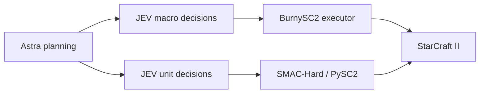

# JEV-Star

[English](#english) | [简体中文](#简体中文)

**StarCraft II macro (Protoss or Terran) and micromanagement with JEV action selection and optional GPT-6 Astra planning.**

**由 JEV 选择动作、可选 GPT-6 Astra 规划的星际争霸 II 宏观控制（Protoss 或 Terran）与微操。**

[Read the paper / 在线阅读论文](paper/PAPER.md) · [PDF](paper/JEV-Star.pdf) · [Video gallery / 视频展示](media/README.md) · [Citation / 引用](#citation)

## Videos / 视频

Play the full winning games directly below. **22.4 fps, original speed, complete matches.**

点击下方播放器即可观看完整胜局，**22.4 fps、原速播放**。

### M01 · Macro VeryHard / Elite victory / 宏观最高非作弊难度胜局

macro-v2.1 / Astra + JEV · 12:47.90

https://github.com/user-attachments/assets/5cab5e0a-e8c4-43b8-a504-96f916f73e2a

### M02 · Macro Easy victory / 宏观 Easy 胜局

earlier Astra + JEV macro · 15:04.20

https://github.com/user-attachments/assets/2beaa558-67d5-4b7f-8a8d-c29f4359ab36

### U01 · Micro mmmt victory / 微观 mmmt 胜局

C / P0 Astra + JEV / schema 7 · 00:21.43

https://github.com/user-attachments/assets/48b26ba0-63be-45c4-82a5-f4bb6814f73e

## English

JEV-Star brings full-game macro control and SMAC-Hard micromanagement into one repository. Each module has its own environment, action space, and experiment records:

| Module | Game interface | Model responsibilities | Current implementation |
| --- | --- | --- | --- |
| [Macro](macro/README.md#english) | LLM Play SC2 / BurnySC2 | Astra plans strategic phases; JEV selects economy, technology, production, and army actions | `macro-v2.3.0`; Protoss (73 actions) or Terran (71 actions) against the built-in AI of any race; real-time games |
| [Micro](micro/README.md#english) | PySC2 bundled with SMAC-Hard | Astra creates one plan per map; JEV selects actions for living units | `p0-v1`; 35 maps; fixed stepping with `realtime=False` |



### Videos and replays

The players at the top of this README show three complete winning games. [Media details and 22 original winning replays](media/README.md#english). Selected victories are shown separately from the complete evaluation results below.

### Quick start

The validated setup is **Windows, Python 3.10, and SC2 5.0.16.97563 installed for the Asia region (`kr`)**. Install the SC2 client separately; matches are created through the local SC2 API. The two modules use separate virtual environments to keep their SC2 SDK dependencies isolated.

Jev requests go to OpenRouter's TypeSafe-compatible endpoint, `https://openrouter.ai/api/v1/systemone`, model `typesafe/jev-1.13`. Set `OPENROUTER_API_KEY`, or an `openrouter:` line in `config.md`. Override the URL with `JEV_API_ENDPOINT` if needed.

```powershell
git clone https://github.com/sc2musa/Jev_Star.git
cd Jev_Star
py -3.10 scripts/setup_environment.py macro
py -3.10 scripts/setup_environment.py micro --video

$env:SC2PATH = 'C:\game\StarCraft II'
$env:OPENROUTER_API_KEY = '<your OpenRouter key>'
py -3.10 scripts/install_maps.py all
```

Alternatively, copy [config.example.md](config.example.md) to a local `config.md`. Git ignores the real key file. Astra planning uses an authenticated native Codex CLI installation; use `--codex-path` to specify its executable explicitly.

Before running macro games, launch the installed SC2 client once to generate `stableid.json`, then synchronize the BurnySC2 enums. Use the version of your installed client:

```powershell
& .\.venvs\macro\Scripts\python.exe -B scripts/sync_sc2_ids.py --game-version 5.0.16.97563
```

Run one macro game (Protoss by default; add `--race Terran` to play Terran):

```powershell
py -3.10 jev_star.py macro --planner codex --planner-effort medium --map 'Altitude LE' --opponent-race Zerg --difficulty Easy --game-time-limit 1200
py -3.10 jev_star.py macro --race Terran --planner codex --planner-effort medium --map 'Altitude LE' --opponent-race Zerg --difficulty Easy --game-time-limit 1200
```

#### Control panel

`scripts/live_view.py` serves a local page at <http://127.0.0.1:8765/> for starting and watching macro games without the command line. Choose race, opponent, difficulty, map, Astra effort, and time limit, then press **Start game**; **Stop game** interrupts the match and still writes its logs. The page shows Astra's current plan, Jev's recent choices, economy, the match result, and a notice when StarCraft II stops updating. On Linux, `scripts/jev-star-panel` starts the panel in the background (if needed) and opens it in the browser. The panel only accepts start/stop requests from its own page.

#### Linux (Wine/Proton)

Macro games also run on Linux with the Windows SC2 client under Wine or Proton. Point BurnySC2 at the Wine prefix and a launcher that runs `SC2_x64.exe` directly (BurnySC2's default `wine start` returns immediately, so the bot loses the process):

```bash
export SC2PF=WineLinux
export WINE=/path/to/wine-sc2   # script that execs Proton/Wine's wine binary on SC2_x64.exe
export SC2PATH="$HOME/Games/battlenet/drive_c/Program Files (x86)/StarCraft II"
python3 jev_star.py macro --race Terran --planner codex --planner-effort medium --map 'Altitude LE' --opponent-race Zerg --difficulty Easy
```

The control panel fills in these variables when it finds `.tools/wine-sc2` and the Battle.net prefix above. Run StarCraft II fullscreen: a large tiled window under Xwayland can flicker and stall the game on integrated graphics.

Run three micro episodes on `3m`:

```powershell
py -3.10 jev_star.py micro --map 3m --episodes 3 --planner codex --planner-effort medium --planner-timeout 180 --request-timeout 15 --max-requests 10000
```

Use `py -3.10 jev_star.py macro --help` or `micro --help` for all options. Relative paths in forwarded arguments are resolved inside `macro/` or `micro/`.

### Experiment status

Each micro version was evaluated on 35 maps with three episodes per map. JEV alone achieved **3 wins, 2 draws, and 100 losses**; the earlier Astra + JEV version achieved **6 wins, 1 draw, and 98 losses**; P0 Astra + JEV achieved **7 wins and 98 losses**. Excluding the two development maps, the three versions achieved **3/99, 3/99, and 7/99 wins**, respectively.

Earlier macro versions won two games against the non-cheating VeryHard/Elite AI. The subsequent version with expanded action coverage lost one game each against CheatVision and CheatMoney. `macro-v2.2.1` added termination on permanent billing errors. The current `macro-v2.3.0` adds Terran; its first test games won against Easy Zerg in 9:36 and against the non-cheating VeryHard Zerg in 13:58. Macro has passed **157 offline regression tests** (Protoss behavior is unchanged) and micro **37**. These are small samples, not estimates of a stable win rate.

Jev calls cost about **$0.04 per million tokens** through OpenRouter (blended rate); a 10-minute macro game uses roughly 1.6M tokens, about $0.06. Astra planning runs on the Codex CLI subscription and is not included.

[Experiments and version boundaries](docs/experiments.md) · [Architecture and data flow](docs/architecture.md) · [Logs and replays](docs/logs-and-replays.md) · [Paper PDF](paper/JEV-Star.pdf) · [Paper source and data](paper/README.md#english)

### Repository layout

```text
macro/       Macro controller, tests, and six ladder maps
micro/       Micro controller, PySC2/SMAC-Hard runtime, tests, and 35 maps
scripts/     Environment setup, map installation, SC2 enum synchronization, and the control panel
docs/        Architecture, experiments, cleanup notes, and source manifest
paper/       Current paper, LaTeX source, figures, and fixed analysis data
licenses/    Upstream licenses
jev_star.py  Unified command entry point for the two isolated environments
```

Run outputs are stored under each module's `jev_runs/` directory. Full events, generated replays and videos, virtual environments, credentials, and machine diagnostics are excluded from Git; the original research archives remain in the local workspace. Reviewed full-length videos under `media/videos/` and original winning replays under `media/replays/` are included. The README uses GitHub's native inline video players; original higher-bitrate recordings are also archived in Releases. The repository also includes the paper's fixed statistical tables. Excerpts do not replace complete original logs.

### Tests

```powershell
Push-Location macro
& ..\.venvs\macro\Scripts\python.exe -B -m unittest discover -s tests -p 'test_jev*.py'
Pop-Location
Push-Location micro
& ..\.venvs\micro\Scripts\python.exe -B -m unittest discover -s tests -p 'test_jev*.py'
Pop-Location
```

Tests use mocked interfaces and do not launch the game or call paid models. GitHub Actions runs the same two offline test suites. See the [cleanup record](docs/repository-cleanup.md) for the scope of the initial publication checks.

### Upstream sources

Macro is based on [LLM Play SC2](https://github.com/sc2musa/Large-Language-Models-play-StarCraftII). Micro is based on [SMAC-Hard](https://github.com/devindeng94/smac-hard) and its bundled PySC2. Original source notices and applicable licenses are retained; see [third-party notices](THIRD_PARTY_NOTICES.md) and the [source manifest](docs/source-manifest.json).

## 简体中文

JEV-Star 将完整对局的宏观控制与 SMAC-Hard 微操放在同一个仓库中维护。两个模块各有独立环境、动作空间和实验记录：

| 模块 | 游戏接口 | 模型职责 | 当前实现 |
| --- | --- | --- | --- |
| [宏观 macro](macro/README.md#简体中文) | LLM Play SC2 / BurnySC2 | Astra 阶段规划，JEV 选择经济、科技、生产和军队动作 | `macro-v2.3.0`；Protoss（73 个动作）或 Terran（71 个动作），对手为任意种族内置 AI；实时对局 |
| [微观 micro](micro/README.md#简体中文) | SMAC-Hard 自带的 PySC2 | Astra 每图一份计划，JEV 为存活单位选择动作 | `p0-v1`；35 张图；固定步进 `realtime=False` |


### 胜局视频与回放

本页上方可直接播放 3 场完整胜局。[视频说明与 22 份原始胜局 replay](media/README.md#简体中文)。这里展示选定胜局，完整实验成绩见下文。

### 快速开始

已验证环境为 **Windows、Python 3.10、SC2 5.0.16.97563 亚服 kr 安装**。SC2 客户端需自行安装；对局通过本地 SC2 API 创建。使用两个虚拟环境，避免不同 SC2 SDK 的依赖互相覆盖。

```powershell
git clone https://github.com/sc2musa/Jev_Star.git
cd Jev_Star
py -3.10 scripts/setup_environment.py macro
py -3.10 scripts/setup_environment.py micro --video

$env:SC2PATH = 'C:\game\StarCraft II'
$env:OPENROUTER_API_KEY = '<your OpenRouter key>'
py -3.10 scripts/install_maps.py all
```

也可将 [config.example.md](config.example.md) 复制为本地 `config.md`。实际密钥文件已被 Git 忽略。Astra 规划使用已登录的原生 Codex CLI；通过 `--codex-path` 可以显式指定它的路径。

宏观实战前，应启动一次安装好的 SC2 以生成 `stableid.json`，再同步 BurnySC2 枚举；版本号以实际客户端为准：

```powershell
& .\.venvs\macro\Scripts\python.exe -B scripts/sync_sc2_ids.py --game-version 5.0.16.97563
```

宏观一局（默认 Protoss；加 `--race Terran` 使用 Terran）：

```powershell
py -3.10 jev_star.py macro --planner codex --planner-effort medium --map 'Altitude LE' --opponent-race Zerg --difficulty Easy --game-time-limit 1200
py -3.10 jev_star.py macro --race Terran --planner codex --planner-effort medium --map 'Altitude LE' --opponent-race Zerg --difficulty Easy --game-time-limit 1200
```

#### 控制面板

`scripts/live_view.py` 在 <http://127.0.0.1:8765/> 提供本地页面，无需命令行即可开始和观看宏观对局。选择种族、对手、难度、地图、Astra 推理强度和时限后点击 **Start game**；**Stop game** 中断对局并照常写出日志。页面显示 Astra 当前计划、Jev 最近的选择、经济数据、比赛结果，以及 StarCraft II 停止更新时的提示。Linux 上可用 `scripts/jev-star-panel` 在后台启动面板（如尚未运行）并在浏览器中打开。面板只接受来自自身页面的开始/停止请求。

#### Linux（Wine/Proton）

宏观对局也可在 Linux 上通过 Wine 或 Proton 运行 Windows 版 SC2 客户端。需让 BurnySC2 使用 Wine 前缀，并提供直接运行 `SC2_x64.exe` 的启动脚本（BurnySC2 默认的 `wine start` 会立即返回，Bot 将失去进程）：

```bash
export SC2PF=WineLinux
export WINE=/path/to/wine-sc2   # 用 Proton/Wine 的 wine 直接执行 SC2_x64.exe 的脚本
export SC2PATH="$HOME/Games/battlenet/drive_c/Program Files (x86)/StarCraft II"
python3 jev_star.py macro --race Terran --planner codex --planner-effort medium --map 'Altitude LE' --opponent-race Zerg --difficulty Easy
```

控制面板在找到 `.tools/wine-sc2` 和上述 Battle.net 前缀时会自动设置这些变量。请全屏运行 StarCraft II：在集成显卡上，Xwayland 下的大尺寸平铺窗口可能闪烁并使游戏卡顿。

微观 `3m` 三局：

```powershell
py -3.10 jev_star.py micro --map 3m --episodes 3 --planner codex --planner-effort medium --planner-timeout 180 --request-timeout 15 --max-requests 10000
```

所有参数可通过 `py -3.10 jev_star.py macro --help` 或 `micro --help` 查看。转发参数中的相对路径以 `macro/` 或 `micro/` 为基准。

### 实验状态

微观每版 35 图 × 3 局：纯 JEV 为 **3 胜、2 平、100 负**，旧 Astra＋JEV 为 **6 胜、1 平、98 负**，P0 Astra＋JEV 为 **7 胜、98 负**。排除两张开发地图后，三版分别为 **3/99、3/99、7/99 胜**。

宏观历史版本已在非作弊的 VeryHard/Elite 难度取得两局胜利；随后动作补全版本在 CheatVision、CheatMoney 各一局失利。`macro-v2.2.1` 增加永久计费错误的停止机制。当前 `macro-v2.3.0` 新增 Terran，首批测试分别以 9:36 战胜 Easy Zerg、以 13:58 战胜非作弊 VeryHard Zerg。宏观已有 **157 项离线回归通过**（Protoss 行为不变），微观 **37 项**。这些是有限样本，不是稳定胜率估计。

经 OpenRouter 调用 Jev 约 **每百万 token 0.04 美元**（综合费率）；10 分钟的宏观对局约 160 万 token，约 0.06 美元。Astra 规划使用 Codex CLI 订阅，不计入其中。

[实验与版本边界](docs/experiments.md) · [架构与数据流](docs/architecture.md) · [日志和回放](docs/logs-and-replays.md) · [论文 PDF](paper/JEV-Star.pdf) · [论文源码及统计表](paper/README.md#简体中文)

### 目录

```text
macro/       宏观控制代码、测试和六张梯图
micro/       微操代码、PySC2/SMAC-Hard 运行底层、测试和 35 张地图
scripts/     环境安装、地图安装、SC2 枚举同步和控制面板
docs/        架构、实验、整理说明和源文件清单
paper/       当前论文、LaTeX 源码、图表和固定统计数据
licenses/    上游许可证
jev_star.py  两个独立环境的统一命令入口
```

运行结果保存在各模块的 `jev_runs/` 下。完整事件、新生成的 replay 和视频、虚拟环境、密钥和本机诊断文件默认不进入 Git；已有原始研究档案保留在本地工作区。已核验的完整视频收录在 `media/videos/`，胜局 replay 收录在 `media/replays/`。README 使用 GitHub 原生播放器，原始高码率录像另存于 Releases。仓库也包含论文的固定统计表，完整原始日志不以节选代替。

### 测试

```powershell
Push-Location macro
& ..\.venvs\macro\Scripts\python.exe -B -m unittest discover -s tests -p 'test_jev*.py'
Pop-Location
Push-Location micro
& ..\.venvs\micro\Scripts\python.exe -B -m unittest discover -s tests -p 'test_jev*.py'
Pop-Location
```

测试使用模拟接口，不启动游戏或付费模型。GitHub Actions 使用同样的两组离线测试。首次公开整理的验证范围见 [整理记录](docs/repository-cleanup.md)。

### 上游来源

宏观基于 [LLM Play SC2](https://github.com/sc2musa/Large-Language-Models-play-StarCraftII)；微观基于 [SMAC-Hard](https://github.com/devindeng94/smac-hard) 及其 PySC2。保留对应源代码声明与许可证，详见 [第三方说明](THIRD_PARTY_NOTICES.md) 和 [源文件清单](docs/source-manifest.json)。

<a id="citation"></a>

## Citation / 引用

If you use JEV-Star in your research, please cite the paper below. You can also use **Cite this repository** in the GitHub sidebar to copy an APA or BibTeX citation.

如果本项目对你的研究有帮助，请引用以下论文；也可以点击 GitHub 侧栏的 **Cite this repository**，复制 APA 或 BibTeX 引用。

Weiyu Ma, Liangbing Zhao, Yongcheng Zeng, and Jian Zhao. 2026. *JEV-Star: Fast, Low-Cost StarCraft II Control with Language-Model Planning*. Preprint.

```bibtex
@misc{ma2026jevstar,
  title = {{JEV-Star}: Fast, Low-Cost {StarCraft II} Control with Language-Model Planning},
  author = {Ma, Weiyu and Zhao, Liangbing and Zeng, Yongcheng and Zhao, Jian},
  year = {2026},
  month = sep,
  note = {Preprint},
  url = {https://github.com/sc2musa/Jev_Star/blob/main/paper/PAPER.md}
}
```

[BibTeX file / BibTeX 文件](CITATION.bib) · [Citation metadata / 引用元数据](CITATION.cff) · [Read the paper / 在线阅读论文](paper/PAPER.md)
