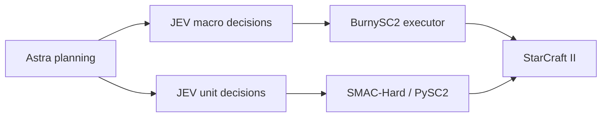

# JEV-Star

[English](#english) | [简体中文](#简体中文)

**StarCraft II macro (Protoss or Terran) and micromanagement with JEV action selection and optional GPT-6 Astra planning.**

**由 JEV 选择动作、可选 GPT-6 Astra 规划的星际争霸 II 宏观控制（Protoss 或 Terran）与微操。**

[Read the paper / 在线阅读论文](paper/PAPER.md) · [PDF](paper/JEV-Star.pdf) · [Video gallery / 视频展示](media/README.md) · [Citation / 引用](#citation)

## Videos / 视频

Play the full winning games directly below. **22.4 fps, original speed, complete matches.**

点击下方播放器即可观看完整胜局，**22.4 fps、原速播放**。

### M01 · Macro VeryHard / Elite victory / 宏观最高非作弊难度胜局

macro-v2.1 / Astra + JEV · 12:47.90

https://github.com/user-attachments/assets/5cab5e0a-e8c4-43b8-a504-96f916f73e2a

### M02 · Macro Easy victory / 宏观 Easy 胜局

earlier Astra + JEV macro · 15:04.20

https://github.com/user-attachments/assets/2beaa558-67d5-4b7f-8a8d-c29f4359ab36

### U01 · Micro mmmt victory / 微观 mmmt 胜局

C / P0 Astra + JEV / schema 7 · 00:21.43

https://github.com/user-attachments/assets/48b26ba0-63be-45c4-82a5-f4bb6814f73e

## English

JEV-Star brings full-game macro control and SMAC-Hard micromanagement into one repository. Each module has its own environment, action space, and experiment records:

| Module | Game interface | Model responsibilities | Current implementation |
| --- | --- | --- | --- |
| [Macro](macro/README.md#english) | LLM Play SC2 / BurnySC2 | Astra plans strategic phases; JEV selects economy, technology, production, and army actions | `macro-v2.3.0`; Protoss (73 actions) or Terran (71 actions) against the built-in AI of any race; real-time games |
| [Micro](micro/README.md#english) | PySC2 bundled with SMAC-Hard | Astra creates one plan per map; JEV selects actions for living units | `p0-v1`; 35 maps; fixed stepping with `realtime=False` |


```mermaid
flowchart LR
    A[Astra planning] --> M[JEV macro decisions]
    A --> U[JEV unit decisions]
    M --> B[BurnySC2 executor]
    U --> P[SMAC-Hard / PySC2]
    B --> G[StarCraft II]
    P --> G
```

### Videos and replays

The players at the top of this README show three complete winning games. [Media details and 22 original winning replays](media/README.md#english). Selected victories are shown separately from the complete evaluation results below.

### Quick start

The validated setup is **Windows, Python 3.10, and SC2 5.0.16.97563 installed for the Asia region (`kr`)**. Install the SC2 client separately; matches are created through the local SC2 API. The two modules use separate virtual environments to keep their SC2 SDK dependencies isolated.

Jev requests go to OpenRouter's TypeSafe-compatible endpoint, `https://openrouter.ai/api/v1/systemone`, model `typesafe/jev-1.13`. Set `OPENROUTER_API_KEY`, or an `openrouter:` line in `config.md`. Override the URL with `JEV_API_ENDPOINT` if needed.

```powershell
git clone https://github.com/sc2musa/Jev_Star.git
cd Jev_Star
py -3.10 scripts/setup_environment.py macro
py -3.10 scripts/setup_environment.py micro --video

$env:SC2PATH = 'C:\game\StarCraft II'
$env:OPENROUTER_API_KEY = '<your OpenRouter key>'
py -3.10 scripts/install_maps.py all
```

Alternatively, copy [config.example.md](config.example.md) to a local `config.md`. Git ignores the real key file. Astra planning uses an authenticated native Codex CLI installation; use `--codex-path` to specify its executable explicitly.

Before running macro games, launch the installed SC2 client once to generate `stableid.json`, then synchronize the BurnySC2 enums. Use the version of your installed client:

```powershell
& .\.venvs\macro\Scripts\python.exe -B scripts/sync_sc2_ids.py --game-version 5.0.16.97563
```

Run one macro game (Protoss by default; add `--race Terran` to play Terran):

```powershell
py -3.10 jev_star.py macro --planner codex --planner-effort medium --map 'Altitude LE' --opponent-race Zerg --difficulty Easy --game-time-limit 1200
py -3.10 jev_star.py macro --race Terran --planner codex --planner-effort medium --map 'Altitude LE' --opponent-race Zerg --difficulty Easy --game-time-limit 1200
```

#### Control panel

`scripts/live_view.py` serves a local page at <http://127.0.0.1:8765/> for starting and watching macro games without the command line. Choose race, opponent, difficulty, map, Astra effort, and time limit, then press **Start game**; **Stop game** interrupts the match and still writes its logs. The page shows Astra's current plan, Jev's recent choices, economy, the match result, and a notice when StarCraft II stops updating. On Linux, `scripts/jev-star-panel` starts the panel in the background (if needed) and opens it in the browser. The panel only accepts start/stop requests from its own page.

#### Linux (Wine/Proton)

Macro games also run on Linux with the Windows SC2 client under Wine or Proton. Point BurnySC2 at the Wine prefix and a launcher that runs `SC2_x64.exe` directly (BurnySC2's default `wine start` returns immediately, so the bot loses the process):

```bash
export SC2PF=WineLinux
export WINE=/path/to/wine-sc2   # script that execs Proton/Wine's wine binary on SC2_x64.exe
export SC2PATH="$HOME/Games/battlenet/drive_c/Program Files (x86)/StarCraft II"
python3 jev_star.py macro --race Terran --planner codex --planner-effort medium --map 'Altitude LE' --opponent-race Zerg --difficulty Easy
```

The control panel fills in these variables when it finds `.tools/wine-sc2` and the Battle.net prefix above. Run StarCraft II fullscreen: a large tiled window under Xwayland can flicker and stall the game on integrated graphics.

Run three micro episodes on `3m`:

```powershell
py -3.10 jev_star.py micro --map 3m --episodes 3 --planner codex --planner-effort medium --planner-timeout 180 --request-timeout 15 --max-requests 10000
```

Use `py -3.10 jev_star.py macro --help` or `micro --help` for all options. Relative paths in forwarded arguments are resolved inside `macro/` or `micro/`.

### Campaign missions

The Terran bot can play Wings of Liberty missions with their real setup: the mission's own units, scripted attacks, triggers and victory conditions. The maps are read from the installed game (read-only), so the campaign must be installed with StarCraft II.

1. Build the two map tools once: `scripts/campaign/build_tools.sh` (CascLib and StormLib go into `.tools/`).
2. In the control panel, choose **Mode: Campaign mission**. Missions are listed first to last: ✅ base-building missions the bot fits, ⚠️ base-building missions with a special objective, ❌ hero-only, special-mechanic or Protoss missions (these can't be selected).
3. **Start mission** prepares the map the first time for the chosen difficulty (`python3 scripts/campaign/campaign.py prepare TRaynor02 --difficulty Hard` does the same by hand). This writes `Maps/Campaign/<id>-<difficulty>.SC2Map` and `.tools/campaign/<id>.json` with the mission's objectives.

**Mission difficulty** (Casual, Normal, Hard or Brutal) is chosen in the panel. Missions read it with `PlayerDifficulty`, which an API game always sets to Normal and which the game won't take from a hand-written bank, so each difficulty is prepared as its own map (`Maps/Campaign/<id>-<difficulty>.SC2Map`, e.g. `TRaynor02-Hard`), and the reporter records the difficulty the mission actually runs on.

A mission counts as won only when **every objective, primary and secondary, is completed**. Destroying the enemy alone isn't enough. The prepared map carries a small trigger that saves each objective's state to the `JevObjectives` bank once per game second. The bot reads that bank, logs `objective_state` events, and passes the objectives and their states to Astra and Jev. The panel shows them live. The result is "Mission complete" only when every objective is done; otherwise a scripted victory shows as "Victory, objectives missed".

Heart of the Swarm needs a Zerg bot, which doesn't exist yet. Legacy of the Void would use the Protoss bot, which hasn't been tested on campaign maps.

| Mission | Result | Objectives |
|---|---|---|
| The Outlaws (TRaynor02) | Not a mission win: "Victory" at 8:08 (before objective tracking) | Not tracked |
| The Outlaws (TRaynor02) | Not a mission win: "Victory" at 6:34, objectives missed | Destroy the Dominion Base: active · Rescue the Rebels: active |
| The Outlaws (TRaynor02) | Not a mission win: "Victory" at 6:22 (bot as only player) | Destroy the Dominion Base: active · Rescue the Rebels: completed as the game ended |
| The Outlaws (TRaynor02) | Not a mission win: "Victory" at 3:54 (bot as only player) | Destroy the Dominion Base: active · Rescue the Rebels: completed as the game ended |
| The Outlaws (TRaynor02), Normal | **Mission complete** at 6:54 (objective shim) | Rescue the Rebels: completed at 3:10 · Destroy the Dominion Base: completed at 6:38 |
| The Outlaws (TRaynor02), **Hard** | **Mission complete** at 7:56 (mission reported Hard) | Rescue the Rebels: completed at 6:43 · Destroy the Dominion Base: completed at 7:43 |
| Zero Hour (TRaynor03), Hard | Not a mission win: survived to the evacuation, "Victory" at 14:51 | Hold Out For Evacuation: completed at 14:24 · Rescue the Rebels (/3): failed at 9:25 |
| Zero Hour (TRaynor03), **Hard** | **Mission complete** at 14:51 (mission markers) | Rescue the Rebels (/3): completed at 8:57 (army sent to the pings at 5:30, 6:27 and 8:29) · Hold Out For Evacuation: completed at 14:23 |

In Zero Hour three rebel squads appear outside the base (on Hard at 2:10, 5:50 and 10:55 mission time), each marked by a minimap ping, and the objective fails as soon as one squad is killed. The bot did not know where they were. Prepared maps now also record the mission's lasting minimap pings; the bot lists them as navigation targets (`mission_marker_N`) that Astra can send the army to, a new ping or objective change asks Astra for a new plan at once, and when a marker disappears the army returns home rather than attacking elsewhere.


Neither "victory" was the mission's. In a game created through the SC2 API, the engine ends the whole game as soon as any objective is set to completed (Victory) or failed (Defeat), even a secondary one: both games ended the moment the bot's Marines reached the rebels and the mission completed "Rescue the Rebels", with the Dominion base untouched. (The 8:08 game also had a built-in Computer in the Dominion's slot; campaign games now start with the bot as the only player.) The prepared maps now route the mission's objective calls through a small shim that keeps the real states for the mission's logic and the reporter but never hands completed or failed to the engine. The game ends only when the mission itself declares victory or defeat; on victory the campaign library would wait on its score screen for a click, so the shim ends the game there instead. Short scripted test games confirmed each step: the rescue completes and play continues, destroying the Dominion base ends in Victory after the mission's victory sequence, and losing every unit ends in Defeat.

### Experiment status

Each micro version was evaluated on 35 maps with three episodes per map. JEV alone achieved **3 wins, 2 draws, and 100 losses**; the earlier Astra + JEV version achieved **6 wins, 1 draw, and 98 losses**; P0 Astra + JEV achieved **7 wins and 98 losses**. Excluding the two development maps, the three versions achieved **3/99, 3/99, and 7/99 wins**, respectively.

Earlier macro versions won two games against the non-cheating VeryHard/Elite AI. The subsequent version with expanded action coverage lost one game each against CheatVision and CheatMoney. `macro-v2.2.1` added termination on permanent billing errors. The current `macro-v2.3.0` adds Terran; its results are below. Macro has passed **240 offline regression tests** (Protoss behavior is unchanged) and micro **37**. These are small samples, not estimates of a stable win rate.

Jev calls cost about **$0.04 per million tokens** through OpenRouter (blended rate); a 10-minute macro game uses roughly 1.6M tokens, about $0.06. Astra planning runs on the Codex CLI subscription and is not included.

#### Terran results (`macro-v2.3.0`)

All games: Terran against the built-in Zerg AI, Astra planning at `medium` effort, Linux with the SC2 client under Proton. Games run on Altitude LE unless noted, with a 20-minute limit through T14 and 30 minutes afterwards. Each game ran with the fixes made after the one before it.

| Game | Opponent | Result | Game time | Jev input tokens | Changes in effect |
| --- | --- | --- | --- | --- | --- |
| T1 | Easy | Victory | 9:36 | 1.57M | First Terran executor |
| T2 | VeryHard | Victory | 13:58 | 2.33M | Batched building placement |
| T3 | VeryHard | Victory | 13:25 | 2.36M | Rejected spots and add-on slots kept free; spending a large bank |
| T4 | VeryHard | Victory | 10:17 | 1.79M | Bunker, SCV repair, supply reserve, Zerg guidance for Astra |
| T5 | **CheatVision** | **Victory** | 10:21 | 1.76M | Baneling dodging for Marines and SCVs; no gas workers as builders |
| T6 | **CheatVision** | **Victory** | 11:46 | 2.11M | None (test plan phase 1, commit `ddd0970`) |
| T7 | CheatVision | Defeat | 12:28 | 2.32M | None (test plan phase 1, commit `ddd0970`) |
| T8 | **CheatVision** | **Victory** | 12:21 | 2.18M | Gas balancing, 40-supply attack floor, Changeling targeting (restarted phase 1, game 1; commit `164e70b`) |
| T9 | **CheatVision** | **Victory** | 10:22 | 1.74M | None (restarted phase 1, game 2; commit `164e70b`) |
| T10 | **CheatVision** | **Victory** | 10:20 | 1.79M | None (restarted phase 1, game 3; commit `164e70b`) |
| T11 | **CheatVision** | **Victory** | 15:51 | 2.78M | Barracks recommended when minerals bank (phase 2, game 1, **Ancient Cistern LE**; commit `cb65b50`) |
| T12 | **CheatVision** | **Victory** | 11:33 | 1.90M | Batch training and four concurrent production buildings while banked (restarted phase 2, game 1, **Ancient Cistern LE**; commit `d9206cb`) |
| T13 | CheatVision | Tie (time limit) | 19:59 | 3.53M | None (restarted phase 2, game 2, **Ancient Cistern LE**; commit `d9206cb`) |
| T14 | CheatVision | Tie (time limit) | 19:59 | 3.68M | Scans against Lurkers, holding an attacked base, expansion recovery (restarted phase 2, game 1, **Ancient Cistern LE**; commit `b361c1b`) |
| T15 | CheatVision | Defeat | 17:01 | 2.97M | Reinforcements gather before joining an attack; army-mix guidance; 30-minute limit (**Ancient Cistern LE**; commit `2ca1641`, later reverted) |
| T16 | CheatVision | Defeat | 17:24 | 2.88M | None (**Ancient Cistern LE**; commit `2ca1641`, later reverted) |
| T17 | CheatVision | Defeat | 19:23 | 3.21M | Reinforcement grouping reverted (phase 2, game 1, **Ancient Cistern LE**; bot code `b361c1b`, commit `a9ef6e2`) |
| T18 | **CheatVision** | **Victory** | 15:01 | 2.41M | Attack only with 90 ready army supply, or 60 once maxed, against the cheating AIs (phase 2, game 1, **Ancient Cistern LE**; commit `fbe1a59`) |
| T19 | **CheatVision** | **Victory** | 21:53 | 3.87M | None (phase 2, game 2, **Ancient Cistern LE**; commit `fbe1a59`) |
| T20 | CheatVision | Defeat | 24:17 | 4.08M | None (phase 2, game 3, **Babylon LE**; commit `fbe1a59`) |
| T21 | CheatVision | Defeat | 21:26 | 3.61M | Builder path check; access-error retry (phase 2, game 4, **Babylon LE**; commit `d3b6bb2`) |
| T22 | CheatVision | Defeat | 17:56 | 3.09M | Home guard and recall; Engineering Bay, Armory and infantry upgrades on schedule (phase 3, game 1, **Babylon LE**; commit `c0f92cc`) |
| T23 | CheatVision | Defeat (stopped at 25:09, lost on the board) | 25:09 | 4.24M | Anti-Baneling schedule: Factory, Tech Lab, 2 Siege Tanks, 4 Widow Mines, Planetary Fortress (phase 3, game 1, **Babylon LE**; commit `15f4006`) |
| T24 | CheatVision | Defeat | 26:20 | 4.35M | None (phase 3, **Ancient Cistern LE**; commit `15f4006`); four maxed pushes at 11:22–18:11 each lost about 60 army supply without breaking the Zerg; Brood Lords from ~17:00, only 1–2 Vikings built; bases then fell |
| T25 | **CheatVision** | **Victory** | 22:15 | 4.12M | Disengaging, earlier sieging, Vikings against Brood Lords, money kept for due tech (phase 3b, game 1, **Ancient Cistern LE**; commit `cfda5dc`) |
| T26 | CheatVision | Defeat (stopped at 26:31, lost on the board) | 26:31 | 4.85M | Research uses the generic ability when required (phase 3b, game 2, **Ancient Cistern LE**; commit `648892f`) |
| T27 | CheatVision | Tie (time limit) | 29:59 | 6.40M | Fights measured where the army meets the enemy, Marines shoot Banelings, bio waits for the Siege Tanks (phase 3c, game 1, **Ancient Cistern LE**; commit `3521806`) |
| T28 | CheatVision | Defeat (stopped at 27:27, lost on the board) | 27:27 | 5.53M | Disengage only when the fighting units are at least 40% of the army; research uses the game's own ability (restarted phase 3c, game 1, **Ancient Cistern LE**; commit `3d10fa3`) |
| T29 | CheatVision | Tie (time limit) | 29:59 | 5.80M | Lanes between buildings for Siege Tanks (restarted phase 3c, game 2, **Ancient Cistern LE**; commit `c1fe19d`) |
| T30 | CheatVision | Defeat (stopped at 15:50, lost on the board) | 15:50 | 2.61M | Late-game counters with money and supply kept for them (phase 3d, game 1, **Ancient Cistern LE**; commit `fde2a28`) |
| T31 | CheatVision | Tie (time limit) | 29:59 | 5.61M | Comparison: the T18–T19 code, checked out unchanged (**Ancient Cistern LE**; commit `fbe1a59`) |
| T32 | **CheatVision** | **Victory** | 25:53 | 4.88M | Comparison: the T18–T19 code, 40-minute limit (**Ancient Cistern LE**; commit `fbe1a59`) |
| T33 | **CheatVision** | **Victory** | 31:07 | 5.76M | Baseline rebuild: `fbe1a59` code with four bug fixes, 40-minute limit (phase 3e, game 1, **Ancient Cistern LE**; commit `4bf68a8`) |
| T34 | CheatVision | Defeat | 20:15 | 3.30M | None (phase 3e, game 2, **Ancient Cistern LE**; commit `68b15e4`) |
| T35 | **CheatVision** | **Victory** (Zerg surrendered) | 18:39 | 3.21M | Building lanes removed; the baseline plays exactly like `fbe1a59` (phase 3e, game 3, **Ancient Cistern LE**; commit `b9dbf44`) |
| T36 | **CheatVision** | **Victory** (Zerg surrendered) | 18:40 | 3.13M | None (phase 3e, game 4, **Ancient Cistern LE**; commit `27e2adc`) |
| T37 | **CheatVision** | **Victory** | 20:27 | 3.70M | None; first win on Babylon (phase 3e, **Babylon LE**; commit `0c61fe2`) |
| T38 | CheatVision | Defeat | 23:50 | 4.27M | None (phase 3e, **Babylon LE**; commit `1690e7c`) |
| T39 | CheatVision | Defeat | 24:13 | 4.30M | Recall on raids added to the baseline (phase 3f, game 1, **Babylon LE**; commit `7fe46ac`) |
| T40 | **CheatVision** | **Victory** | 19:02 | 3.46M | Recall reverted; SCVs evacuate raided, undefended bases (phase 3g, game 1, **Babylon LE**; commit `c0af324`) |
| T41 | CheatVision | Defeat (stopped at 29:37, lost on the board) | 29:37 | 5.56M | None (phase 3g, game 2, **Babylon LE**; commit `d25d0eb`) |
| T42 | CheatVision | Defeat (stopped at 25:17, lost on the board) | 25:17 | 4.64M | Lanes only around Factories (phase 3h, game 1, **Babylon LE**; commit `92856e2`) |
| T43 | CheatVision | Defeat (stopped at 28:08, lost on the board) | 28:08 | 5.17M | None (phase 3i, **Babylon LE**; commit `5f1fcb7`) |
| T44 | CheatVision | Defeat (stopped at 34:50, lost on the board) | 34:50 | 6.34M | Siege Tanks limited to about a third of the army (phase 3j, game 1, **Ancient Cistern LE**; commit `499fa6c`) |
| T45 | **CheatVision** | **Victory** (Zerg surrendered) | 17:31 | 2.90M | Buildings keep 2 cells of walkable terrain from cliffs and the map edge (phase 3k, game 1, **Ancient Cistern LE**; commit `709e95d`) |
| T46 | **CheatVision** | **Victory** | 18:01 | 2.95M | None (phase 3k, game 2, **Ancient Cistern LE**; commit `45166bf`) |
| T47 | **CheatVision** | **Victory** | 16:23 | 2.71M | None (phase 3k, Babylon game 1, **Babylon LE**; commit `a42a540`) |
| T48 | **CheatVision** | **Victory** | 18:10 | 3.00M | None (phase 3k, Babylon game 2, **Babylon LE**; commit `4f4a10f`) |
| T49 | **CheatVision** | **Victory** | 17:34 | 3.09M | None (phase 3l, **Dragon Scales LE** game 1; commit `81ce965`) |
| T50 | **CheatVision** | **Victory** | 23:12 | 4.18M | None (phase 3l, **Dragon Scales LE** game 2; commit `6025dca`, bot code as `81ce965`) |
| T51 | **CheatVision** | **Victory** | 16:55 | 2.88M | None (phase 3l, **Gresvan LE** game 1; commit `eea3a00`, bot code as `81ce965`) |
| T52 | CheatVision | Defeat | 17:56 | 2.83M | None (phase 3l, **Gresvan LE** game 2; commit `733f8ff`, bot code as `81ce965`) |
| T53 | **CheatVision** | **Victory** | 20:53 | 3.56M | None (phase 3l, **Neohumanity LE** game 1; commit `74c6f42`, bot code as `81ce965`) |
| T54 | **CheatVision** | **Victory** | 19:28 | 3.33M | None (phase 3l, **Neohumanity LE** game 2; commit `9756d4d`, bot code as `81ce965`) |
| T55 | **CheatVision** | **Victory** | 14:25 | 2.42M | None (phase 3l, **Altitude LE** game 1; commit `b9a2455`, bot code as `81ce965`) |
| T56 | **CheatVision** | **Victory** | 15:03 | 2.48M | None (phase 3l, **Altitude LE** game 2; commit `a37620f`, bot code as `81ce965`) |
| T57 | **CheatMoney** | Defeat | 24:45 | 4.03M | None (first game against **CheatMoney** Zerg, **Altitude LE**, Astra effort high; commit `148e88f`, bot code as `81ce965` plus the campaign guards) |
| T58 | **CheatMoney** | Defeat | 12:43 | 1.77M | None (CheatMoney Zerg, **Ancient Cistern LE**, Astra effort medium; commit `f845edb`, ladder behaviour as the certified baseline) |
| T59 | **CheatMoney** | Defeat | 34:27 | 5.03M | None (CheatMoney Zerg, **Ancient Cistern LE**; **bank spending** on branch `cheatmoney-bank-spend`, commit `f49f891`) |
| T60 | **CheatMoney** | Defeat | 17:37 | 2.64M | None (CheatMoney Zerg, **Ancient Cistern LE**; bank spending, bot code as `f49f891`, commit `8ad9940`) |
| T61 | **CheatMoney** | Defeat | 17:01 | 2.52M | None (CheatMoney Zerg, **Babylon LE** game 1; bank spending, bot code as `f49f891`, commit `98226f9`) |
| T62 | **CheatMoney** | Defeat | 23:09 | 3.65M | None (CheatMoney Zerg, **Babylon LE** game 2; bank spending, bot code as `f49f891`, commit `ce80f62`) |
| T63 | **CheatMoney** | Defeat | 20:04 | 3.14M | None (CheatMoney Zerg, **Ancient Cistern LE**; bank spending plus **Vikings against Brood Lord tech**, branch `cheatmoney-anti-air`, commit `39c5840`) |
| T64 | **CheatMoney** | Defeat | 12:40 | 1.85M | None (CheatMoney Zerg, **Ancient Cistern LE**; Viking response started by Corruptors, branch `cheatmoney-anti-air`, commit `1a8ccbf`; the response never started) |
| T65 | **CheatMoney** | Defeat | 19:53 | 3.24M | None (CheatMoney Zerg, **Ancient Cistern LE**; Viking response started by Corruptors, bot code as `1a8ccbf`, commit `ad1ff1a`; the response never started) |
| T66 | **CheatMoney** | Defeat | 20:42 | 3.45M | None (CheatMoney Zerg, **Ancient Cistern LE**; **Medivacs over the front of the bio**, with the Viking response, branch `cheatmoney-medivacs`, commit `d3143b4`) |
| T67 | **CheatMoney** | Defeat | 37:20 | 6.26M | None (CheatMoney Zerg, **Ancient Cistern LE** game 2; Medivacs over the bio, with the Viking response, bot code as `d3143b4`, commit `8fd0e3f`) |
| T68 | **CheatMoney** | Defeat | ~31:44 | 5.49M | None (CheatMoney Zerg, **Babylon LE** game 1; Medivacs over the bio, with the Viking response, bot code as `d3143b4`, commit `f1a2ff4`; SC2 stopped sending updates after the defeat and the run was stopped from the panel) |
| T69 | **CheatMoney** | Defeat | ~18:01 | 2.86M | None (CheatMoney Zerg, **Babylon LE** game 2; Medivacs over the bio, with the Viking response, bot code as `d3143b4`, commit `01a393d`; stopped by hand when lost, 18 SCVs and 6 army supply left) |
| T70 | **CheatMoney** | **Tie** | 39:59 (40-minute limit) | 7.80M | None (CheatMoney Zerg, **Ancient Cistern LE**; **no attacks into the Zerg main or crawler cover**, branch `cheatmoney-no-suicide-attacks`, commit `69d3f83`) |
| T71 | **CheatMoney** | Defeat | 36:18 | 5.16M | None (CheatMoney Zerg, **Ancient Cistern LE** game 2; no attacks into the Zerg main or crawler cover, bot code as `69d3f83`, commit `db26bea`) |
| T72 | **CheatMoney** | Defeat | ~23:11 | 2.89M | None (CheatMoney Zerg, **Babylon LE** game 1; no attacks into the Zerg main or crawler cover, bot code as `69d3f83`, commit `8bdb1b5`; Jev timed out often between 11:00 and 16:00; stopped by hand when lost) |
| T73 | **CheatMoney** | Defeat | ~15:52 | 2.20M | None (CheatMoney Zerg, **Babylon LE** game 2; no attacks into the Zerg main or crawler cover, bot code as `69d3f83`, commit `ce15471`; stopped by hand when lost) |
| T74 | **CheatMoney** | **Tie** | 49:28 (SC2 stalemate) | 17.24M | None (CheatMoney Zerg, **Ancient Cistern LE**, 60-minute limit; **growing into the map**, branch `cheatmoney-grow`, commit `02f4379`) |
| T75 | **CheatMoney** | Stopped while holding | ~48:15 | 18.42M | None (CheatMoney Zerg, **Babylon LE**, 60-minute limit; growing into the map, bot code as `02f4379`, commit `6fbab47`; stopped by hand, maxed with all 7 bases, heading for a stalemate) |
| T76 | **CheatMoney** | Defeat | ~19:20 | 3.93M | None (CheatMoney Zerg, **Ancient Cistern LE**, 60-minute limit; **sticky targets, home guard, siege push**, branch `cheatmoney-finish`, commit `46c4b30`; stopped by hand when lost) |
| T77 | **CheatMoney** | Defeat | ~17:48 | 3.07M | None (CheatMoney Zerg, **Ancient Cistern LE**, 60-minute limit; `main` plus **sticky fallback targets** only, branch `cheatmoney-sticky`, commit `143bae1`; stopped by hand when lost) |
| T78 | **CheatMoney** | Defeat | 18:31 | 4.18M | None (CheatMoney Zerg, **Ancient Cistern LE**, 60-minute limit; **`main` unchanged** (the T74–T75 code), commit `8a09ef0`, played as a control) |
| T79 | **CheatMoney** | Defeat | ~34:03 | 10.99M | None (CheatMoney Zerg, **Ancient Cistern LE**, 60-minute limit; **early defense until 9:30**, branch `cheatmoney-early-defense`, commit `eb3a0ea`; stopped by hand when lost) |
| T80 | **CheatMoney** | Defeat | ~36:21 | 12.26M | None (CheatMoney Zerg, **Babylon LE**, 60-minute limit; early defense until 9:30, bot code as `eb3a0ea`; stopped by hand when lost, after the 30-minute mark) |
| T81 | **CheatMoney** | Defeat | ~23:00 | 4.61M | None (CheatMoney Zerg, **Altitude LE**, 60-minute limit; frozen `main` for the map check, commit `1272c20`; stopped by hand when lost) |
| T82 | **CheatMoney** | Defeat | ~29:27 | 8.77M | None (CheatMoney Zerg, **Gresvan LE**, 60-minute limit; frozen `main` for the map check, bot code as `1272c20`; stopped by hand when lost) |
| T83 | **CheatMoney** | **Tie** | 56:19 (SC2 stalemate) | 20.26M | None (CheatMoney Zerg, **Dragon Scales LE**, 60-minute limit; frozen `main` for the map check, bot code as `1272c20`) |
| T84 | **CheatMoney** | Defeat | ~35:28 | 11.49M | None (CheatMoney Zerg, **Neohumanity LE**, 60-minute limit; frozen `main` for the map check, bot code as `1272c20`; stopped by hand when lost) |
| T85 | **CheatMoney** | Defeat | ~29:37 | 9.50M | None (CheatMoney Zerg, **Ancient Cistern LE**, 60-minute limit; **automatic recall**, branch `cheatmoney-recall`, commit `a68494e`; stopped by hand when lost) |
| T86 | **CheatMoney** | Defeat | ~28:51 | 9.28M | None (CheatMoney Zerg, **Ancient Cistern LE**, 60-minute limit; **automatic recall**, branch `cheatmoney-recall`, commit `a68494e`; stopped automatically when lost) |
| T87 | **CheatMoney** | Defeat | ~23:59 | 6.01M | None (CheatMoney Zerg, **Babylon LE**, 60-minute limit; **automatic recall**, branch `cheatmoney-recall`, commit `a68494e`; stopped automatically when lost) |
| T88 | **CheatMoney** | Defeat | ~31:39 | 10.88M | None (CheatMoney Zerg, **Ancient Cistern LE**, 60-minute limit; **attack pull-out** on top of the recall, branch `cheatmoney-pullout`, commit `8940c36`; stopped when lost) |
| T89 | **CheatMoney** | Defeat | ~26:09 | 7.20M | None (CheatMoney Zerg, **Ancient Cistern LE**, 60-minute limit; **defending Tanks siege at 20** on top of the recall, branch `cheatmoney-siege-early`, commit `a36cc5f`; stopped by hand when lost) |
| T90 | **CheatMoney** | Defeat | ~26:37 | 6.69M (Jev) + 1.29M (Opus) | None (CheatMoney Zerg, **Ancient Cistern LE**, **Macro build**, 60-minute limit; `main` at `1272c20` bot code; **planner Opus 5.5** through Claude Code, medium effort; stopped when lost) |
| T91 | **CheatMoney** | Defeat | ~29:26 | 6.47M (Jev) + 1.39M (Opus) | None (CheatMoney Zerg, **Ancient Cistern LE**, **Macro build**, 60-minute limit; **win attempt**: early siege, composition, upgrades, counter-attack and push, branch `cheatmoney-win`, commit `57da4f8`; planner Opus 5.5, medium; stopped when lost) |
| T92 | **CheatMoney** | Defeat | ~13:32 | 2.30M (Jev) + 0.44M (Opus) | None (CheatMoney Zerg, **Ancient Cistern LE**, **Macro build**, 60-minute limit; win attempt after T91: counter-attack at 70, defend only 8+ supply raids, planner attacks refused, branch `cheatmoney-win`, commit `424381e`; planner Opus 5.5, medium; stopped automatically when lost) |
| T93 | **CheatMoney** | Defeat | ~17:17 | 3.29M (Jev) + 0.71M (Opus) | None (CheatMoney Zerg, **Ancient Cistern LE**, **Macro build**, 60-minute limit; T91 code with the counter-attack at 70 ready army counting Marines in Bunkers, branch `cheatmoney-win2`, commit `f9e88de`; planner Opus 5.5, medium; stopped automatically when lost) |
| T94 | **CheatMoney** | Defeat | ~13:44 | 2.23M (Jev) + 0.50M (Opus) | None (CheatMoney Zerg, **Ancient Cistern LE**, **Macro build**, 60-minute limit; **T91's code repeated**, branch `cheatmoney-t91`, bot code as `57da4f8`; planner Opus 5.5, medium; stopped automatically when lost) |
| T95 | **CheatMoney** | Defeat | ~31:10 | 6.26M (Jev) + 1.61M (Opus) | None (CheatMoney Zerg, **Ancient Cistern LE**, **Macro build**, 60-minute limit; base code (T91's) with a per-wave log, branch `cheatmoney-t91`, commit `a3ec74f`; planner Opus 5.5, medium; stopped by hand when lost) |
| T96 | **CheatMoney** | Defeat | 19:26 | 3.73M (Jev) + 0.76M (Opus) | None (CheatMoney Zerg, **Ancient Cistern LE**, **Macro build**, 60-minute limit; base code plus **both Refineries at every base from 4:00**, branch `cheatmoney-gas`, commit `5013b76`; planner Opus 5.5, medium) |
| T97 | **CheatMoney** | Defeat | ~32:56 | 10.34M (Jev) + 1.81M (Opus) | None (CheatMoney Zerg, **Ancient Cistern LE**, **Macro build**, 60-minute limit; base code plus **defending Tanks held sieged at the rally base after 9:30**, branch `cheatmoney-hold`, commit `2e4920a`; planner Opus 5.5, medium; stopped automatically when lost) |
| T98 | **CheatMoney** | Defeat | ~17:35 | 3.49M (Jev) + 0.78M (Opus) | None (CheatMoney Zerg, **Ancient Cistern LE**, **Macro build**, 60-minute limit; T97's code plus **the defending army stays with the sieged Tanks**, branch `cheatmoney-hold`, commit `626cccf`; planner Opus 5.5, medium; stopped automatically when lost) |
| T99 | **CheatMoney** | Defeat | ~19:53 | 4.38M (Jev) + 0.89M (Opus) | None (CheatMoney Zerg, **Ancient Cistern LE**, **Macro build**, 60-minute limit; T98's code with **the army leaving home only for the push** and the planner's attack orders refused, branch `cheatmoney-hold`, commit `aed41fb`; planner Opus 5.5, medium; stopped by hand when lost) |
| T100 | **CheatMoney** | Defeat | ~23:41 | 5.40M (Jev) + 1.07M (Opus) | None (CheatMoney Zerg, **Ancient Cistern LE**, **Macro build**, 60-minute limit; T99's code repeated, branch `cheatmoney-hold`, commit `aed41fb`; planner Opus 5.5, medium; stopped automatically when lost) |
| T101 | **CheatMoney** | Defeat | ~20:14 | 4.07M (Jev) + 0.84M (Opus) | None (CheatMoney Zerg, **Ancient Cistern LE**, **Macro build**, 60-minute limit; T99's code with **SCVs moved off gas only at 1,000 gas** (back at 500), branch `cheatmoney-hold`, commit `afc3f7e`; planner Opus 5.5, medium; stopped automatically when lost) |
| T102 | **CheatMoney** | **Stopped at a stalemate** | ~43:15 | 14.06M (Jev) + 2.09M (Opus) | None (CheatMoney Zerg, **Ancient Cistern LE**, **Macro build**, 60-minute limit; T101's code with **the army moving to a far base with its Tanks** and **gas throttle at 500/250**, branch `cheatmoney-hold`, commit `0c701ff`; planner Opus 5.5, medium; stopped automatically when the bank and army had not changed for 5 minutes) |
| T103 | **CheatMoney** | Defeat | ~18:31 | 3.71M (Jev) + 0.76M (Opus) | None (CheatMoney Zerg, **Ancient Cistern LE**, **Macro build**, 60-minute limit; T102's code plus **the push also after 60 s without Zerg attacks**, branch `cheatmoney-hold`, commit `f9207a8`; planner Opus 5.5, medium; stopped automatically when lost) |

Uncounted runs (stopped or excluded, not part of any result):

| Run (UTC+3) | Map | Opponent | Ended | Commit | Why not counted |
| --- | --- | --- | --- | --- | --- |
| 2026-09-25 21:19 | Altitude LE | VeryHard | Stopped at 4:59 | before T2 | The SC2 window stalled; stopped by hand |
| 2026-09-26 01:34 | Ancient Cistern LE | CheatVision | Victory at 10:01 | `b361c1b` | The Codex login failed from 6:38, so Astra made no plans |
| 2026-09-26 07:26 | Ancient Cistern LE | CheatVision | Stopped at 0:30 | `2ca1641` | Stopped right after the start and restarted |
| 2026-09-26 09:21 | Ancient Cistern LE | CheatVision | Stopped at 12:29 | `a9ef6e2` | The Jev provider refused requests (HTTP 403) |
| 2026-09-26 11:25 | Babylon LE | CheatVision | Stopped at 6:35 | `1bae3ec` | The Jev provider refused requests (HTTP 404) |
| 2026-09-26 17:01 | Ancient Cistern LE | CheatVision | Stopped at 4:15 | `4d5828d` | Stopped to switch to the `fbe1a59` comparison (T31–T32) |
| 2026-09-28 10:20 | Ancient Cistern LE | CheatMoney | Stopped at 12:29 | `61775af` | The Jev provider refused requests (HTTP 403) from 11:34; it had held the 8:46 attack (army 73 to 63, no base lost) and had 91 army supply and 66 SCVs at 10:11 |
| 2026-09-28 16:15 | Ancient Cistern LE | CheatMoney | Stopped at 8:43 | `9ae9ee8` | The Jev provider was timing out (32 timeouts in the first 6 minutes; 14–25 decisions a minute instead of about 55), leaving the bot short of army and SCVs; a check afterwards had 3 of 10 requests over 6 seconds and two HTTP 503 |
| 2026-09-29 15:50 | Ancient Cistern LE | CheatMoney (Macro build) | Stopped at 13:12 | `1272c20` bot code | Planner Fable 5.1 through Claude Code; the planner failed from 11:52 (four times, the shared Claude usage limit), then the game froze at 13:15 game time, most likely SC2 under Wine hanging when a Bluetooth audio device failed at 16:05; my watcher stopped it after 3 minutes without game data. It had held the 8:36 attack (82 → 44) and was maxed at 125 army with 74 SCVs |

One further VeryHard game was stopped by hand after the SC2 window stalled and is not counted. A CheatVision game on Ancient Cistern LE (commit `b361c1b`) was won in 10:01 but is also not counted: the Codex login stopped working mid-game (Astra's requests failed with authentication errors from 6:38), so Jev played mostly without plans; the control panel now shows "Astra unavailable" when this happens. A game on the reverted code (Ancient Cistern LE, commit `a9ef6e2`) was stopped at 12:29 when the Jev provider started refusing requests (HTTP 403, "RBAC: access denied"); it is not counted. A Babylon LE game on commit `1bae3ec` stopped the same way at 6:36 (HTTP 404) and is not counted either. OpenRouter began listing a new `typesafe/jev-router` the evening before; requests for `typesafe/jev-1.13` were still answered by `jev-1.13-20260917`, the version used in every game, but the provider briefly refused access twice. Access errors (401, 403, 404) are now retried for up to 60 seconds before a run stops. For comparison, the Protoss runs on the same machine the day before won three games against MediumHard and lost one against VeryHard.

T5 is the first win above VeryHard recorded in this repository; the earlier Protoss version lost its CheatVision and CheatMoney games. It is still a single game on one map against one race, so it is evidence, not a win rate.

T7 was lost: an early Zergling–Baneling attack (at least 25 Zerglings and 7 Banelings around 4:00–5:30) destroyed the Bunker, all Marines, and the natural; while rebuilding, 4 of 13–17 SCVs stayed on gas and 400–800 gas went unspent while minerals stayed under 100; and a 9:03 attack with about 30 army supply died, after which both bases fell. The fixes that followed (gas balancing, a 40-supply attack floor, and targeting Changelings) restart phase 1 of the test plan.

What changed the outcome: T2–T3 won despite losing bases to Zergling–Baneling pressure and banking minerals. After the Bunker, supply reserve, and Zerg guidance (T4), the bot kept both bases, never retreated, and grew to 48 SCVs by 10:00. With Baneling dodging (T5, 403 dodges) it lost no base against CheatVision and reached 60 SCVs and 161 supply by 10:00, with no failed orders.

#### Test plan for the cheating AIs

Before testing other opponent races, confirm the Zerg results. Keep settings and code fixed within a phase (record the commit of each game), play fullscreen on an otherwise idle machine, and do not count games stopped by hand or by a stall. If a bug forces a code change, fix it and restart that phase's count.

| Phase | Games | Goal |
| --- | --- | --- |
| 1. Repeat CheatVision | 5 against CheatVision Zerg on Altitude LE | At least 3 of 5 wins shows T5 was not luck. On commit `ddd0970` it went 2–1 (T5–T7); after the T7 fixes, 3–0 on `164e70b` (T8–T10), which meets the goal, so the remaining two games were skipped for phase 2 |
| 2. Other maps | 2 each on Ancient Cistern LE and Babylon LE against CheatVision Zerg | Placement and Bunker position work beyond one map. **Completed with the 90-supply attack rule: 2–2** (T18–T19 won on Ancient Cistern, T20–T21 lost on Babylon). On `cb65b50` it went 1–0 (T11); on `d9206cb` one win and one tie (T12–T13); on `b361c1b` one tie (T14); on `2ca1641` two defeats (T15–T16), then reverted to `b361c1b`. Restarted on the reverted code with a 30-minute limit and no further code changes during the phase |
| 3. Home defense and upgrades | 2 each on Babylon LE and Ancient Cistern LE against CheatVision Zerg, code frozen | Babylon losses fixed without losing Ancient Cistern. On `c0f92cc` one defeat on Babylon (T22); on `15f4006` one defeat on Babylon (T23). Babylon was deferred until the army's fighting improved; one defeat on Ancient Cistern (T24). **Phase 3 ends 0–3.** The army-fighting changes after it (disengaging, earlier sieging, Vikings against Brood Lords, money kept for due tech) start phase 3b |
| 3b. Army fighting | 2 each on Ancient Cistern LE and Babylon LE against CheatVision Zerg, code frozen | Pushes that go badly pull back instead of losing about 60 army supply each time; Vikings appear once Brood Lords do. On `cfda5dc`: 1–0 on Ancient Cistern (T25); on `648892f`: one defeat on Ancient Cistern (T26). **Ended at 1–1** once T26 showed the disengage rule measured fights around the army's center; the fixes start phase 3c |
| 3c. Baneling fights | 2 each on Ancient Cistern LE and Babylon LE against CheatVision Zerg, code frozen | Pushes keep more than half of their army against Baneling armies; the disengage rule fires only in real fights. On `3521806`: one tie on Ancient Cistern (T27). Restarted after it: the disengage rule's ratio test now needs at least 40% of the attacking army near the enemy, and research uses the game's own ability. On `3d10fa3`: one defeat on Ancient Cistern (T28); on `c1fe19d`: one tie (T29). **Ended at 0–1–1** (T27 tie before the restart): the bot is healthy at 20:00 in every game but loses the late game |
| 3d. Late-game counters | 2 each on Ancient Cistern LE and Babylon LE against CheatVision Zerg, code frozen | Vikings, Thors and Marauders appear once Brood Lords, Mutalisks and Ultralisks do, and pushes after 20:00 stop losing half the army. On `fde2a28`: one defeat on Ancient Cistern (T30), lost before any late-game unit appeared. Restarted with retreats limited to 8 seconds and a 120-supply attack floor before 12:00 unless maxed |
| 3e. Baseline rebuild | Branch `terran-baseline`: the `fbe1a59` bot code with only the builder path check, Jev access retry, research-ability fix and lanes for Siege Tanks; 40-minute limit, Ancient Cistern LE against CheatVision Zerg | Confirm the baseline (2 games), then add the later changes back one at a time, 2 games each, keeping only those that do not hurt. On `4bf68a8`: one win (T33), then one defeat (T34). The lanes between buildings were then removed so that the baseline plays exactly like `fbe1a59`; on `b9dbf44` and `27e2adc` (README only) two wins (T35–T36), which confirms the baseline |
| 3f. Recall on the baseline | Baseline plus the recall; 2 games on Babylon LE and at least 2 consecutive wins on Ancient Cistern LE, 40-minute limit | Bases raided behind an attacking army are defended, without losing the Ancient Cistern results. On `7fe46ac`: one defeat on Babylon (T39). **Reverted**: the baseline won a Babylon game and the recall none |
| 3g. SCV evacuation on the baseline | Baseline plus one change: SCVs leave a raided, undefended base; 2 games on Babylon LE and at least 2 consecutive wins on Ancient Cistern LE, 40-minute limit | SCVs survive raids on Babylon without losing the Ancient Cistern results. On `c0af324`: one win on Babylon (T40); then one defeat (T41) |
| 3h. Lanes around Factories | Baseline with SCV evacuation plus 2-cell lanes around Factories only; 2 games on Babylon LE and at least 2 consecutive wins on Ancient Cistern LE, 40-minute limit | No Siege Tanks stuck in the main, without losing the Ancient Cistern results. On `92856e2`: one defeat on Babylon (T42). **Reverted** with the evacuation: with lanes the bot went 1–2 (T33, T34, T42), without them 4–2 (T35–T38, T40–T41) |
| 3i. Baseline restored | The `fbe1a59` code with the three failure-only fixes (`2ca9f89`), proven on Ancient Cistern | Each further change is first played twice on Ancient Cistern LE and kept only if it does not hurt there, then tested on Babylon LE. On `5f1fcb7`: one defeat on Babylon (T43) |
| 3j. Siege Tank share | Baseline plus one change: Siege Tanks limited to about a third of the army; first 2 games on Ancient Cistern LE, then 2 on Babylon LE, 40-minute limit | Kept only if Ancient Cistern still wins; on Babylon, a mobile army that defends the bases. On `499fa6c`: one defeat on Ancient Cistern (T44). **Reverted** |
| 3k. Edge clearance | Baseline plus one change: production and tech buildings keep 2 cells of walkable terrain from cliffs and the map edge; first 2 games on Ancient Cistern LE, then 2 on Babylon LE, 40-minute limit | No units trapped between buildings and the edge of the base, without losing the Ancient Cistern results. On `709e95d`: one win on Ancient Cistern (T45); on `45166bf` (README only) a second (T46), so edge clearance **passes Ancient Cistern**; Babylon next. On `a42a540`: one win on Babylon (T47); on `4f4a10f` (README only) a second (T48). **Edge clearance passes: 4–0** |
| 3l. All maps, code frozen | The edge-clearance baseline (`986a3cf`) unchanged: 2 games each on Altitude LE, Dragon Scales LE, Gresvan LE and Neohumanity LE against CheatVision Zerg, 40-minute limit | Shows whether the bot generalizes before any further change. Dragon Scales: 2–0 (T49–T50); Gresvan: 1–1 (T51 won, T52 lost); Neohumanity: 2–0 (T53–T54); Altitude: 2–0 (T55–T56). **Frozen code 11–1 across six maps** |
| 4. CheatMoney | 3 against CheatMoney Zerg on Altitude LE | Extra enemy income; expect larger armies earlier |
| 5. CheatInsane | 3 against CheatInsane Zerg on Altitude LE | Extra income and full vision; the hardest built-in AI |

Before phase 2, T8–T10 still banked 600–1,600 minerals late in the game: Jev rarely chose an offered Barracks, and the plan's Barracks ceiling applied until 800 minerals. The large-bank override now starts at 600 minerals and recommends another Barracks to Jev.

T11 (Ancient Cistern LE) placed every building without an engine error, but banked up to 2,615 minerals between 9:00 and 12:00: only two production buildings could be under construction at once (Barracks was refused as already pending in 105 of 111 decisions), and one decision per second trains one unit, too few for about 14 production slots. With 600 or more minerals banked, a Marine, Marauder, Siege Tank, or Medivac choice now fills every free producer, and up to four production buildings may be under construction at once.

T13 reached 200/200 supply by 15:00 but did not finish Zerg before the 20-minute limit. Its attacks stalled against burrowed Lurkers with one Raven for detection and no scans; at 16:21 it retreated from an attacked base with 110 ready army supply under a defend plan; and it retried unreachable expansion sites (seven "couldn't reach target" failures), with two builders taken from gas. Orbital Commands now scan ahead of a fighting army when Lurkers were seen recently, a defend plan no longer retreats from an attacked base while the army is above the retreat threshold, and expansions skip rejected sites and use mineral workers.

T14 used every new fix (6 scans against Lurkers, retreat refused 144 times while holding a base, 175 batch-trained units) but ended in a second tie: five attacks each lost about half the army and turned back, while CheatVision rebuilt. New units walked to the fight one at a time, and by 19:00 the army was 18 Siege Tanks and 6 Marines. The next version made new units gather near home during an attack and leave in groups of about 8 supply, and asked Astra for about three Marines or Marauders per Siege Tank. It lost both games (T15–T16): first attacks of the same size as before ended with 15–21 ready army supply instead of 25–47, because the fighting army no longer received a steady stream of reinforcements, and Zerg counter-attacked into a weak home. Both changes were reverted, returning the bot to the T14 code (`b361c1b`). The remaining games keep the 30-minute limit, since a 20-minute tie with a maxed, five-base army says little about the result.

T15–T17 were lost the same way on two code versions, so the reinforcement change was not the cause. Replaying 40 logged decisions from the T12 win gave Jev's original choice every time, and Astra's latency, output size, and plans were unchanged, so neither model had changed. Before 8:00 the Zerg army looked alike in every game; what differed was the bot's first attack, at about 7:20–8:15 with 40–57 ready army supply: after it the army kept 25–47 supply in the wins and ties but 15–21 in the losses, and Zerg then reached Infestors, Lurkers, and Ultralisks. Against the cheating AIs the Terran bot now attacks only with at least 90 ready army supply (60 once total supply reaches 190), defending behind the Bunker and sieged Tanks and expanding until then. Phase 2 restarts on this version.

On Babylon LE (T20) the bot kept its bases through 20 minutes, but six buildings failed with "couldn't reach target": free spots walled in by terrain or its own buildings. All three Armory attempts failed, so it had no level 2–3 upgrades or Thors when 7 Ultralisks and 12 Mutalisks destroyed its Marine army at about 20:50. Placement now also checks, in one batched query, that the builder can walk to the spot. As a bug fix this does not restart phase 2.

T24 (Ancient Cistern LE) kept its economy: it was maxed with five or six bases and 76 SCVs from about 13:00 and rebuilt after every fight. But each of four maxed pushes (11:22, 13:28, 15:28, 18:11) lost about 60 of 90–108 ready army supply within about 20 seconds without breaking the Zerg army, the same weakness that lost on Babylon. From about 17:00 Zerg added Brood Lords; Astra asked for Vikings, but only one or two were built, and the bases fell from 19:00. Now an attacking army compares supply within 15 of its center: if the enemy there is 1.4 times stronger, or the attack has already cost 35% of the army and the enemy there is at least as strong, it moves away for 8 seconds, then defends, and cannot attack again for 45 seconds. Siege Tanks siege when ground enemies come within 15 instead of 13. Brood Lords (two Vikings each, up to 12) and Corruptors (one each) make Vikings, and a second Starport for six or more, recommended purchases; and while a scheduled or recommended purchase lacks only money, other purchases (except SCVs and Supply Depots) keep its cost back.

T25 (Ancient Cistern LE, the first game on these changes) won in 22:15. The disengage rule never fired, and that shows what the fights really were: when the first two pushes lost about 60 of 102–118 ready army supply, the visible Zerg army was only about 40–45 supply (Banelings, Roaches, Zerglings, Hydralisks, Infestors), and T24's four fights looked the same (40–56 visible supply, always with Banelings). The army is lost to Baneling and Fungal Growth splash on clumped Marines, not to a larger army; that is the next weakness to work on. The third push lost about 48 supply and the fourth kept 101–110 ready army supply from 18:30 while destroying one Zerg structure after another until the win. Vikings were recommended from 13:57 (up to 2 Brood Lords, 2 Corruptors and 3 Mutalisks seen) but mostly blocked by a maxed 200/200 supply or a busy Starport, so only one or two existed at a time. Vehicle and Ship Plating failed four times with NotSupported: this game version offers it only under its generic ability, and the executor sent the level-specific one; research now uses the generic ability when that is the one offered (a bug fix, so the phase continues).

T26 (Ancient Cistern LE) led at 9:00 (135 supply, 70 ready army supply) but repeated the pattern: five pushes from 97–121 ready army supply each lost about 50–65 supply. The disengage rule fired twice and showed a flaw in how it measures: it compares supply within 15 of the army's center, but a marching or split army has few units there. At 16:48 it counted 2 of our supply against 15 (after the army had already lost 52%), and at 20:52 7 against 38, six seconds into a push, while Zerg counter-attacked a base behind it. The bases fell from 6 to 1 between 20:49 and 26:00, and the game was stopped at 26:31. Fights need to be measured around the units actually fighting, and the Baneling splash problem remains the main weakness.

After T26 the disengage rule measures each fight where the army meets the enemy: enemy units within 12 of any of our attacking units (ignoring those at our own bases, which the recall covers) against our units within 17 of them. Marines and Marauders within 7 of a Baneling shoot the nearest one whenever their weapon is ready and step away (alternating sides) while reloading, instead of only stepping away. On the way to a fight, Marines and Marauders that are not fighting and are more than 6 closer to the target than the leading Siege Tank walk back to it, so the tanks arrive with the army and can siege.

T27 (Ancient Cistern LE) was the best-fought game so far but ended in a tie at the 30-minute limit. Marines fired 1,177 targeted shots at Banelings and stepped away 1,258 times, and bio walked back to the Siege Tanks 3,987 times. The first two pushes lost about 18 and 20 ready army supply instead of 50–65, and from 19:40 the bot held 200/200 supply, 95–111 ready army supply and 7–8 bases without losing a base. It could not finish Zerg in time, partly because the disengage rule fired seven times, five of them with 0–11% of the army lost: a few units at the front (2–22 supply) meeting 10–37 enemy supply pulled the whole army of about 100 supply back and blocked attacking for 45 seconds. When a push really did go badly (26:22–26:33, 105 to 59), the rule fired only after the loss. Vehicle and Ship Plating failed with NotSupported 15 times, from a second Armory, even with the generic-ability fix; research now takes its ability from the running game's upgrade data first, a NotSupported answer blocks the action for 2 minutes instead of 5 seconds, and the abilities the unit offered are logged. The disengage rule's ratio test now applies only when the units near the enemy are at least 40% of the attacking army; the loss test (35% lost and the enemy there at least as strong) is unchanged. Phase 3c restarts on this version.

T28 (Ancient Cistern LE) was lost differently from the earlier games. The disengage rule fired once, correctly (13:03, after 39% of the army was lost), and no research failed. Pushes still lost about 45 ready army supply each (10:23, 12:11, 15:46), more than T27's 18–20. The economy was worn down by base raids instead: bases lost at 13:59, 18:16 and 24:16 took the SCV count from 72 to 32 by 23:00. At 24:05 a full Zerg army (about 20 Banelings, 21 Zerglings, 5 Ultralisks, 8 Mutalisks, 4 Hydralisks, 3 Corruptors and then 5 Brood Lords) hit a base held by 120 ready army supply of 55 Marines and 11 Siege Tanks with no Vikings; the army fell to 45 and the last SCVs died. Two things to address: army composition against Ultralisks and Brood Lords (Marauders, Vikings, Thors), and SCV losses to raids. During the game many Siege Tanks were seen stuck between buildings far back in the main: placement kept add-on slots and build sites free but packed buildings side by side, so SCVs could reach every spot while tanks built inside the cluster could not get out. New buildings other than Supply Depots (which are lowered and walkable) now keep a 2-cell lane from existing buildings and free add-on slots. As a bug fix this does not restart the phase.

T29 (Ancient Cistern LE) ended in a tie at the 30-minute limit, with 195 supply, 8 bases and 56 SCVs; no Siege Tanks were reported stuck and only one placement failed. Pushes again lost heavily to Lurkers (10:34–11:05, 95 to 33 ready army supply; the first scan came at 10:53, after the Lurkers were first seen mid-fight, and there was no Raven) and to Banelings, Mutalisks, Infestors, a Viper and Brood Lords (16:45–17:17, 118 to 45). The disengage rule fired three times, at 35%, 64% and 53% lost: supply counts undervalue splash and spellcasters, so the enemy near the fight looked weaker than it was until most of the army was gone.

At 20:00 the bot was healthy in every Ancient Cistern game since phase 3 (T24–T28: 4–7 bases, 52–69 SCVs, 145–200 supply), and T24, T26 and T28 fell apart only after 22 minutes. Under the old 20-minute limit all of them would have been ties, like T13–T14; the 30-minute limit exposed a late-game weakness rather than the bot getting worse. From about 20 minutes the cheating Zerg fields Brood Lords, Ultralisks, Mutalisks, Infestors and Vipers, and Marines with Siege Tanks lose to it. Seen late-game units now make counters recommended (Vikings for Brood Lords and Corruptors, Thors for Mutalisks, Marauders with Barracks Tech Labs for Ultralisks), and while one is due, other army production keeps its money and supply free, so a maxed army refills with counters instead of Marines. Astra is told the same. Phase 3d tests this.

T30 (Ancient Cistern LE) was lost early, before any late-game unit appeared, so the counters never came into play. The first push at 10:11 lost 60 of 95 ready army supply to a Baneling-heavy army (about 50 visible supply); first pushes around 10:10–10:25 lost 46–62 supply in T28–T30, against 18 in T27, whose first push came at 12:29. At 12:22, just after the second push left with 104 ready army supply, Zerg (about 66 visible supply: 19 Banelings, 15 Zerglings, 10 Roaches, 7 Hydralisks, 3 Lurkers) took a base behind it, and Jev ordered a retreat that lasted from 12:23 to 13:19. Retreat gives move orders, so the army walked away under fire without shooting back and fell from 104 to 7; SCVs fell from 71 to 19 and the game was stopped at 15:50. Any retreat now turns into defense after 8 seconds (and retreating is refused for 20 seconds), so the army fights back at home; and against the cheating AIs an attack before 12:00 needs 120 ready army supply unless total supply has reached 190. Phase 3d restarts on this version.

No game won for five games after T25 raised the question of a regression. The models had not changed (every CheatVision game used `jev-1.13-20260917` and `gpt-6-astra`), so the T18–T19 code (`fbe1a59`) was checked out unchanged for two games on Ancient Cistern LE. T31 tied at 29:59 with the army in the Zerg main: 9 Zerg buildings fell after 25:00 and only tech buildings were still known. The limit was then raised to 40 minutes, and T32 won at 25:53. The old code's fights were no better (its pushes also lost 36–86 ready army supply each, and T32 lost a base at 11:16 and another at 16:25), but its economy was steadier: 55–56 SCVs at 9:00 against 49–54, it never collapsed after 20 minutes, it had 120–133 ready army supply at 20:00, and it ended both games with more than 23,000 minerals unspent. With T18–T19, the unchanged `fbe1a59` code has won three of four games on Ancient Cistern and tied the fourth one near a win. The later versions went 1 win, 2 ties and 4 losses (T24–T30). In T32, from about 22:30, the army's search target alternated between neighbouring expansion sites 8–15 times a minute while no Zerg building was known; the last buildings still fell at 25:53.

The next phase therefore starts from the `fbe1a59` bot code on the branch `terran-baseline`, keeping only four bug fixes (builder path check, Jev access retry, research ability with the NotSupported block, lanes between buildings for Siege Tanks; 204 offline tests on that branch). The later additions (tech schedule, home guard and recall, Baneling micro, disengage rule, late-game counters, retreat limit, early attack floor) remain on `main` and will be added back one at a time.

T33, the first baseline game, won at 31:07, a game the 30-minute limit would have called a tie. It had 57 SCVs at 9:00, and from 20:00 it held 200 supply, 106–108 ready army supply, 70–74 SCVs and 7–8 bases without losing a base. Its pushes still lost 45–50 ready army supply each, and Jev often retreated for about 30 seconds between pushes with no losses. Nine Zerg buildings fell between 20:00 and 30:00 and the rest by 31:07. It banked 1,230 minerals at 9:00, 11,700 at 20:00 and 35,470 at the end, so spending that bank is the first addition to test. Vehicle and Ship Plating still failed with NotSupported: the Armory offers `ARMORYRESEARCH_TERRANVEHICLEANDSHIPPLATINGLEVEL1`, yet the engine rejects both that command (the old code) and the game data's `ARMORYRESEARCHSWARM_…PLATINGLEVEL1` (the fix); the 2-minute block keeps this to one failed order every two minutes.

T34, on the same code, lost at 20:15. At 8:44 a Zerg attack of about 9 Banelings, 10 Roaches, 2 Infestors and 2 Hydralisks killed 29 of 39 Marines within seconds, while the bot had 2 Siege Tanks; a base fell at 9:13. The army was rebuilt to 85 ready army supply by 12:00, but the bot held only 2–4 bases and 42–43 SCVs, lost the army again by 16:00 and its bases from 17:07. Its early build matched T31–T33 (one Bunker, one Factory, no placement failures before 9:00; 33 SCVs and 2 Barracks at 6:00 against 36–41 and 3–4), so the lanes did not change it, but they are the only one of the four fixes that alters play. They were removed from the baseline, which now differs from `fbe1a59` only by the builder path check, the Jev access retry and the research fix (202 offline tests); the lanes will be tested later as an addition.

T35, on the baseline without lanes, won at 18:39 when the CheatVision AI offered to surrender and the offer was accepted in the game window; SC2 records that as a Victory. It had the strongest start of these games (31 ready army supply at 6:00, 72 at 9:00, 56 SCVs), attacked at 10:25 with about 103 ready army supply (losing about 65 but no base), and was maxed at 16:00 with 108 ready army supply, 70 SCVs and 6 bases. The surrender offer is a dialog in the game window; the SC2 API gives the bot chat messages but neither that dialog nor a way to accept it (the only surrender request makes our own player leave, a defeat).

T36 repeated it: Zerg surrendered at 18:40. It had 59 SCVs at 9:00 (with a smaller army, 34 ready army supply), attacked first at 10:40, lost no base, and was maxed at 16:00 with 94 ready army supply, 68 SCVs and 6 bases. With T18–T19 and T31–T36, the `fbe1a59` code (unchanged or with failure-only fixes) has won 7 of 9 games on Ancient Cistern LE against CheatVision, tied one and lost one.

On Babylon LE the baseline is 0–2: T20 (`fbe1a59`) lost at 24:17, and T21 (`d3b6bb2`, which plays exactly like the current baseline: it differs only in the research fix) lost at 21:26. T21 started as well as the Ancient Cistern wins (151 supply, 72 ready army supply and 56 SCVs at 9:05) but never held more than three bases, and it had only 2 Siege Tanks at 9:05. Three Zerg attacks on its bases decided the game: at 9:05–10:05 (about 37 visible supply of Roaches, Zerglings and Infestors; Jev retreated at 9:27 and a base fell at 9:46) the army went from 72 to 27 and SCVs from 56 to 41; at 12:58–13:25 (about 75 supply, including 14 Banelings, 14 Roaches, 18 Zerglings and 4 Infestors) another base fell, the army went from 97 to 64 and SCVs to 34; at 17:02–17:40 a third base fell and SCVs dropped to 13. There were no significant placement failures, so the path check worked. On Babylon the baseline loses its bases and SCVs to attacks between 9 and 18 minutes and never builds the economy that wins on Ancient Cistern; home defense (early Siege Tanks and Widow Mines, a Planetary Fortress, holding attacked bases instead of retreating) is the likely first addition to test there.

T37, the first Babylon game on the baseline, won at 20:27, the bot's first win on that map. The same code that lost T21 had 61 SCVs, 4 bases and 5 Siege Tanks at 9:01 (T21: 56, 3 and 2), 70 SCVs, 5 bases and 7 Siege Tanks at 12:03 without losing a base, and was maxed at 20:04 with 106 ready army supply, 72 SCVs, 7 bases and 17 Siege Tanks, never losing a base. Whether the Zerg's early attacks land before the Siege Tanks and extra bases are up decides these games; when the economy forms, the baseline wins on Babylon as on Ancient Cistern. Three Missile Turrets and two Supply Depots failed on unreachable or rejected spots, and 17,795 minerals were banked by 20:04. Across both maps the baseline code is now 8 wins, 1 tie and 3 losses (Babylon 1–2).

T38, the second Babylon game on the same code, lost at 23:50. Its start was in between (57 SCVs, 3 bases and 3 Siege Tanks at 9:02) and it was maxed at 14:08 with 92 ready army supply, 73 SCVs and 5 bases after losing only a new base at 10:53. Then Jev ordered an attack at 14:08, a retreat at 14:15 and another attack at 14:46 while Zerg raided the bases: three bases fell between 14:29 and 15:59 and SCVs dropped from 74 at 14:24 to 22 at 16:00, with the army still at 110 ready army supply and nowhere near them. With 22 SCVs the army could not be replaced; it fell to 39 by 20:03. The baseline has no rule that brings the army home when a base is raided behind it (the recall on `main`), which is the case that lost this game. The baseline is 1–3 on Babylon (T20, T21, T38 lost; T37 won) and 7–1–1 on Ancient Cistern (T34, with lanes, not counted), so it does not yet generalize; the recall is the first addition to test, on both maps.

The baseline now has the recall from `main`, unchanged: during an attack, 8 or more enemy supply at a base more than 35 from the army brings the army home to defend and blocks attacking for 30 seconds (206 offline tests). It does not act while the army is retreating; in T38 Jev's retreat from 14:15 to 14:46 sent the army to the base farthest from the raid. It is tested with 2 games on Babylon LE and at least 2 consecutive wins on Ancient Cistern LE.

T39, the first game with the recall, lost on Babylon at 24:13 the same way as T38. It lost a base at 9:18 and another at 14:11 (3 seconds after the push left, with the army still near), then Zerg raided the bases during the push: SCVs fell from 64 at 14:12 to 42 at 14:23. The recall fired at 14:25 (8 enemy supply, army 54 away), after most of those SCVs were dead; Jev then ordered a retreat at 14:33, and the army lost a fight against about 76 visible supply (Roaches, Hydralisks, Zerglings, Ravagers, Infestors, Mutalisks, Lurkers and a Viper) at 14:44–14:54, falling from 94 to 41. It recovered to 44 SCVs and 65 ready army supply by 20:04 but kept losing bases. The recall works but reacts too late: the raid kills SCVs within about ten seconds, before the army is counted as far away and 8 supply of raiders is visible.

The recall was reverted: the baseline won one Babylon game and the recall version none. The baseline instead gets one small change: when 4 or more enemy supply attacks a base and our combat units there are weaker, its SCVs (except builders and repairers) go and mine at the base farthest from the enemy, and worker distribution leaves them alone for 20 seconds (logged as `scvs_evacuated`; 206 offline tests). It acts only during an undefended raid, so play is otherwise unchanged; the base may still fall, but its SCVs survive.

T40, the first game with the evacuation, won on Babylon at 19:02 without losing a base: 62 SCVs at 9:03, 68 SCVs and 5 bases at 12:02, maxed at 16:02 with 106 ready army supply, 69 SCVs and 6 bases. No raid reached an undefended base, so the evacuation never acted; the game shows it does no harm, but not yet that it helps.

T41 lost on Babylon (stopped at 29:37 with 11 SCVs and 2 bases). It held two early Zerg attacks and still had 64 SCVs and 5 bases at 16:02, which T38–T39 did not, but from 18:55 Zerg attacked one base after another. The evacuation acted in each raid (8 SCVs at 18:55, 17 at 19:24, 15 at 23:07; the `scvs_evacuated` stat counts repeated orders, not SCVs), so SCVs fell gradually (46 at 20:00, 32 at 25:01) instead of collapsing, but bases fell at 19:01, 19:35, 23:31, 26:05 and 29:35. Many Siege Tanks were seen stuck between buildings far back in the main again: without the lanes, buildings are packed side by side and tanks built inside cannot leave, so part of the counted army never reached the raided bases. All six Babylon games (T20, T21, T37–T41) ran without lanes; the wins (T37, T40) had no base raided before 16:00, and the losses were decided by raids from about 14 minutes.

The lanes are back, but only around Factories, where Siege Tanks come from: a new Factory (and its add-on slot) keeps a 2-cell lane from every building, and other new buildings except Supply Depots keep that lane only from Factories and their add-ons. Everything else is packed as in the baseline. The lanes have never been played on Babylon (T28–T30 and T33–T34 were all on Ancient Cistern). The SCV evacuation stays (208 offline tests).

T42, the first game with Factory lanes, lost on Babylon (stopped at 25:17). It was the strongest Babylon game through 20 minutes: 65 SCVs and 4 bases at 9:03, 71 SCVs and 5 bases at 12:03, 70 SCVs, 6 bases, 7 Siege Tanks and 4 Factories at 16:00, and maxed at 20:02 with 63 SCVs and 6 bases. Siege Tanks were seen leaving the main easily, though some still looked stuck later; at 18:00–18:22 none of its 11 tanks were sieged and all 20 depots were lowered, so the lane around a Factory probably opens into space that other packed buildings still enclose. The evacuation moved 22, 17 and 21 SCVs out of raided bases (9:02, 16:50, 22:13). From 21:08 Zerg took three bases in two minutes with a late-game army (about 97 visible supply at 23:21: 4 Brood Lords, 6 Ultralisks, 10 Mutalisks, Hydralisks, Roaches, Corruptors and Infestors), and SCVs fell from 63 to 18 by 25:04.

The Factory lanes and the SCV evacuation were both removed, returning the bot code to the proven baseline `2ca9f89` (202 offline tests). Since T37 every change was aimed at Babylon and none was played on Ancient Cistern, so none showed that it keeps the Ancient Cistern results. From now on each change is first played twice on Ancient Cistern LE and kept only if it does not hurt there.

T43, the first extra Babylon game on the restored baseline, lost (stopped at 28:08). It was on the winning path through 16:03 (maxed with 101 ready army supply, 67 SCVs, 6 bases and 17 Siege Tanks, no base lost), then lost bases at 16:29, 17:49, 19:54, 22:35 and 25:15 while its army kept growing: 152 ready army supply and 34 Siege Tanks at 25:05, with 30 SCVs and 3 bases. At the end the army was 23 Siege Tanks, 11 Marines, 6 Marauders and 8 Medivacs. Production drifted to Siege Tanks, which are slow, hard to get out of the packed main, and weak against raids without bio, so the large army did not protect the bases.

The next single change limits Siege Tanks to about a third of the army: after the first four, another Siege Tank (sieged ones included) is trained only while tank supply stays at most half of the rest of the army's supply, and batch training stops at the same limit (logged as the blocked reason `tank_share_limit`; 204 offline tests). Nothing else changes; Jev then picks Marines, Marauders or other units instead. It is played twice on Ancient Cistern LE first.

T44, the first game with the Siege Tank limit, lost on Ancient Cistern (stopped at 34:50). An early Zerg attack at 8:49 (11 Banelings, 8 Roaches, 2 Infestors) cut the army from 60 to 17 ready army supply and a base fell at 11:09, before the limit had ever acted; the bot recovered to 70 SCVs by 12:02 and was maxed from 16:05 with 6–7 bases. The limit then blocked 104 Siege Tank choices, keeping the army mostly Marines (54–65 Marines, 2–6 Marauders, 8–11 Siege Tanks), and that army destroyed no Zerg building all game, where the baseline's Ancient Cistern wins broke into Zerg bases between 20 and 30 minutes. Bases fell from 20:45; SCVs dropped from 53 at 30:02 to 1 at 31:46 with 143 ready army supply still standing. Units were again seen trapped in the main: Siege Tanks between buildings and the outer wall, infantry on a narrow strip between buildings and the cliff edge; one heavy Zerg attack was held off only in part because so much of the army was stuck. The limit hurt Ancient Cistern, so it was reverted to the baseline `2ca9f89` (202 offline tests).

The next single change targets the trapped units directly. Units were seen trapped between buildings and the outer wall or cliff edge of the main, where a unit appears on the side of its producer that faces the cliff. Buildings other than Supply Depots, Missile Turrets and Bunkers may now be placed only where a 2-cell ring around the footprint (and a production building's add-on slot) is walkable terrain: no cliff, map edge or rocks. The terrain is the pathing grid of the first placement of the game, because the SDK refreshes that grid every step and marks our own buildings in it; the check is one array slice per footprint. Along the base's edges this leaves a strip at least 2 cells wide, enough for Siege Tanks, which buildings cannot close. Nothing else changes (204 offline tests).

T45, the first game with edge clearance, won on Ancient Cistern at 17:31 when Zerg surrendered, the fastest win since T18. No building failed to place and production matched the baseline (4 Barracks at 6:04, 12 Barracks and 2 Factories at 12:01); the bot lost no base and was maxed at 16:02 with 120 ready army supply, 64 SCVs and 6 bases.

Medivacs were also seen staying near the base in earlier games. They fly to the center of all combat units, moved 3 cells toward home, so units stuck in the main pull them back, and they get move orders, under which a Medivac does not heal; the order is repeated whenever that center shifts more than 5 cells. Making them follow the bio nearest the army's target with attack-move orders is a candidate for a later change.

T46 won on Ancient Cistern at 18:01, again without losing a base or failing to place a building (49 SCVs at 9:00, 64 SCVs and 4 bases at 12:04, maxed at 16:01 with 99 ready army supply, 70 SCVs and 6 bases). Two wins in two games: edge clearance passes on Ancient Cistern.

T47, the first Babylon game with edge clearance, won at 16:23. It had the strongest Babylon position so far: 55 SCVs, 9 Barracks and 2 Factories at 9:00, maxed at 12:04 with 100 ready army supply and 76 SCVs, and 68 SCVs and 6 bases at 16:04, without losing a base or failing to place a building.

T48 won on Babylon at 18:10 after a harder start: bases fell at 11:31 and 12:54 and SCVs dropped from 59 at 9:04 to 32 at 12:01, but the army stayed intact (87 ready army supply at 12:01) and the bot recovered to 46 SCVs and 4 bases at 16:01 and was maxed at 18:07 with 129 ready army supply, 50 SCVs and 5 bases. With edge clearance the bot won all four test games (T45–T46 on Ancient Cistern, T47–T48 on Babylon) in 16–18 minutes, with no building failing to place; before it, the same baseline was 2–4 on Babylon. Edge clearance is kept.

The code is now frozen (phase 3l) and played twice on each remaining map. T49, the bot's first game on Dragon Scales LE, won at 17:34: 55 SCVs and 3 bases at 9:02, 63 SCVs, 4 bases, 12 Barracks and 2 Factories at 12:02, and maxed at 16:01 with 106 ready army supply, 64 SCVs and 6 bases, without losing a base; one Bunker spot was rejected by the engine.

T50 won on Dragon Scales at 23:12 after a harder game: 57 SCVs and 4 bases at 9:00 and 71 SCVs and 5 bases at 12:04, then bases fell at 13:10 and 18:09, SCVs dropped to 45 by 16:04 while the army was maxed at 135 ready army supply, and a big fight cut the army to 47 by 20:02; the economy had recovered to 60 SCVs and 5 bases and the bot still won. One Bunker spot was rejected and one expansion site could not be reached.

T51, the bot's first game on Gresvan LE, won at 16:55: 74 ready army supply and 55 SCVs at 9:03, 66 SCVs and 4 bases at 12:07, and maxed at 16:00 with 114 ready army supply, 67 SCVs, 5 bases and 12 Siege Tanks, with no building failing to place and no base lost.

T52 lost on Gresvan (17:56). At 8:51 about 35 visible supply of Banelings, Roaches, Hydralisks and Ravagers hit a base and cut the army from 60 to 20 ready army supply within seconds (44 Marines to 11), with 1 Siege Tank out; a base fell at 9:16 and SCVs dropped from 52 to 31 by 12:01. The army was rebuilt to 63, but three more bases fell (15:29, 16:00, 16:59) and only 6 SCVs were left at 16:02. The same attack at about 8:50, against clumped Marines with 1–3 Siege Tanks, also hit T34, T44 and T21; it is the clearest remaining weakness.

T53, the bot's first game on Neohumanity LE, won at 20:53. The same attack came at 8:46 but cost only about 20 ready army supply (47 Marines to 32) and no base; the bot had 65 SCVs and 4 bases at 12:03 and was maxed at 20:04 with 96 ready army supply, 71 SCVs and 7 bases, without losing a base or failing to place a building.

T54 won on Neohumanity at 19:28: 47 ready army supply, 53 SCVs and 3 bases at 9:00, 68 SCVs and 4 bases at 12:00, 68 SCVs and 6 bases at 16:00, no base lost.

T55 won on Altitude LE at 14:25, the fastest win of the frozen test: 47 SCVs and 3 bases at 9:02, 67 SCVs and 4 bases at 12:02, and maxed at the end with 124 ready army supply, 66 SCVs and 5 bases, without losing a base; two Supply Depot spots were rejected by the engine.

T56 won on Altitude at 15:03 (no base lost; 46 SCVs and 3 bases at 9:02, 67 SCVs, 4 bases and 9 Siege Tanks at 12:03). This completes the frozen test: the edge-clearance baseline (bot code of `81ce965`, unchanged since) won 11 of 12 games against CheatVision Zerg across all six maps (Ancient Cistern, Babylon, Dragon Scales, Neohumanity and Altitude 2–0 each; Gresvan 1–1), most in 14–21 minutes. The one loss (T52) came from the Baneling, Roach and Infestor attack at about 8:50 that also hit T21, T34 and T44 on other maps; it is the next thing to address.

T57 was the first game against CheatMoney Zerg (the computer gets extra income as well as full vision), on Altitude LE with Astra at high effort. The bot held the early pressure: a base was lost at 5:20, but it had 60 SCVs and 99 army supply at 13:53 and was nearly maxed at 15:27 (182/200, 122 army supply). Its attack at 14:26 traded badly, army supply fell to 56 by 17:00, and it retreated. Five bases were lost from 19:33 on, SCVs fell from 60 to 37 by 20:02 and to 12 by 23:07, and the last building fell at 24:45 while 1,393 minerals sat unspent at 18:32. Astra's plans were slow at high effort: 13 of 35 were discarded because the battle changed while it planned, and 3 were rejected as invalid, so only 19 were used. The panel's "Astra unavailable: 3 planner requests failed in a row" was wrong: the three failures were at 7:07, 7:44 and 24:06, with accepted plans between them. CheatMoney is a harder level than the frozen test's CheatVision; one game isn't a result yet.

T58 was the second CheatMoney game, on Ancient Cistern, the baseline's strongest map, with Astra back at medium effort. Zerg showed Roaches, Ravagers and Hydralisks at 6:37. At 8:44 the bot had 58 SCVs and 62 army supply (33 Marines, 4 Siege Tanks, 3 Medivacs, 2 Widow Mines) but **1,490 minerals and 522 gas unspent**; from 8:05 it had carried 1,000–1,600 minerals while Jev spent one order at a time on Barracks, an Engineering Bay and SCVs. The attack at 8:44 took army supply from 62 to 25 in 17 seconds and to 13 by 9:21, a base fell at 9:02, and with 1,400–1,600 minerals still banked the army was not rebuilt; Lurkers came at 9:47 and the last building fell at 12:43. The unspent bank before the fight is the clearest difference from the CheatVision wins.

T59 tested one change on top of the baseline: once a game second, while minerals are at 600 or more, the bot queues Siege Tanks, Marauders and Marines in every idle production slot, down to 200 minerals (320 units over the game). It lasted 34:27 against 12:43 in T58. The same attack came at 8:53 with 72 army supply against 62: army fell to 45 and one base was lost, but the 1,200-mineral bank went straight into replacements, and the bot had 81 army supply and 59 SCVs at 10:05 (T58: 19 and 43), 120 army supply at 12:00 and was maxed at 18:02 with 72 SCVs. It then held for ten more minutes, losing SCVs and two Command Centers to raids around 20–22 minutes and rebuilding. It lost in the late game: attacks at 26:47 and 29:16 traded badly (army 130 to 62, then 136 to 28 by 30:00, Marine-heavy after the Marauders and Tanks were lost), the remaining bases were mined out, and a new Command Center could not be placed safely, so there was no mineral income left to rebuild; the last building fell at 34:27.

T60, the second counted Cistern game with bank spending (the game before it was stopped when the OpenRouter key reached its spending limit), held the early game again: 62 army supply at 8:04, no collapse at the ~8:45 attack, and 63 SCVs with 126 army supply (10 Siege Tanks, 52 Marines, 15 Marauders) at 13:15. Astra's plan was to attack at 90 ready supply; the army moved out at 12:59 and at 13:14 met a Hatchery with Spine Crawlers, Vipers and Corruptors, and fell from 126 to 40 army supply in 30 seconds. Mutalisks followed at 14:33, bases fell at 14:39 and 15:55, and SCVs went from 54 to 12 between 15:31 and 16:03; the last building fell at 17:37. Bank spending queued only 57 units, as the bank rarely reached 600. With it, Cistern CheatMoney lasted 34:27 and 17:37 against 12:43 without it; both losses came from fights after the early game.

T61 was the first Babylon game with bank spending. The bot went into the fight with its strongest early army yet, 83 army supply and 63 SCVs at 9:02 with under 400 minerals banked, but the attack at 9:13 brought Banelings, Hydralisks, Lurkers, Ravagers and Roaches together: army supply fell to 32 by 9:36 and a base fell at 9:17. Zerg then destroyed production (Barracks 5 to 3, Factories 2 to 1, Reactors 3 to 1 between 10:01 and 11:44), so with few producers the bank grew to 1,366 minerals at 14:07 while the army stayed at 20–50 supply; bank spending queued only 83 units. Brood Lords came at 15:29, bases fell at 15:25 and 15:55, and the last building fell at 17:01.

T62, the second Babylon game, was the strongest CheatMoney game so far. The attack at 8:55 (Banelings, Lurkers, Ravagers) cost no army and no base; the bot had 119 army supply and 63 SCVs at 10:10 and was maxed at 14:11 with 127 army supply and 73 SCVs, and still had 99 army supply and 76 SCVs at 16:05. Brood Lords came at 16:07 (Vipers from 12:36, Mutalisks from 14:10), and the bot had one Viking: from 16:19 the army fell from 107 to 52 by 17:47 while defending, bases fell from 17:01, Infestors appear to have taken Siege Tanks at 17:54, and SCVs went from 72 at 17:47 to 21 by 19:40; the last building fell at 23:09. Bank spending queued 222 units. Every CheatMoney loss with bank spending came after the early game: attacks into defended bases (T59, T60), the combined 9:13 attack and lost production (T61), and Brood Lords with almost no anti-air (T62).

T63 added the next change: once a Greater Spire, Brood Lord cocoon or Brood Lord is seen, Starports make Vikings (2 per Brood Lord seen, 6 to 16) ahead of bank spending, and a second Starport and Reactors are added. The early game was the best on Cistern so far: 71 SCVs and 74 army supply at 10:10, 76 SCVs at 12:04, and 110 army supply at 15:01. The Greater Spire was never scouted, so the response started only when Brood Lords arrived together with a large attack at 15:07–15:12. With one Starport (Tech Lab) it made one Viking every ~30 seconds, only 5 in all; a base fell at 15:20 and another at 16:01, SCVs went from 74 to 40 between 15:30 and 16:02, and the last building fell at 20:04. The trigger came too late: Corruptors, which morph into Brood Lords, were seen at 13:12, two minutes earlier.

T64 was the first game with the amended response (Corruptors also start it, and the second Starport and its Reactor come before the Vikings); the two-game count restarted with it. It says nothing about anti-air: the game ended before any Corruptor or Brood Lord appeared. At 8:27 the army was 42 Marines, 4 Marauders and one Siege Tank (5 Barracks, one Factory), and Banelings and Hydralisks at 8:35–8:50 took it from 75 to 28 army supply by 9:01; a base fell at 9:42, and the last building fell at 12:40. In the games that held this attack the bot had four or more Siege Tanks by then.

T65, the second game with the amended response, again never met Brood Lord tech (Mutalisks and Vipers at 14:09, no Corruptor), so it says nothing about anti-air either. It held the ~8:45 attack and had 119 army supply and 63 SCVs at 10:07 and 144 army supply at 14:15, the largest army yet against CheatMoney. At 16:12 Zerg attacked a base: 37 Marines and 10 Marauders at 16:17 were 13 and 1 by 16:33, while **all 8 Medivacs survived**, and at 16:48 there were still 8 Medivacs next to 8 Marines. Bases fell at 16:19, 16:48 and 18:02, and the game ended at 19:53. The user noticed while watching that Medivacs stay away from the fighting army and outlive it; the logs show the same in T59, T62 and T63. The escort code sends them to the centre of all combat units pulled 3 cells toward home, with plain move orders, and a Medivac on a move order does not heal.

T66 tested the next change: Medivacs attack-move over the centre of the 8 Marines and Marauders nearest the army's heading, and a healing Medivac is not re-ordered. The user, watching, thought the fights went better. With a Marine-heavy army (42 Marines, one or two Siege Tanks, like T64) the ~8:45 attack cost 21 army supply (77 to 56) against 47 in T64 (75 to 28), and two of four Medivacs died in it, where before they survived every fight untouched. The bot reached 111 army supply and attacked toward the Zerg start at 11:04, walked into Lurkers and a drop at 11:11, and lost 61 Marines to 12 by 11:40 (Medivacs, which Lurkers cannot hit, survived); Infestors and Vipers followed at 11:50. The ground war wore the army down to 54 by 16:15. Corruptors at 16:17 started the Viking response for the first time: a second Starport by 16:46 and two Vikings, with too little money left for more. Bases fell at 16:45, 17:31 and 18:05, and the game ended at 20:42. The Zerg army was, in the user's words, surprisingly strong: CheatMoney gathers extra resources, so the bot has to win trades rather than out-produce it.

T67, the second Cistern game with the Medivac change, was the strongest CheatMoney game so far and ended at 37:20. It held the ~8:45 attack, had 99 army supply at 10:13, raided Zerg bases again and again from 11:27 to 15:10 (the user noticed more hits on Zerg bases), and was maxed at 14:05 with 124 army supply and 76 SCVs. Big fights still cost half the army (a full attack at 16:07 into Banelings and Ultralisks: 124 to 64; 20:02: 55), but each time it was back to maximum supply within about two minutes, and it was maxed again at 22:11 (15 Siege Tanks, 23 Marauders), 24:02 and 28:08 (158 army supply, 12 Vikings; Corruptors at 20:38 started the Viking response). It lost to the economy: five mineral lines ran out between 15:11 and 24:23, gas fell below 500 from 26:07 while 15,000 minerals sat unused, Zerg held most of the map (as the user saw), minerals ran out at 32:12 and the army could not be replaced. The better mix came mostly from bank spending, which trains Siege Tanks, then Marauders, then Marines: it made 250 Marauders and 57 Siege Tanks, while Jev's own orders made 259 Marines but only 19 Marauders and 11 Siege Tanks, although 33 of Astra's 36 plans asked for Tanks or Marauders.

T68, the first Babylon game with the Medivac change, was the longest Babylon game against CheatMoney (T61 17:01, T62 23:09). It held the early attack with 114 army supply and 63 SCVs at 10:03 and was maxed from 18:09 to 22:01 (141 army supply at 20:08). Corruptors at 21:00 started the Viking response. At 22:07 the maxed army (68 Marines) attacked into the Zerg main (Baneling Nest, Hydralisk Den, Lurker Den and Roach Warren seen at 22:37), met Brood Lords at 22:34, and had 4 Marines left at 23:03 (army 129 to 85). Vikings came one at a time and died alone (their count stayed at 4–6 while 29 were made); gas fell to 15–75, mineral lines ran out at 23:22 and 25:15, and the army could not be rebuilt. Nothing was left by about 30 minutes; SC2 stopped sending updates at 31:44 without ending the game, and the run was stopped from the panel. Bank spending queued 506 units.

T69, the second Babylon game, lost half its army to the early attack (50 Marines at 8:05, 21 at 10:10) but rebuilt to 128 army supply by 12:48. At 13:01 it attacked the Zerg start location with 68 Marines, 14 Marauders and 7 Siege Tanks, met Spore Crawlers, Infestors and burrowed Hydralisks, and fell from 136 to 53 army supply by 13:48. Corruptors at 13:35 started the Viking response (10 Vikings). The army never recovered (34 at 16:06, 6 at 18:01) and the game was stopped by hand as lost. With this, the Medivac change had its two Cistern and two Babylon games (T66–T69): the two longest CheatMoney games so far (T67 37:20, T68 about 31:44) and every late loss began with the whole army attacking into the Zerg main or defended bases (T67 16:07, T68 22:07, T69 13:01, and T60 and T66 before).

T70 tested the next change: against CheatMoney and CheatInsane only, attack targets within 28 cells of the enemy start or 12 cells of a known Spine or Spore Crawler are not attacked, and Astra is told the opponent is beaten by trading. It was the first CheatMoney game the bot did not lose: a **tie at the 40-minute limit**. It held the early attack, was maxed from 12:06 (134 army supply, 12 Siege Tanks), and stayed maxed or nearly so until about 34:00, rebuilding within two minutes after each Zerg attack (Mutalisks at 15:34, 134 to 97; Ultralisks at 24:18, 124 to 63 and a base lost), with a 160-supply army at 30:15 and SCVs cut to 40 to make room. Its bank reached 17,600 minerals at 24:01 with nothing to buy at 200/200; minerals ran out at 32:02 and the army wore down to 60 by the end. The army never attacked: all 56 of Astra's plans chose defend, and no attack was redirected, because Astra never learned of an exposed Zerg expansion: no scouting mission went out, 9 of the 16 expansion sites were never seen, and only 2 Hatcheries were known. The user, watching, noted that the bot fought hard but only defended while Zerg held more of the map and resources, and that holding alone cannot win.

T71, the second Cistern game with the rule (the attempt before it was stopped at 8:43 while the Jev provider was timing out), held the early attack with 95 army supply and 64 SCVs at 10:05 and was maxed at 12:02 (136 army supply). The rule acted for the first time: from 17:55 attack orders toward a building under crawler cover were redirected and the army held at home (the log repeated two alternating lines, 54 in all). It defended Zerg attacks at 15:04 (Vipers, burrowed Roaches: 112 to 75) and 19:19 (Infestors took control of our Siege Tanks: 128 to 54), rebuilt each time, and was maxed again at 24:10 with 18 Vikings. At about 27 minutes Zerg broke into the mining bases (SCVs 61 to 31, army 139 to 100), minerals ran out at 30:08, and the last building fell at 36:18. Over the two Cistern games the rule met both targets: no attack lost the army against the Zerg main or crawlers, and both games passed 30 minutes with the army fighting (T70 a tie at 40:00, T71 to 36:18).

T72, the first Babylon game with the rule, held the early attack (107 army supply and 60 SCVs at 10:05) and was maxed at 12:08 (138 army supply, 11 Siege Tanks). The army never attacked and no attack was redirected. Zerg attacked our bases at 13:28 with Infestors, Mutalisks and Vipers (130 to 74 army supply in nine seconds), and the bot was maxed again by 16:09 and at 18:03 (144 army supply, 80 Marines), although the Jev provider timed out on a third to half of the requests between 11:00 and 16:00. At 18:08 a full Zerg attack on our bases took the maxed army from 144 to 35 in 40 seconds while it defended; a base fell at 19:34, SCVs fell to 11 by 22:01, and the game was stopped by hand as lost at about 23:11. Holding a maxed army at home was not enough against a full Zerg re-max with nothing else, such as static defence, to tip the fight.

T73, the second Babylon game with the rule, lost Marines to the early attack (39 to 24) but reached 76 SCVs at 12:06 and 124 army supply (78 Marines, 8 Siege Tanks) at 13:30. The army never attacked. At 13:42 Zerg attacked our base with Mutalisks among their army and the army fell from 124 to 33 in about 20 seconds while defending (79 Marines to 1); bases fell at 14:37 and 15:31, and the game was stopped by hand as lost at about 15:52. Over its four games (T70–T73) the rule met its first target every time: the army was never lost attacking into the Zerg main or crawler cover. Two games passed 30 minutes (T70 a tie at 40:00, T71 to 36:18); both Babylon games were lost to a full Zerg attack on our bases around 13–18 minutes, against a maxed, mostly-Marine army defending at home with no static defence.

T74 tested the next change, against CheatMoney and CheatInsane only: Command Centers beyond three Orbitals become Planetary Fortresses; with 1,500 minerals or more the bot takes the next safe base, adds a Missile Turret per base and Refineries; and every 45 seconds an Orbital Command Scans the expansion site seen longest ago. The time limit was raised to 60 minutes from this change on. It was the strongest CheatMoney game so far and ended in a **tie at 49:28** by SC2's stalemate rule (no mining, building or losses for several minutes), not the time limit. It held the early attack, was maxed from 12:05 and stayed maxed or nearly so for the rest of the game, rebuilding within about a minute after every fight, including Zerg attacks with Brood Lords on our bases at 34:24 and 35:37, without losing a base after 17:23. By 22:11 it had 8 bases (the contract cap; 4 Planetary Fortresses), 16 Missile Turrets (the cap) and 14–16 Refineries; gas was plentiful (up to 9,800) where T70 and T71 had starved. 52 scouting Scans had seen every expansion site by 19:36 (83 known Zerg buildings and 6 Hatcheries, against 16 and 2 in T70), and Astra attacked exposed Zerg bases the Scans found at 16:50 and 21:04, clearing several buildings for about 13 army supply. Three weaknesses showed: the whole army left on the 16:50 attack and a base fell at 17:23; when a requested target was blocked the fallback took the allowed building nearest the army, which switched across the map every few seconds (26:13–26:35) until burrowed Banelings caught the army; and with the bases, turrets and Refineries capped the bank rose past 11,000 minerals. Both sides ran out of resources: from about 43:15 our bank did not change, both armies stood maxed, and SC2 ended the game. The bot cannot win this way on its own: 76 of the 90 known Zerg buildings were near the Zerg main or under crawler cover, which the attack rule never attacks.

T75, the Babylon game with growing into the map, was the best Babylon game against CheatMoney: it passed the 30-minute target and was stopped by hand at about 48:15 while holding. It had 76 SCVs at 10:02, was maxed at 12:05 (124 army supply, 15 Siege Tanks), and held 7–8 bases (4 Planetary Fortresses), 16 Missile Turrets and 14 Refineries. A fight at 16:00 cost about 54 army supply and two bases fell by 18:01, but it rebuilt both, and from 24:04 it stayed maxed (124 to 159 army supply) with all seven bases and a bank of 10,000–17,000 minerals and up to 10,300 gas; gas was short only while the army was being rebuilt. From about 36 minutes income faded, SCVs fell slowly from 76 to 41 while the army grew into their supply, and nothing else changed. The user and the assistant agreed that the change had met its targets on both maps (T74 a stalemate tie on Cistern, T75 past 30 minutes on Babylon) and skipped the second game on each map to save time. 48 scouting Scans were made.

T76 tested the next change against CheatMoney: a fallback attack target is kept while still known and allowed; while attacking, a quarter of the Marines and Marauders and, outside a push, the Siege Tanks stay home; and a siege push, opened at 190+ supply with 3,000 minerals, 1,000 gas and 8 Siege Tanks, lets the army attack the Zerg main and crawler cover until it falls below 60% of its size. It was lost at about 19:20 (stopped by hand), and **the home guard caused it**. At 13:07, with 137 army supply, Astra attacked an exposed Zerg base; the home guard kept all 12–13 Siege Tanks and a quarter of the bio at home, so bio alone attacked and was destroyed (Marines 66 to 17, Medivacs 6 to 0 by 13:48), where in T74 the same kind of attack took the Tanks along and cleared several buildings for 13 army supply. Without the army and bank the bot never grew (4 bases at most, one Planetary Fortress), lost a base at 15:14, and Ultralisks from 15:44 took a rebuilt Marine-heavy army of 130 to 21 at 17:17. No siege push opened. The user doubted the first reading, that the new code had not acted (the trace had started too late); the change was reverted, and its parts are tested one at a time from `main`, without a home guard that holds Siege Tanks back.

T77 tested only the first part again, on `main`: keep the fallback attack target while it is known and allowed. It was lost at about 17:48 (stopped by hand). It had 51 army supply at 8:00 (T74 73, T75 68, T76 72, all with the same early-game code), the early attack cut the Marines from 33 to 12, and the bank never reached 1,500, so it stayed on three or four bases. At 13:01 Astra itself sent the army of 121 (50 Marines, 10 Siege Tanks, 6 Medivacs) at a named, allowed Zerg building, which the Zerg army defended; by 13:52 the army was 49, and the game fell apart from there. The fallback, and so the sticky code, never chose a target. Source fingerprints show T77 differed from T74 and T75 only in that file. The user judged that `main` works and the change should not be kept; the working copy returned to `main` and sticky targets were dropped.

T78 was a control game on `main` exactly (the T74–T75 code), which the user expected to hold. It had 58 army supply at 8:10 (40 Marines, 2 Siege Tanks); the Zerg attack at 8:45 took it to 26 by 9:01 (Marines 47 to 9), a base fell at 10:45, and the bot stayed on two or three bases without a bank. The army never attacked. At 16:05 Zerg attacked with Brood Lords: the army fell from 81 to 13, bases fell at 16:12 and 16:52, and the game was lost at 18:31. Replaying 40 of T74's logged Jev requests gave the same choice 40 times out of 40, and the same Jev and Astra models answered in every game, so neither the code nor the models had changed; the Zerg's random build and the course of the ~8:45 fight differed. Across T74–T78 the games that went long (T74, T75) had 63–70 army supply at 8:10 and a Zerg attack at 8:52–8:54, while T77 and T78 had 49–58; in all five the army was mostly Marines (33–46) with one to three Siege Tanks, none sieged before the attack, against Banelings, Roaches, Hydralisks and Ravagers.

The peak Zerg army the bot saw in the ~8:45 fight was 34 supply in T74, 34 in T75 and 33 in T76, against 40 in T77 and 41 in T78 (more Banelings and Hydralisks together); with our army at 63–70 against 33–34 (about 2 : 1) the fight was held, at 49–58 against 40–41 it was lost. The Zerg AI picks a random build each game, so both the size of its attack and our army then vary.

T79 tested a change for that fight, against CheatMoney and CheatInsane only and only until 9:30: idle Tech Lab producers train Siege Tanks (up to 4) and Marauders (up to 6), a second Bunker goes up at the front from 5:00, and Tanks at the front position siege there and stay sieged while no enemy is near. At 8:09 the bot had 71 army supply with all 4 Siege Tanks sieged at the front, 2 Bunkers and 4 Marauders; the Zerg attacked at 8:47 with the largest force yet (about 43 supply: 16 Banelings, 8 Roaches, 4 Hydralisks, Ravagers and a Lurker), and the army lost too little to be flagged and grew to 88 by 9:07. At 10:11 it had 115 army supply, 63 SCVs and 4 bases, the strongest ten-minute position against CheatMoney, and reached 8 bases (the cap) by 18:06. After 9:30 it ran the same code as T74 and T75; the Zerg attacked far more often than in T74 (big trades at about 11, 16, 22, 28 and 32 minutes), the bank never built up, and at about 32 minutes the bot collapsed; it was stopped by hand as lost at about 34:03. The user asked whether the change overfits: its 9:30 window was set from the Cistern attack times, which Babylon (attacks at 8:52–9:04) and other maps will test.

T80, early defense on Babylon, had 64 army supply at 8:00 (6 Marauders, 2 Siege Tanks) and 85 at 8:59; the Zerg attacked at 8:56 with about 38 supply (13 Banelings, 6 Roaches, 5 Hydralisks, Ravagers, a Lurker), inside the 9:30 window, and the army kept 72% (85 to 61): every Siege Tank and nearly every Marauder survived, the Banelings killed about 23 Marines, and no base was lost. It rebuilt to 96 army supply and 74 SCVs by 10:10, attacked exposed Zerg bases from 10:38 at little cost, was maxed at 14:09 and reached 8 bases (the cap) at 16:11, about six minutes earlier than T75, and stayed maxed with 7–8 bases and a bank of up to 19,000 minerals past 30:00. The user noticed that on Babylon the Zerg keep attacking where we are strongest: about 25 of 34 defensive engagements were around (40–50, 40–50), next to the rally point at (56, 30) with the Tanks, Bunkers and Planetary Fortresses. After 30 minutes heavy fights spent the bank, the mineral fields ran out (minerals stayed at 33 with 67 SCVs), and the army fell from 127 to 16 by 36:00; the game was stopped by hand as lost at about 36:21. Early defense met its targets on both maps (T79: the 8:47 attack of 43 held without loss; T80: 72% kept) and was merged into `main`.

T81 began a check of the other maps with the code frozen (`main` with all the CheatMoney changes), one game each. On Altitude LE the Zerg attacked at 3:56, far earlier than on Cistern or Babylon, and took the natural at 4:37; early defense, which starts its second Bunker at 5:00 and needs Tech Labs for Tanks and Marauders, did not cover it, and the bot was on one base with 19 SCVs at 5:07. It recovered: it retook the natural, held attacks at 9:24 (with three sieged Tanks) and 11:44 (at a cost of 31 Marines), and was maxed at 20:09 with 132 army supply, 68 SCVs and 5 bases. At 20:10 Astra sent the army against exposed Zerg bases; the Zerg attacked our bases with Ultralisks at 20:20, and the army kept to its attack targets (new ones at 20:45 and 20:51) instead of coming back, switching to defend only at 20:58, 38 seconds later, when a base had fallen (20:33) and SCVs were going from 68 to 22. The army, still 135, then met the Zerg main (Hive and tech buildings seen at 21:32) and was destroyed, 135 to 5 by 22:00. The user noticed the army attacking another base while ours was attacked: nothing recalls the army when a base is attacked during an attack, so it waits for Astra's next plan. The game was stopped by hand as lost at about 23:00.

T82, the map check on Gresvan LE, held the first Zerg attack cleanly: at 8:02 the bot had 58 army supply with three sieged Siege Tanks, six Marauders and two Bunkers; the Zerg attacked at 8:59 and the army grew to 65 with no loss flagged. It had 90 army supply, 70 SCVs and four bases at 10:14 and was maxed at 12:16 (136). At 12:51 Astra attacked a Zerg building near Spine and Spore Crawlers; Vipers and Mutalisks came at 13:15, and by 14:13 the army was 61 with no Siege Tank left (the fallback target also switched back and forth between two buildings at 13:55–13:57). The bot held its bases, reached seven (three to four Planetary Fortresses) with 76 SCVs, and was maxed again at 20:10; it attacked at 20:03, a base was attacked at 20:10, and the army switched to defend only at 20:48, 38 seconds later, as on Altitude; two bases fell (one at 21:29) and the army went from 124 to 36. From 23:45 bases fell one after another, and the game was stopped by hand as lost at about 29:27. Altitude and Gresvan both show the army away on an attack when the Zerg hit our bases, with no recall until Astra's next plan.

T83, the map check on Dragon Scales LE, is the longest game so far and a tie. The bot had 69 army supply with one Siege Tank at 8:05, held the Zerg attack at 8:57 and rebuilt to 83 army supply by 10:03; it was maxed from 11:04 and stayed at 200 supply for the rest of the game. The slow return to defend showed again: at 15:22 a base was attacked 9 s into an attack (the army pulled back 8 s later), a base fell at 16:49, the defend switch came 35 s late at 17:21, and at 18:46 a base was attacked at 19:12 with defend only at 20:02, 50 s later. But the army never broke: it had seven bases (four Planetary Fortresses) and 76 SCVs at 24:10 and kept seven town halls to the end. From 25:00 Zerg attacks on the mining bases slowly took SCVs (71 at 26:07, 49 at 40:29, 31 at 52:54) while the army grew into the freed supply (129 → 169) on a bank that peaked at 14,582 minerals and 8,045 gas. Gas stopped at 6,870 from about 43:00, and from 52:54 nothing changed; SC2 ended the game as a tie at 56:19. At the end: 80 Marines, 10 Marauders, 9 Siege Tanks, 10 Vikings, 7 Medivacs and a Raven, with 8,576 minerals unspent.

T84, the map check on Neohumanity LE, lost in a different way from Altitude and Gresvan: the army was at home defending, not away on an attack. There was no early rush; at 8:05 the bot had 71 army supply with three Siege Tanks, held the Zerg attack at about 8:47 and was maxed at 11:58 (124 army, ten Tanks, five bases). From 11:25 every Astra plan was to hold the mining bases behind sieged Tanks, and the Zerg attacked them without pause: the army fell from 126 to 75 at 14:15 and to 45 at 15:35 (a base lost at 15:49), rebuilt to 114 by 19:35, lost again to 74 at 21:19 against air units and Lurkers, and was maxed again at 23:01 (124, 13 Tanks, seven bases). An outer base fell at 23:19 with 17 SCVs while the army held elsewhere. From about 24:00 the bank kept it alive: the army went 143 → 84 (26:09) → 146 (27:03) → 80 (30:09) → 158 with 16 Tanks (31:58), but by 29:30 Astra reported only 679 minerals left in the mining bases. The next Zerg attack took the army from 158 to 16 by 33:47 with 20 minerals left; bases fell at 34:11, 34:42 and 35:16, and the game was stopped by hand as lost at about 35:28.

T85, the first game with the automatic recall (at 8+ enemy army supply near our bases, an army attacking 30+ away switches to defend at once, and attacks stay blocked until the bases have been clear for 10 s), lost at about 29:37 on Ancient Cistern. The bot had 74 army supply with four Siege Tanks at 8:21, held the Zerg attack with no loss and was nearly maxed at 10:26 (132, the earliest so far). Its own attacks were costly: the one at 10:47 met burrowed Roaches and Astra called it off at 11:40 (132 → 98), and the one at 14:41 met the Zerg army at 14:46 (126 → 56). At 15:02 the Zerg hit a base with 15 supply while the army was 68 away; the recall fired at 15:04, 2 s later (35–50 s on main), and no SCV or base was lost there. A third attack at 17:37 cost 126 → 82 and Astra switched to defend at 18:53. From then on the army stayed home, and the Zerg waves beat it there: 124 → 54 at 20:34–21:16 with every Tank lost, bases lost at 21:27, 22:16 and 27:38, and after rebuilding to 129 at 26:33 the army fell to 30 by 28:45 and the SCVs from 61 to 34. The game was stopped by hand as lost at about 29:37. The recall fired once and did what it should; the three base losses were all with the army at home.

T86, the second Cistern game with the automatic recall, lost at about 28:51, and the recall never fired: whenever the Zerg hit a base, the army was already at home. The opening was slower (20 SCVs at 4:03, against 30 in T85), but at 8:07 the bot had 68 army supply with three Siege Tanks, held the attack at about 8:45 with no loss and had 112 army and 11 Tanks at 12:12. Its one attack, at 14:42, ran into Crawler cover: losses from 15:20 and Astra called it off at 15:51 (106 → 61). From then on the army stayed home. A base fell at 17:48 and the army dropped to 30 with no Tank at 18:26, then rebuilt to 125 by 20:32 and was maxed at 22:32 (130, 14 Tanks). Zerg waves then broke the army at home twice: 130 → 48 at 22:41–23:15, rebuilt to 125 by 24:45, then 125 → 28 at 24:50–26:04; bases fell at 26:04, 27:12 and 27:59, the SCVs went from 64 to 9, and the game was stopped automatically as lost at 28:51 (at most 30 army, 40 SCVs and 300 minerals for 90 s). In both Cistern games the base losses came with the army at home, and the costly trades were our own attacks and Zerg waves beating a maxed army in defense.

T87, the Babylon game with the automatic recall, lost at about 23:59. The bot had 68 army supply with two Siege Tanks at 8:18, held the attack at about 8:45 with no loss and had 120 army at 11:14. It attacked at 11:23; at 11:30 the Zerg hit a base with 39 supply while the army was 63 away, and the recall fired at 11:35: the base held, one SCV was lost, and the army traded 124 → 92 in defense and was back to 104 by 12:11. Maxed at 16:02 (125, ten Tanks, seven bases), it attacked again; at 16:18 the Zerg hit a far base with 31 supply while the army was 48 away. The recall fired the same second, but the base fell at 16:23 with nine SCVs, too fast for any army to arrive. Astra then retreated (16:35, 116 → 81) and defended from 17:06 against Brood Lords; the army rebuilt to 108 by 19:54, then broke at home (108 → 38 at 20:17) and bases fell at 20:17, 21:15, 22:01 and 22:51. The game was stopped automatically as lost at 23:59. Over the three recall games (T85–T87) the recall fired three times, each within 5 s of the attack; one base was saved, one fell too fast, and every other base loss came with the army at home.

T88, the first game with the attack pull-out (an attack that loses at least 12 supply and a quarter of the army within 15 s, away from our bases, is called off at once and attacks are blocked for 30 s), lost at about 31:39 on Ancient Cistern. The ~8:45 Zerg attack took the third base, finished at 8:26, at 8:58 (army 82 → 54); the bot rebuilt and was nearly maxed at 12:26 (126, nine Siege Tanks). Both pull-outs fired quickly but saved little: at 12:38 the maxed army (132) attacked, losses began at about 12:57 and the pull-out fired at 13:01 (30 of 120 lost), yet the army kept dying on the way home, 132 → 69 by 13:13; at 15:03 it attacked the same target again, the pull-out fired at 15:23 (33 of 120), and the army fell 132 → 68 by 15:34, about the same as the attacks Astra called off late in T85–T86. The bot was maxed again at 18:33 with seven bases and 76 SCVs; outlying bases then fell faster than the army could arrive: at 19:09 (the army already retreating), at 19:42 (recall at 19:35, 23 supply, army 60 away) and at 24:00 (recall at 24:00, 80 supply, army 70 away). Maxed again at 26:44 (140, 15 Tanks) and 29:43 (140), a Zerg wave then broke the army at home, 141 → 43 in about 15 s at 30:36, and took the SCVs from 54 to 2 by 31:33; the game was stopped as lost at 31:39. The pull-out acts within seconds, but withdrawing under fire lost as much as fighting on.

T89 tested Siege Tanks sieging when Zerg army units come within 20 while the army defends (instead of 13, the Tanks' own range), on top of the recall; it lost at about 26:09 on Ancient Cistern. The ~8:45 attack came at 8:49 and cost 86 → 44 with no base lost; the bot was maxed from about 11:30 and never attacked until 19:54. In the two defending fights the rule did its job: at 13:46 twelve of 13 Tanks were sieged (125 → 82) and at 17:18 seventeen of 18 (126 → 95), against about half sieged and about 40 supply lost per defending fight in T85–T88; in the 17:18 fight most Tanks unsieged again partway through (three of 17 sieged at 17:29). At 19:54 Astra sent the army to attack in the same second a big Zerg wave hit a base; the army met it unsieged (the rule acts only in defense) and lost seven Tanks in 7 s, a base fell at 20:04 when the recall fired (62 supply, army 48 away), and the army fell 124 → 57 by 20:38 with about 8,000 minerals banked at the supply cap before. Bases fell at 24:33 and 26:05 and the game was stopped by hand at 26:09. Since the recall went in, the Cistern and Babylon games lasted 24–32 minutes (T85–T89) against 34–36 for T79–T80 on `1272c20`, so the recall was reverted and `main` went back to the `1272c20` bot code.

T90 was the first game with two new settings: the built-in AI's build fixed to Macro instead of random (every earlier game was against a random build, which is one reason identical code lasted 23–56 minutes), and Opus 5.5 as the planner through the Claude Code CLI instead of Astra. The bot code was `1272c20`. The first Zerg attack came at 8:39 and was expensive (83 → 39) even with three sieged Tanks, but no base was lost; the bot was maxed at 12:35, attacked once (12:31–13:35) and then held at home for the rest of the game while Opus's plans put the bank into upgrades, Vikings and new bases (eight bases and 72 SCVs at 17:37, with 4,286 minerals banked at the supply cap). At 20:37 it was clearly ahead of every earlier Cistern game at that point (maxed at 128 against 57–92). The Macro build's late wave then broke it: 123 → 97 at 19:33 (one Tank sieged), a base lost at 19:57, then 128 → 46 at 21:31–22:02 with no Tank sieged beforehand; bases fell at 22:02, 23:00 and 25:16, the bank ran out at 22:58 and the army stayed under 40 with no Tanks; the game was stopped as lost at 26:37 with 67 SCVs still alive. Opus made 45 plans (median 16.5 s, no errors, about 1.3M input tokens). The build and the planner changed together, so the next game keeps the Macro build and returns to Astra to separate them.

T91 put every suggestion into one try against the same setup as T90 (Cistern, Macro build, Opus 5.5 planner): Tanks siege at 20 while defending; Marines stop at 40 and the bank goes to Siege Tanks, Marauders and Hellbats; two Engineering Bays and an Armory keep upgrades going; a counter-attack follows a beaten Zerg wave, and a push that may attack the Zerg main when maxed with a bank and +2 weapons. It lost at about 29:26, three minutes later than T90. The upgrades clearly worked: Engineering Bays at 5:04 and 7:06, the Armory at 8:12, +1 weapons at 5:37, +2 at 9:11, and every +3 (infantry weapons and armour, vehicle weapons) started by 13:47, against mostly +1/+1 in earlier games; the army was Tank and Marauder heavy (at 9:46: six Tanks, six Marauders, 17 Marines). The early waves cost less than in T90 (8:44: 79 → 49 against 83 → 39; 11:18: 92 → 65; 15:37: 124 → 95). The counter-attack never fired: it needed 100 ready army right after a beaten wave, and every wave left the army at 44–97, so the push never fired either. At 17:20–17:50 the defending army ran between bases after raids and met a big wave unsieged (125 → 47); at 20:11–20:38 another wave took it from 123 to 49 and every Tank. A base fell at 21:02, and the army was maxed again by 23:05. At 23:07 Opus itself ordered an attack on exposed expansions; while it was out a base was hit at 23:28 and fell at 24:04, the bank ran out by 24:20, and after rebuilding to 132 the army lost 54 at 26:32 and was wiped out at 28:32–28:46 (73 → 7) with bases falling at 28:36 and 29:16. The game was stopped as lost at 29:26 with 59 SCVs and 6 minerals.

T92 added three changes after T91: the counter-attack needs 70 ready army instead of 100, the defending army moves only for 8+ enemy army supply at one base, and the planner's attack orders are refused. It lost at about 13:32, the shortest Macro-build game. The opening was already behind T91 (two bases, 54 SCVs and 59 army at 8:08, against three bases, 62 and 72); the upgrades came on the same schedule. The first wave (8:46) cost 69 → 32 but the Zerg lost 49 supply, our first logged trade in our favour. The second wave hit at 11:04 while the army was still rebuilding: it lost 40 supply before it moved to the attacked base at 11:14, the Zerg lost only 25, a base fell at 11:20, and another attack at 11:37 took the army to 7 and the SCVs from 70 to 33 by 12:08. No counter-attack fired: after each wave our ready army was 10–21 (Marines in Bunkers and Medivacs do not count). The watcher stopped the game as lost at 13:32. With the opening behind, one game cannot tell whether the new defend rule cost the 11:04 fight.

T93 went back to T91's code and changed only the counter-attack trigger: 70 ready army instead of 100, counting Marines in Bunkers, with each wave logging the Zerg supply it cost. It lost at about 17:17. The defense traded well: the first wave (8:47) cost 70 → 45 with four Tanks sieged beforehand, the 11:17 wave cost us 30 while the Zerg lost 62, and the 13:56 wave cost us about 47 while the Zerg lost 64. The first counter-attack fired at 11:59 (Zerg had lost 62, our army 67 plus Bunkers) against a known Zerg base; the army grew to 107 on the way, never destroyed the target, and lost about 33 supply before the 45 s window ended at 12:44. The later waves left the counter-attack army at 45–56, so no other counter-attack or push fired. The mineral bank stayed near zero from 14:06, and the 16:12 wave took the army from 96 to 23 by 16:35, a base fell and the SCVs went from 67 to 1 by 17:17, when the watcher stopped the game. One logging gap showed up: the 8:47 wave was never logged as over, because Zerg units stayed near a base until 10:40 and its kills had aged out of the 45 s window by then.

T94 repeated T91 exactly (same bot code, map, Macro build, Opus planner and effort) to see how much the same code varies. It lost at about 13:44, against 29:26 for T91. The opening was slower (two bases and 27 army at 6:04), and the first Zerg wave took a base at 8:48 and the army from 70 to 17 by 9:02 (T91: 79 to 46, no base lost); the army never recovered past 67, bases fell at 11:50, 12:33 and 13:17, and the watcher stopped the game at 13:44. So identical code on a fixed build still ranged from 13:44 to 29:26, and T92 (13:32) and T93 (17:17) are within that range: they do not show that their changes made the bot worse, as I had concluded after T93.

T95 was the third game on the base code (T91's), now logging every Zerg wave on our bases with what it cost each side. It lost at about 31:10, the longest Macro-build game; so far the base code has lasted 29:26 (T91), 13:44 (T94) and 31:10. The first seven waves were all won on trade: 8:44 (Zerg 27, us 17, with five of six Tanks sieged by the early-defense rule), 11:34 (68/62), 13:40 (68/40), 16:52 (98/90), 18:56 (93/89), 21:02 (75/59) and 22:35 (71/52), 500 against 409 in all; from 16:14 on the maxed army met each wave with its Tanks unsieged, because the early-defense rule that keeps front Tanks sieged ends at 9:30. The push to win fired for the first time at 21:37 (maxed, 1,500+ minerals, +2 weapons, after a beaten wave): it met a wave on the way, destroyed two Zerg buildings and came home at 23:07. By then gas had run out (28 at 21:39) with only five Refineries, so the army was rebuilt mostly from Marines; the first base fell at 23:42, the next waves were lost (90/125 and 90/166), and bases fell from 24:14 to 31:05. Over the game the Zerg lost 704 army supply and we lost 733.

T96 tested the Refinery change: both Refineries at every finished base from 4:00, without waiting for a mineral bank. It lost at 19:26 (a real Defeat, so the replay was saved). The change worked as written (three Refineries at 4:17, four at 6:11, six on three bases by 11:34), but it barely changed the count against T95 on the base code: four Refineries and 62 SCVs at 10:00 in both games, six against seven at 15:00. T91's 14 Refineries came from having more bases, not from when Refineries were started. The first two waves were won (9:04: Zerg 42, us 31; 11:29: 71 against 63). A raid at 13:21 took a base and SCVs (we lost 13, the Zerg 4); at 15:00 the army was 69 against T95's maxed 128, with minerals near zero (97) and gas unused (413). The 15:53 wave was lost 69 against 107 (the army fell from 71 to 8), bases fell at 17:07 and 17:44, and SC2 ended the game at 19:26. In all, the Zerg lost 186 army supply and we lost 214.

T97 tested keeping a defending army's Tanks sieged at the rally base after 9:30 (before, only the early-defense rule did that, until 9:30). It lost at about 32:56, the longest Macro-build game, against 13:44–31:10 for the base code. The change did what it was meant to: waves after 9:30 began with 7 of 7, 10 of 10 and 12 of 14 Tanks sieged, against none in T95. The trades did not follow on their own: the 11:18 wave was won 27 to 18, but the 13:11 and 15:18 waves were lost 72 to 83 and 52 to 71 with nearly every Tank sieged, because the defend order sent the Marines and Marauders at the nearest Zerg units 10–16 away, outside the sieged Tanks' cover (at 13:17–13:22 the army fell from 124 to 63 while the Tanks lost one or two). Between 10:00 and the first push the defending trades were 222 to 225, against 402 to 340 in T95. Two pushes fired (18:27, after a 71-to-50 wave; 25:06, after the best trade of any game, 93 to 31 with nine of ten Tanks sieged); the waves that hit home during them were lost (53 to 80) or ended the push early (25:58, base attacked). Bases fell from 17:18 on, and over the whole game the Zerg lost 960 army supply and we lost 885.

T98 added the second half of T97's change: after 9:30, a defending army with Tanks sieged at its position holds at their centre and fights only Zerg units within 12 of them, instead of chasing. It lost at about 17:35, and the new rule barely came into play. The first wave (8:50, before 9:30) was lost 39 to 48 with all four Tanks sieged. The army then rebuilt to a maxed 130 with 12 Tanks, but at 13:25 Opus ordered an attack on exposed expansions; the Tanks unsieged and left, a raid took a base at 13:43, and the next wave (13:34–14:49) was lost 79 to 89 with no Tank sieged. A counter-attack at 15:10 cost about 23 army supply and six Tanks for no known kill and ended early at 15:42 when a base was hit; the wave that caught the army on its way home took it from 96 to 38, and the SCVs went from 60 to 1 by 17:14. Over the game the Zerg lost 140 army supply and we lost 173. In T93 and here the ordinary counter-attack cost far more than it gained, and in T91 and here the planner's own attack order broke the defence at a bad moment.

T99 kept the army at home except for the push: no ordinary counter-attack, and the planner's attack orders refused, so the Tanks stayed sieged at the rally base with the bio held among them. It lost at about 19:53. Every defending wave at the rally went our way: 11:17 (Zerg 13, us 5, six of six Tanks sieged), 12:24 (11 to 0), 14:37 (94 to 34, seven of eight sieged) and 17:11 (25 to 13); over the logged waves the Zerg lost 194 army supply and we lost 107, against 704 to 733 in T95. Three things undid it. Outlying bases fell while the army held the rally (11:17, 14:51, 17:11, 19:30). When the rally base itself fell at 17:09, the rally moved to another base: the bio walked there while the eight Tanks stayed sieged at the old spot until 17:25, and the army fell from 122 to 82 in that gap. And at 19:19 the big wave hit a base about 45 away from the rally at (98, 124): the defend order sent the army there, where no Tanks were sieged, and it fell from 130 to 14 by 19:37 (this wave was never logged as over). No push fired: the bank stayed at 100–300 minerals while the army was being rebuilt, below the 1,500 the push needs.

T100 repeated T99's code. It lost at about 23:41. The pattern of T99 held: waves that came to the sieged Tanks at the rally were won (11:20: 42 to 30 with seven of seven sieged; 15:49: 78 to 52 with ten of ten), and the one that hit a base away from the rally (13:09, at 73, 135) was lost 74 to 87, because the Tanks unsieged to go there and the army fell from 124 to 63 before they were set up again. A push fired at 16:20, destroyed three Zerg buildings (16:33–16:43) without loss, then met the Zerg army and fell from 124 to 57 before coming home at 17:52; the bases were untouched while it was out. The army was maxed again by 19:52, but mostly Marauders and Marines with five Tanks: gas had fallen from 455 at 18:01 to 34 at 19:58 with 13 Refineries, and the wave at 19:53 took the army from 123 to 24 (35 to 114). Bases fell from 20:57 and the game was stopped at 23:41; over the game the Zerg lost 464 army supply and we lost 488. The gas log points at a cause: the rule that moves SCVs from gas to minerals when gas exceeds 300 and twice the minerals switched on eleven times, because the minerals were usually spent down to 100–200, and each time it pulled every SCV off gas until gas fell to 25–135.

T101 tested moving SCVs off gas only at 1,000 gas (back below 500) against CheatMoney, instead of at 300 when gas is twice the minerals. It lost at about 20:14. The throttle now switched only three times (14:59, 16:36, 19:12), but it swung the other way: gas piled up unused (720 at 8:08, 783 at 10:06, 1,005 at 14:59, 1,141 at 19:42) while minerals stayed at 25–120, the third base came late and the army lagged (70 at 13:56, against about 122 in T99 and T100). The first wave (8:44) caught the Tanks unsieged and took the army from 61 to 10; later waves at the rally were won (11:33: 42 to 27; 15:46: 74 to 59; 18:36: 26 to 18) and the one at 16:11–17:00 was lost 74 to 98 with all eight Tanks sieged. No push fired (the bank never reached 1,500 minerals). With 300 on, the bot lost its gas; with 1,000 on, it lost its minerals: gas that is mined is not being spent, and a middle setting or more gas spending (Factories, Tanks, upgrades) is needed.

T102 added two changes: when the army defends a base away from its sieged Tanks, the Tanks head there and the Marines and Marauders follow them instead of running ahead; and against CheatMoney SCVs leave gas above 500 gas and return below 250, whatever the minerals. It was the best CheatMoney game so far: not lost, and stopped at 43:15 as a stalemate, maxed at 124 army with 14 sieged Tanks, 76 SCVs and eight bases, with 4,844 minerals and 683 gas that had not changed since 39:47. The gas throttle switched 29 times between 250 and 500 and kept both banks healthy until about 30:00, when the geysers began to run dry. The defending trades were the best yet: 11:29 (Zerg 63, us 14, with nine of 11 Tanks sieged), 13:51 (43 to 25, 14 of 15), 21:25 (100 to 40), 22:34 (97 to 62), 25:46 (95 to 33) and 30:34 (90 to 36); over the game the Zerg lost 793 army supply and we lost 491. Seven pushes fired (14:11, 24:17, 26:17, 28:18, 30:42, 32:42, 34:43). The first lost about 80 army supply and ten Tanks for no building; the next six destroyed 8, 3, 3, 3, 6 and 1 Zerg buildings while the army stayed near the maximum between them, 37 Zerg buildings cleared in all. Only three of our bases fell (17:44, 18:45, 21:18). From 36:14 the Zerg stopped attacking; the push waited for a beaten wave, so the maxed army stayed at home until the game stalled. A push that also goes after 60 s without Zerg attacks was written for the next game.

T103 added the idle push (the push also goes after 60 s without a Zerg threat) to T102's code. It lost at about 18:31 and never reached the point where the push could fire. Every logged wave was lost, even with most Tanks sieged: 8:49 (Zerg 23, us 26), 12:04 (53 to 81, five of seven sieged; the Marines fell from 36 to 4), 15:04 (77 to 93) and 17:53 (44 to 81), 197 against 281 in all. The difference from T102 was in the army: at 11:00 T103 had five Siege Tanks and 33 Marines, T102 had 11 Tanks; both had two Factories with Tech Labs, so how many Tanks got built depended on the orders Jev and Opus happened to give and on the gas left after upgrades. With few Tanks, the Marine-heavy army lost at the rally despite the hold.

Phase 2 showed what the 90-supply rule fixes and what it leaves open. Both Babylon losses followed the same pattern: while the army attacked, Zerg raided a base behind it (about 30 SCVs lost in T20, a base and 14 SCVs in T21), and the army fought the late game without level 2–3 upgrades (T20's Armory failed to build; T21 never planned one), losing about 60 supply in single fights. Two Siege Tanks now stay home during an attack, a raid on a base far from the army brings the army back, and an Engineering Bay, an Armory and infantry upgrades are recommended on a fixed schedule.

In T22 the upgrades came on time (Engineering Bay 5:37, Armory 6:45), but the army never reached the attack size: CheatVision brought 19 Banelings before 10:00 on Babylon (17–20 in T20–T21 as well) and destroyed a mostly-Marine defense with one or two Siege Tanks at 9:00 and again at 13:30. The schedule now also asks for a Factory with a Tech Lab by 5:30, two Siege Tanks by 6:30, and four Widow Mines by 7:00, and for a Planetary Fortress at the most exposed base once Banelings are seen; sieged Tanks and burrowed Mines now count toward those numbers.

For each game, record the result, game time, Jev tokens, the review items (failed orders, supply blocks, banked minerals, base losses, Baneling dodges), and any code change. After these phases, repeat phases 1–2 against Terran and Protoss opponents at VeryHard and then CheatVision.

[Experiments and version boundaries](docs/experiments.md) · [Architecture and data flow](docs/architecture.md) · [Logs and replays](docs/logs-and-replays.md) · [Paper PDF](paper/JEV-Star.pdf) · [Paper source and data](paper/README.md#english)

### Repository layout

```text
macro/       Macro controller, tests, and six ladder maps
micro/       Micro controller, PySC2/SMAC-Hard runtime, tests, and 35 maps
scripts/     Environment setup, map installation, SC2 enum synchronization, and the control panel
docs/        Architecture, experiments, cleanup notes, and source manifest
paper/       Current paper, LaTeX source, figures, and fixed analysis data
licenses/    Upstream licenses
jev_star.py  Unified command entry point for the two isolated environments
```

Run outputs are stored under each module's `jev_runs/` directory. Full events, generated replays and videos, virtual environments, credentials, and machine diagnostics are excluded from Git; the original research archives remain in the local workspace. Reviewed full-length videos under `media/videos/` and original winning replays under `media/replays/` are included. The README uses GitHub's native inline video players; original higher-bitrate recordings are also archived in Releases. The repository also includes the paper's fixed statistical tables. Excerpts do not replace complete original logs.

### Tests

```powershell
Push-Location macro
& ..\.venvs\macro\Scripts\python.exe -B -m unittest discover -s tests -p 'test_jev*.py'
Pop-Location
Push-Location micro
& ..\.venvs\micro\Scripts\python.exe -B -m unittest discover -s tests -p 'test_jev*.py'
Pop-Location
```

Tests use mocked interfaces and do not launch the game or call paid models. GitHub Actions runs the same two offline test suites. See the [cleanup record](docs/repository-cleanup.md) for the scope of the initial publication checks.

### Upstream sources

Macro is based on [LLM Play SC2](https://github.com/sc2musa/Large-Language-Models-play-StarCraftII). Micro is based on [SMAC-Hard](https://github.com/devindeng94/smac-hard) and its bundled PySC2. Original source notices and applicable licenses are retained; see [third-party notices](THIRD_PARTY_NOTICES.md) and the [source manifest](docs/source-manifest.json).

## 简体中文

JEV-Star 将完整对局的宏观控制与 SMAC-Hard 微操放在同一个仓库中维护。两个模块各有独立环境、动作空间和实验记录：

| 模块 | 游戏接口 | 模型职责 | 当前实现 |
| --- | --- | --- | --- |
| [宏观 macro](macro/README.md#简体中文) | LLM Play SC2 / BurnySC2 | Astra 阶段规划，JEV 选择经济、科技、生产和军队动作 | `macro-v2.3.0`；Protoss（73 个动作）或 Terran（71 个动作），对手为任意种族内置 AI；实时对局 |
| [微观 micro](micro/README.md#简体中文) | SMAC-Hard 自带的 PySC2 | Astra 每图一份计划，JEV 为存活单位选择动作 | `p0-v1`；35 张图；固定步进 `realtime=False` |


```mermaid
flowchart LR
    A[Astra planning] --> M[JEV macro decisions]
    A --> U[JEV unit decisions]
    M --> B[BurnySC2 executor]
    U --> P[SMAC-Hard / PySC2]
    B --> G[StarCraft II]
    P --> G
```

### 胜局视频与回放

本页上方可直接播放 3 场完整胜局。[视频说明与 22 份原始胜局 replay](media/README.md#简体中文)。这里展示选定胜局，完整实验成绩见下文。

### 快速开始

已验证环境为 **Windows、Python 3.10、SC2 5.0.16.97563 亚服 kr 安装**。SC2 客户端需自行安装；对局通过本地 SC2 API 创建。使用两个虚拟环境，避免不同 SC2 SDK 的依赖互相覆盖。

```powershell
git clone https://github.com/sc2musa/Jev_Star.git
cd Jev_Star
py -3.10 scripts/setup_environment.py macro
py -3.10 scripts/setup_environment.py micro --video

$env:SC2PATH = 'C:\game\StarCraft II'
$env:OPENROUTER_API_KEY = '<your OpenRouter key>'
py -3.10 scripts/install_maps.py all
```

也可将 [config.example.md](config.example.md) 复制为本地 `config.md`。实际密钥文件已被 Git 忽略。Astra 规划使用已登录的原生 Codex CLI；通过 `--codex-path` 可以显式指定它的路径。

宏观实战前，应启动一次安装好的 SC2 以生成 `stableid.json`，再同步 BurnySC2 枚举；版本号以实际客户端为准：

```powershell
& .\.venvs\macro\Scripts\python.exe -B scripts/sync_sc2_ids.py --game-version 5.0.16.97563
```

宏观一局（默认 Protoss；加 `--race Terran` 使用 Terran）：

```powershell
py -3.10 jev_star.py macro --planner codex --planner-effort medium --map 'Altitude LE' --opponent-race Zerg --difficulty Easy --game-time-limit 1200
py -3.10 jev_star.py macro --race Terran --planner codex --planner-effort medium --map 'Altitude LE' --opponent-race Zerg --difficulty Easy --game-time-limit 1200
```

#### 控制面板

`scripts/live_view.py` 在 <http://127.0.0.1:8765/> 提供本地页面，无需命令行即可开始和观看宏观对局。选择种族、对手、难度、地图、Astra 推理强度和时限后点击 **Start game**；**Stop game** 中断对局并照常写出日志。页面显示 Astra 当前计划、Jev 最近的选择、经济数据、比赛结果，以及 StarCraft II 停止更新时的提示。Linux 上可用 `scripts/jev-star-panel` 在后台启动面板（如尚未运行）并在浏览器中打开。面板只接受来自自身页面的开始/停止请求。

#### Linux（Wine/Proton）

宏观对局也可在 Linux 上通过 Wine 或 Proton 运行 Windows 版 SC2 客户端。需让 BurnySC2 使用 Wine 前缀，并提供直接运行 `SC2_x64.exe` 的启动脚本（BurnySC2 默认的 `wine start` 会立即返回，Bot 将失去进程）：

```bash
export SC2PF=WineLinux
export WINE=/path/to/wine-sc2   # 用 Proton/Wine 的 wine 直接执行 SC2_x64.exe 的脚本
export SC2PATH="$HOME/Games/battlenet/drive_c/Program Files (x86)/StarCraft II"
python3 jev_star.py macro --race Terran --planner codex --planner-effort medium --map 'Altitude LE' --opponent-race Zerg --difficulty Easy
```

控制面板在找到 `.tools/wine-sc2` 和上述 Battle.net 前缀时会自动设置这些变量。请全屏运行 StarCraft II：在集成显卡上，Xwayland 下的大尺寸平铺窗口可能闪烁并使游戏卡顿。

微观 `3m` 三局：

```powershell
py -3.10 jev_star.py micro --map 3m --episodes 3 --planner codex --planner-effort medium --planner-timeout 180 --request-timeout 15 --max-requests 10000
```

所有参数可通过 `py -3.10 jev_star.py macro --help` 或 `micro --help` 查看。转发参数中的相对路径以 `macro/` 或 `micro/` 为基准。

### 战役任务

人族机器人可以按任务原本的设置游玩《自由之翼》战役：任务自带的单位、脚本进攻、触发器和胜利条件。地图从已安装的游戏中只读读取，因此 StarCraft II 需要安装战役内容。

1. 先构建两个地图工具（只需一次）：`scripts/campaign/build_tools.sh`（CascLib 和 StormLib 安装到 `.tools/`）。
2. 在控制面板中选择 **Mode: Campaign mission**。任务按顺序从第一关到最后一关列出：✅ 适合机器人的建造基地任务，⚠️ 带特殊目标的建造基地任务，❌ 纯英雄、特殊机制或神族任务（不可选）。
3. **Start mission** 首次运行时会为所选难度准备地图（也可手动运行 `python3 scripts/campaign/campaign.py prepare TRaynor02 --difficulty Hard`），生成 `Maps/Campaign/<id>-<难度>.SC2Map` 和记录任务目标的 `.tools/campaign/<id>.json`。

**任务难度**（Casual、Normal、Hard 或 Brutal）在控制面板中选择。任务通过 `PlayerDifficulty` 读取难度，而 API 对局总是设为 Normal，游戏也不会读取手写的存档，因此每个难度单独准备一张地图（`Maps/Campaign/<id>-<难度>.SC2Map`，例如 `TRaynor02-Hard`），报告中记录任务实际使用的难度。

只有**所有目标（主要和次要）全部完成**才算任务胜利，仅消灭敌人不够。准备好的地图带有一个小触发器，每游戏秒把每个目标的状态写入 `JevObjectives` 存档。机器人读取该存档，记录 `objective_state` 事件，并把目标及其状态提供给 Astra 和 Jev；控制面板实时显示这些目标。只有全部目标完成时结果才显示为 “Mission complete”；否则脚本判定的胜利显示为 “Victory, objectives missed”。

《虫群之心》需要虫族机器人（尚未实现）。《虚空之遗》将使用神族机器人，但尚未在战役地图上测试。

| 任务 | 结果 | 目标 |
|---|---|---|
| The Outlaws (TRaynor02) | 非任务胜利：8:08 “Victory”（尚未跟踪目标） | 未跟踪 |
| The Outlaws (TRaynor02) | 非任务胜利：6:34 “Victory”，目标未完成 | 摧毁自治领基地：进行中 · 营救叛军：进行中 |
| The Outlaws (TRaynor02) | 非任务胜利：6:22 “Victory”（机器人为唯一玩家） | 摧毁自治领基地：进行中 · 营救叛军：在游戏结束时完成 |
| The Outlaws (TRaynor02) | 非任务胜利：3:54 “Victory”（机器人为唯一玩家） | 摧毁自治领基地：进行中 · 营救叛军：在游戏结束时完成 |
| The Outlaws (TRaynor02)，Normal | **任务完成**，6:54（目标中间层） | 营救叛军：3:10 完成 · 摧毁自治领基地：6:38 完成 |
| The Outlaws (TRaynor02)，**Hard** | **任务完成**，7:56（任务报告难度为 Hard） | 营救叛军：6:43 完成 · 摧毁自治领基地：7:43 完成 |
| Zero Hour (TRaynor03)，Hard | 非任务胜利：坚持到撤离，14:51 “Victory” | 坚持到撤离：14:24 完成 · 营救叛军 (/3)：9:25 失败 |
| Zero Hour (TRaynor03)，**Hard** | **任务完成**，14:51（任务标记） | 营救叛军 (/3)：8:57 完成（部队在 5:30、6:27 和 8:29 前往标记）· 坚持到撤离：14:23 完成 |

Zero Hour 中三支叛军小队会出现在基地外（Hard 难度下在任务时间 2:10、5:50 和 10:55），各有小地图标记；只要有一支小队被消灭，该目标即失败。机器人并不知道他们的位置。现在准备好的地图还会记录任务中持续存在的小地图标记；机器人把它们列为导航目标（`mission_marker_N`），Astra 可以派部队前往；新标记出现或目标状态变化时会立即请求 Astra 重新规划；标记消失后部队返回基地，而不是去攻击别处。


两次 “胜利” 都不是任务本身的胜利。通过 SC2 API 创建的对局中，只要任何目标（即使是次要目标）被设为完成，引擎就会以胜利结束整局；设为失败则以失败结束。两局都在机器人的 Marine 到达叛军、任务完成 “营救叛军” 的那一刻结束，而自治领基地完好无损。（8:08 那局还让内置电脑占用了自治领的位置；现在战役对局只以机器人为唯一玩家启动。）准备好的地图现在把任务的目标调用转到一个小的中间层：它为任务逻辑和报告保留真实状态，但从不把 “完成” 或 “失败” 交给引擎。只有任务自己判定胜负时游戏才结束；胜利时战役库会停在得分界面等待点击，因此由中间层在那里结束游戏。用简短的脚本测试对局逐项确认：营救完成后游戏继续；摧毁自治领基地后在任务的胜利过场之后以胜利结束；失去所有单位则以失败结束。

### 实验状态

微观每版 35 图 × 3 局：纯 JEV 为 **3 胜、2 平、100 负**，旧 Astra＋JEV 为 **6 胜、1 平、98 负**，P0 Astra＋JEV 为 **7 胜、98 负**。排除两张开发地图后，三版分别为 **3/99、3/99、7/99 胜**。

宏观历史版本已在非作弊的 VeryHard/Elite 难度取得两局胜利；随后动作补全版本在 CheatVision、CheatMoney 各一局失利。`macro-v2.2.1` 增加永久计费错误的停止机制。当前 `macro-v2.3.0` 新增 Terran，成绩见下文。宏观已有 **240 项离线回归通过**（Protoss 行为不变），微观 **37 项**。这些是有限样本，不是稳定胜率估计。

经 OpenRouter 调用 Jev 约 **每百万 token 0.04 美元**（综合费率）；10 分钟的宏观对局约 160 万 token，约 0.06 美元。Astra 规划使用 Codex CLI 订阅，不计入其中。

#### Terran 成绩（`macro-v2.3.0`）

全部对局：Terran 对内置 Zerg AI，Astra 规划强度 `medium`，Linux 上通过 Proton 运行 SC2 客户端。除注明外地图为 Altitude LE；T14 及之前时限 20 分钟，之后为 30 分钟。每局都包含上一局之后的修复。

| 对局 | 对手 | 结果 | 游戏时间 | Jev 输入 token | 生效的改动 |
| --- | --- | --- | --- | --- | --- |
| T1 | Easy | 胜 | 9:36 | 157 万 | 首个 Terran 执行器 |
| T2 | VeryHard | 胜 | 13:58 | 233 万 | 批量建筑选址 |
| T3 | VeryHard | 胜 | 13:25 | 236 万 | 避开被拒位置、保留附属建筑位置；积存矿物时继续花费 |
| T4 | VeryHard | 胜 | 10:17 | 179 万 | Bunker、SCV 修理、补给预留、Astra 对 Zerg 策略 |
| T5 | **CheatVision** | **胜** | 10:21 | 176 万 | Marine 与 SCV 躲避 Baneling；不再派采气 SCV 建造 |
| T6 | **CheatVision** | **胜** | 11:46 | 211 万 | 无（测试计划第 1 阶段，提交 `ddd0970`） |
| T7 | CheatVision | 负 | 12:28 | 232 万 | 无（测试计划第 1 阶段，提交 `ddd0970`） |
| T8 | **CheatVision** | **胜** | 12:21 | 218 万 | 瓦斯平衡、40 人口进攻下限、攻击 Changeling（重新计数的第 1 阶段第 1 局；提交 `164e70b`） |
| T9 | **CheatVision** | **胜** | 10:22 | 174 万 | 无（重新计数的第 1 阶段第 2 局；提交 `164e70b`） |
| T10 | **CheatVision** | **胜** | 10:20 | 179 万 | 无（重新计数的第 1 阶段第 3 局；提交 `164e70b`） |
| T11 | **CheatVision** | **胜** | 15:51 | 278 万 | 积存矿物时推荐 Barracks（第 2 阶段第 1 局，**Ancient Cistern LE**；提交 `cb65b50`） |
| T12 | **CheatVision** | **胜** | 11:33 | 190 万 | 积存时批量生产、最多同时建造四座生产建筑（重新计数的第 2 阶段第 1 局，**Ancient Cistern LE**；提交 `d9206cb`） |
| T13 | CheatVision | 平（时限） | 19:59 | 353 万 | 无（重新计数的第 2 阶段第 2 局，**Ancient Cistern LE**；提交 `d9206cb`） |
| T14 | CheatVision | 平（时限） | 19:59 | 368 万 | 扫描 Lurker、坚守受攻击基地、分矿恢复（重新计数的第 2 阶段第 1 局，**Ancient Cistern LE**；提交 `b361c1b`） |
| T15 | CheatVision | 负 | 17:01 | 297 万 | 新单位集结后再加入进攻；兵种比例建议；30 分钟时限（**Ancient Cistern LE**；提交 `2ca1641`，之后已撤回） |
| T16 | CheatVision | 负 | 17:24 | 288 万 | 无（**Ancient Cistern LE**；提交 `2ca1641`，之后已撤回） |
| T17 | CheatVision | 负 | 19:23 | 321 万 | 撤回援军集结（第 2 阶段第 1 局，**Ancient Cistern LE**；Bot 代码 `b361c1b`，提交 `a9ef6e2`） |
| T18 | **CheatVision** | **胜** | 15:01 | 241 万 | 对作弊 AI 仅在就绪部队 90 人口（满人口时 60）时进攻（第 2 阶段第 1 局，**Ancient Cistern LE**；提交 `fbe1a59`） |
| T19 | **CheatVision** | **胜** | 21:53 | 387 万 | 无（第 2 阶段第 2 局，**Ancient Cistern LE**；提交 `fbe1a59`） |
| T20 | CheatVision | 负 | 24:17 | 408 万 | 无（第 2 阶段第 3 局，**Babylon LE**；提交 `fbe1a59`） |
| T21 | CheatVision | 负 | 21:26 | 361 万 | 建造路径检查；访问错误重试（第 2 阶段第 4 局，**Babylon LE**；提交 `d3b6bb2`） |
| T22 | CheatVision | 负 | 17:56 | 309 万 | 留守坦克与回防；按时间表建造 Engineering Bay、Armory 并研究步兵升级（第 3 阶段第 1 局，**Babylon LE**；提交 `c0f92cc`） |
| T23 | CheatVision | 负（25:09 时手动停止，局面已输） | 25:09 | 424 万 | 反 Baneling 时间表：Factory、Tech Lab、2 辆 Siege Tank、4 个 Widow Mine、Planetary Fortress（第 3 阶段第 1 局，**Babylon LE**；提交 `15f4006`） |
| T24 | CheatVision | 负 | 26:20 | 435 万 | 无（第 3 阶段，**Ancient Cistern LE**；提交 `15f4006`）；11:22–18:11 四次满人口进攻，每次损失约 60 人口的部队而未能击溃 Zerg；约 17:00 起出现 Brood Lord，只造了 1–2 架 Viking；随后基地相继失守 |
| T25 | **CheatVision** | **胜** | 22:15 | 412 万 | 脱离不利交战、更早架坦克、以 Viking 对抗 Brood Lord、为到期科技预留资源（第 3b 阶段第 1 局，**Ancient Cistern LE**；提交 `cfda5dc`） |
| T26 | CheatVision | 负（26:31 时手动停止，局面已输） | 26:31 | 485 万 | 游戏要求时研究使用通用技能（第 3b 阶段第 2 局，**Ancient Cistern LE**；提交 `648892f`） |
| T27 | CheatVision | 平（时间上限） | 29:59 | 640 万 | 在部队与敌军接触处计算交战、Marine 射击 Baneling、生化部队等待 Siege Tank（第 3c 阶段第 1 局，**Ancient Cistern LE**；提交 `3521806`） |
| T28 | CheatVision | 负（27:27 时手动停止，局面已输） | 27:27 | 553 万 | 仅当交战单位至少占部队 40% 时才脱离；研究使用游戏自身的技能（重新计数的第 3c 阶段第 1 局，**Ancient Cistern LE**；提交 `3d10fa3`） |
| T29 | CheatVision | 平（时间上限） | 29:59 | 580 万 | 建筑之间为 Siege Tank 留出通道（重新计数的第 3c 阶段第 2 局，**Ancient Cistern LE**；提交 `c1fe19d`） |
| T30 | CheatVision | 负（15:50 时手动停止，局面已输） | 15:50 | 261 万 | 后期克制单位，并为其预留资源和人口（第 3d 阶段第 1 局，**Ancient Cistern LE**；提交 `fde2a28`） |
| T31 | CheatVision | 平（时间上限） | 29:59 | 561 万 | 对照：原样检出 T18–T19 的代码（**Ancient Cistern LE**；提交 `fbe1a59`） |
| T32 | **CheatVision** | **胜** | 25:53 | 488 万 | 对照：T18–T19 的代码，40 分钟上限（**Ancient Cistern LE**；提交 `fbe1a59`） |
| T33 | **CheatVision** | **胜** | 31:07 | 576 万 | 基线重建：`fbe1a59` 代码加四项错误修复，40 分钟上限（第 3e 阶段第 1 局，**Ancient Cistern LE**；提交 `4bf68a8`） |
| T34 | CheatVision | 负 | 20:15 | 330 万 | 无（第 3e 阶段第 2 局，**Ancient Cistern LE**；提交 `68b15e4`） |
| T35 | **CheatVision** | **胜**（Zerg 投降） | 18:39 | 321 万 | 移除建筑间通道；基线打法与 `fbe1a59` 完全一致（第 3e 阶段第 3 局，**Ancient Cistern LE**；提交 `b9dbf44`） |
| T36 | **CheatVision** | **胜**（Zerg 投降） | 18:40 | 313 万 | 无（第 3e 阶段第 4 局，**Ancient Cistern LE**；提交 `27e2adc`） |
| T37 | **CheatVision** | **胜** | 20:27 | 370 万 | 无；首次在 Babylon 获胜（第 3e 阶段，**Babylon LE**；提交 `0c61fe2`） |
| T38 | CheatVision | 负 | 23:50 | 427 万 | 无（第 3e 阶段，**Babylon LE**；提交 `1690e7c`） |
| T39 | CheatVision | 负 | 24:13 | 430 万 | 基线加入遭袭回防（第 3f 阶段第 1 局，**Babylon LE**；提交 `7fe46ac`） |
| T40 | **CheatVision** | **胜** | 19:02 | 346 万 | 撤回回防；SCV 撤离遭袭且无防守的基地（第 3g 阶段第 1 局，**Babylon LE**；提交 `c0af324`） |
| T41 | CheatVision | 负（29:37 时手动停止，局面已输） | 29:37 | 556 万 | 无（第 3g 阶段第 2 局，**Babylon LE**；提交 `d25d0eb`） |
| T42 | CheatVision | 负（25:17 时手动停止，局面已输） | 25:17 | 464 万 | 只围绕 Factory 的通道（第 3h 阶段第 1 局，**Babylon LE**；提交 `92856e2`） |
| T43 | CheatVision | 负（28:08 时手动停止，局面已输） | 28:08 | 517 万 | 无（第 3i 阶段，**Babylon LE**；提交 `5f1fcb7`） |
| T44 | CheatVision | 负（34:50 时手动停止，局面已输） | 34:50 | 634 万 | Siege Tank 限制在部队的约三分之一（第 3j 阶段第 1 局，**Ancient Cistern LE**；提交 `499fa6c`） |
| T45 | **CheatVision** | **胜**（Zerg 投降） | 17:31 | 290 万 | 建筑与悬崖及地图边缘之间保留 2 格可通行地形（第 3k 阶段第 1 局，**Ancient Cistern LE**；提交 `709e95d`） |
| T46 | **CheatVision** | **胜** | 18:01 | 295 万 | 无（第 3k 阶段第 2 局，**Ancient Cistern LE**；提交 `45166bf`） |
| T47 | **CheatVision** | **胜** | 16:23 | 271 万 | 无（第 3k 阶段 Babylon 第 1 局，**Babylon LE**；提交 `a42a540`） |
| T48 | **CheatVision** | **胜** | 18:10 | 300 万 | 无（第 3k 阶段 Babylon 第 2 局，**Babylon LE**；提交 `4f4a10f`） |
| T49 | **CheatVision** | **胜** | 17:34 | 309 万 | 无（第 3l 阶段，**Dragon Scales LE** 第 1 局；提交 `81ce965`） |
| T50 | **CheatVision** | **胜** | 23:12 | 418 万 | 无（第 3l 阶段，**Dragon Scales LE** 第 2 局；提交 `6025dca`，Bot 代码同 `81ce965`） |
| T51 | **CheatVision** | **胜** | 16:55 | 288 万 | 无（第 3l 阶段，**Gresvan LE** 第 1 局；提交 `eea3a00`，Bot 代码同 `81ce965`） |
| T52 | CheatVision | 负 | 17:56 | 283 万 | 无（第 3l 阶段，**Gresvan LE** 第 2 局；提交 `733f8ff`，Bot 代码同 `81ce965`） |
| T53 | **CheatVision** | **胜** | 20:53 | 356 万 | 无（第 3l 阶段，**Neohumanity LE** 第 1 局；提交 `74c6f42`，Bot 代码同 `81ce965`） |
| T54 | **CheatVision** | **胜** | 19:28 | 333 万 | 无（第 3l 阶段，**Neohumanity LE** 第 2 局；提交 `9756d4d`，Bot 代码同 `81ce965`） |
| T55 | **CheatVision** | **胜** | 14:25 | 242 万 | 无（第 3l 阶段，**Altitude LE** 第 1 局；提交 `b9a2455`，Bot 代码同 `81ce965`） |
| T56 | **CheatVision** | **胜** | 15:03 | 248 万 | 无（第 3l 阶段，**Altitude LE** 第 2 局；提交 `a37620f`，Bot 代码同 `81ce965`） |
| T57 | **CheatMoney** | 负 | 24:45 | 403 万 | 无（首局对 **CheatMoney** Zerg，**Altitude LE**，Astra 强度 high；提交 `148e88f`，Bot 代码同 `81ce965` 加战役防护） |
| T58 | **CheatMoney** | 负 | 12:43 | 177 万 | 无（CheatMoney Zerg，**Ancient Cistern LE**，Astra 强度 medium；提交 `f845edb`，天梯行为同认证基线） |
| T59 | **CheatMoney** | 负 | 34:27 | 503 万 | 无（CheatMoney Zerg，**Ancient Cistern LE**；分支 `cheatmoney-bank-spend` 上的**积压资源出兵**，提交 `f49f891`） |
| T60 | **CheatMoney** | 负 | 17:37 | 264 万 | 无（CheatMoney Zerg，**Ancient Cistern LE**；积压资源出兵，Bot 代码同 `f49f891`，提交 `8ad9940`） |
| T61 | **CheatMoney** | 负 | 17:01 | 252 万 | 无（CheatMoney Zerg，**Babylon LE** 第 1 局；积压资源出兵，Bot 代码同 `f49f891`，提交 `98226f9`） |
| T62 | **CheatMoney** | 负 | 23:09 | 365 万 | 无（CheatMoney Zerg，**Babylon LE** 第 2 局；积压资源出兵，Bot 代码同 `f49f891`，提交 `ce80f62`） |
| T63 | **CheatMoney** | 负 | 20:04 | 314 万 | 无（CheatMoney Zerg，**Ancient Cistern LE**；积压资源出兵加上**针对 Brood Lord 科技的 Viking**，分支 `cheatmoney-anti-air`，提交 `39c5840`） |
| T64 | **CheatMoney** | 负 | 12:40 | 185 万 | 无（CheatMoney Zerg，**Ancient Cistern LE**；由 Corruptor 触发的 Viking 响应，分支 `cheatmoney-anti-air`，提交 `1a8ccbf`；响应从未触发） |
| T65 | **CheatMoney** | 负 | 19:53 | 324 万 | 无（CheatMoney Zerg，**Ancient Cistern LE**；由 Corruptor 触发的 Viking 响应，Bot 代码同 `1a8ccbf`，提交 `ad1ff1a`；响应从未触发） |
| T66 | **CheatMoney** | 负 | 20:42 | 345 万 | 无（CheatMoney Zerg，**Ancient Cistern LE**；**Medivac 跟随生物部队前线**，并保留 Viking 响应，分支 `cheatmoney-medivacs`，提交 `d3143b4`） |
| T67 | **CheatMoney** | 负 | 37:20 | 626 万 | 无（CheatMoney Zerg，**Ancient Cistern LE** 第 2 局；Medivac 跟随生物部队，并保留 Viking 响应，Bot 代码同 `d3143b4`，提交 `8fd0e3f`） |
| T68 | **CheatMoney** | 负 | 约 31:44 | 549 万 | 无（CheatMoney Zerg，**Babylon LE** 第 1 局；Medivac 跟随生物部队，并保留 Viking 响应，Bot 代码同 `d3143b4`，提交 `f1a2ff4`；战败后 SC2 不再发送更新，由控制面板停止） |
| T69 | **CheatMoney** | 负 | 约 18:01 | 286 万 | 无（CheatMoney Zerg，**Babylon LE** 第 2 局；Medivac 跟随生物部队，并保留 Viking 响应，Bot 代码同 `d3143b4`，提交 `01a393d`；已输时手动停止，剩 18 台 SCV、6 部队人口） |
| T70 | **CheatMoney** | **平** | 39:59（40 分钟上限） | 780 万 | 无（CheatMoney Zerg，**Ancient Cistern LE**；**不进攻 Zerg 主基地或有地堡覆盖的基地**，分支 `cheatmoney-no-suicide-attacks`，提交 `69d3f83`） |
| T71 | **CheatMoney** | 负 | 36:18 | 516 万 | 无（CheatMoney Zerg，**Ancient Cistern LE** 第 2 局；不进攻 Zerg 主基地或有地堡覆盖的基地，Bot 代码同 `69d3f83`，提交 `db26bea`） |
| T72 | **CheatMoney** | 负 | 约 23:11 | 289 万 | 无（CheatMoney Zerg，**Babylon LE** 第 1 局；不进攻 Zerg 主基地或有地堡覆盖的基地，Bot 代码同 `69d3f83`，提交 `8bdb1b5`；11:00 至 16:00 间 Jev 频繁超时；已输时手动停止） |
| T73 | **CheatMoney** | 负 | 约 15:52 | 220 万 | 无（CheatMoney Zerg，**Babylon LE** 第 2 局；不进攻 Zerg 主基地或有地堡覆盖的基地，Bot 代码同 `69d3f83`，提交 `ce15471`；已输时手动停止） |
| T74 | **CheatMoney** | **平** | 49:28（SC2 僵局判定） | 1724 万 | 无（CheatMoney Zerg，**Ancient Cistern LE**，60 分钟上限；**向地图扩张**，分支 `cheatmoney-grow`，提交 `02f4379`） |
| T75 | **CheatMoney** | 守住时手动停止 | 约 48:15 | 1842 万 | 无（CheatMoney Zerg，**Babylon LE**，60 分钟上限；向地图扩张，Bot 代码同 `02f4379`，提交 `6fbab47`；手动停止时满人口、7 个基地全在，正走向僵局） |
| T76 | **CheatMoney** | 负 | 约 19:20 | 393 万 | 无（CheatMoney Zerg，**Ancient Cistern LE**，60 分钟上限；**目标保持、留守部队、围攻推进**，分支 `cheatmoney-finish`，提交 `46c4b30`；已输时手动停止） |
| T77 | **CheatMoney** | 负 | 约 17:48 | 307 万 | 无（CheatMoney Zerg，**Ancient Cistern LE**，60 分钟上限；`main` 仅加入**后备目标保持**，分支 `cheatmoney-sticky`，提交 `143bae1`；已输时手动停止） |
| T78 | **CheatMoney** | 负 | 18:31 | 418 万 | 无（CheatMoney Zerg，**Ancient Cistern LE**，60 分钟上限；**`main` 未改动**（T74–T75 的代码），提交 `8a09ef0`，作为对照局） |
| T79 | **CheatMoney** | 负 | 约 34:03 | 1099 万 | 无（CheatMoney Zerg，**Ancient Cistern LE**，60 分钟上限；**9:30 前的早期防守**，分支 `cheatmoney-early-defense`，提交 `eb3a0ea`；已输时手动停止） |
| T80 | **CheatMoney** | 负 | 约 36:21 | 1226 万 | 无（CheatMoney Zerg，**Babylon LE**，60 分钟上限；9:30 前的早期防守，Bot 代码同 `eb3a0ea`；超过 30 分钟后已输时手动停止） |
| T81 | **CheatMoney** | 负 | 约 23:00 | 461 万 | 无（CheatMoney Zerg，**Altitude LE**，60 分钟上限；地图检验用的冻结 `main`，提交 `1272c20`；已输时手动停止） |
| T82 | **CheatMoney** | 负 | 约 29:27 | 877 万 | 无（CheatMoney Zerg，**Gresvan LE**，60 分钟上限；地图检验用的冻结 `main`，Bot 代码同 `1272c20`；已输时手动停止） |
| T83 | **CheatMoney** | **平** | 56:19（SC2 僵局判定） | 2026 万 | 无（CheatMoney Zerg，**Dragon Scales LE**，60 分钟上限；地图检验用的冻结 `main`，Bot 代码同 `1272c20`） |
| T84 | **CheatMoney** | 负 | 约 35:28 | 1149 万 | 无（CheatMoney Zerg，**Neohumanity LE**，60 分钟上限；地图检验用的冻结 `main`，Bot 代码同 `1272c20`；已输时手动停止） |
| T85 | **CheatMoney** | 负 | 约 29:37 | 950 万 | 无（CheatMoney Zerg，**Ancient Cistern LE**，60 分钟上限；**自动召回**，分支 `cheatmoney-recall`，提交 `a68494e`；已输时手动停止） |
| T86 | **CheatMoney** | 负 | 约 28:51 | 928 万 | 无（CheatMoney Zerg，**Ancient Cistern LE**，60 分钟上限；**自动召回**，分支 `cheatmoney-recall`，提交 `a68494e`；已输时自动停止） |
| T87 | **CheatMoney** | 负 | 约 23:59 | 601 万 | 无（CheatMoney Zerg，**Babylon LE**，60 分钟上限；**自动召回**，分支 `cheatmoney-recall`，提交 `a68494e`；已输时自动停止） |
| T88 | **CheatMoney** | 负 | 约 31:39 | 1088 万 | 无（CheatMoney Zerg，**Ancient Cistern LE**，60 分钟上限；召回之上加**进攻撤出**，分支 `cheatmoney-pullout`，提交 `8940c36`；已输时停止） |
| T89 | **CheatMoney** | 负 | 约 26:09 | 720 万 | 无（CheatMoney Zerg，**Ancient Cistern LE**，60 分钟上限；召回之上加**防守时 Tank 在 20 距离架起**，分支 `cheatmoney-siege-early`，提交 `a36cc5f`；已输时手动停止） |
| T90 | **CheatMoney** | 负 | 约 26:37 | 669 万（Jev）+ 129 万（Opus） | 无（CheatMoney Zerg，**Ancient Cistern LE**，**Macro 构建**，60 分钟上限；`main`，Bot 代码 `1272c20`；**规划者为 Claude Code 的 Opus 5.5**，medium 强度；已输时停止） |
| T91 | **CheatMoney** | 负 | 约 29:26 | 647 万（Jev）+ 139 万（Opus） | 无（CheatMoney Zerg，**Ancient Cistern LE**，**Macro 构建**，60 分钟上限；**求胜尝试**：提前架起、兵种组成、升级、反击和推进，分支 `cheatmoney-win`，提交 `57da4f8`；规划者 Opus 5.5，medium；已输时停止） |
| T92 | **CheatMoney** | 负 | 约 13:32 | 230 万（Jev）+ 44 万（Opus） | 无（CheatMoney Zerg，**Ancient Cistern LE**，**Macro 构建**，60 分钟上限；T91 之后的求胜尝试：反击门槛 70、只防守 8 人口以上的袭击、拒绝规划者的进攻命令，分支 `cheatmoney-win`，提交 `424381e`；规划者 Opus 5.5，medium；已输时自动停止） |
| T93 | **CheatMoney** | 负 | 约 17:17 | 329 万（Jev）+ 71 万（Opus） | 无（CheatMoney Zerg，**Ancient Cistern LE**，**Macro 构建**，60 分钟上限；T91 代码，反击门槛改为 70 可用部队并计入 Bunker 中的 Marine，分支 `cheatmoney-win2`，提交 `f9e88de`；规划者 Opus 5.5，medium；已输时自动停止） |
| T94 | **CheatMoney** | 负 | 约 13:44 | 223 万（Jev）+ 50 万（Opus） | 无（CheatMoney Zerg，**Ancient Cistern LE**，**Macro 构建**，60 分钟上限；**重复 T91 的代码**，分支 `cheatmoney-t91`，Bot 代码同 `57da4f8`；规划者 Opus 5.5，medium；已输时自动停止） |
| T95 | **CheatMoney** | 负 | 约 31:10 | 626 万（Jev）+ 161 万（Opus） | 无（CheatMoney Zerg，**Ancient Cistern LE**，**Macro 构建**，60 分钟上限；基础代码（T91 的）加每波记录，分支 `cheatmoney-t91`，提交 `a3ec74f`；规划者 Opus 5.5，medium；已输时手动停止） |
| T96 | **CheatMoney** | 负 | 19:26 | 373 万（Jev）+ 76 万（Opus） | 无（CheatMoney Zerg，**Ancient Cistern LE**，**Macro 构建**，60 分钟上限；基础代码加 **4:00 起每个基地两座 Refinery**，分支 `cheatmoney-gas`，提交 `5013b76`；规划者 Opus 5.5，medium） |
| T97 | **CheatMoney** | 负 | 约 32:56 | 1034 万（Jev）+ 181 万（Opus） | 无（CheatMoney Zerg，**Ancient Cistern LE**，**Macro 构建**，60 分钟上限；基础代码加 **9:30 后防守时 Tank 在集结基地保持架起**，分支 `cheatmoney-hold`，提交 `2e4920a`；规划者 Opus 5.5，medium；已输时自动停止） |
| T98 | **CheatMoney** | 负 | 约 17:35 | 349 万（Jev）+ 78 万（Opus） | 无（CheatMoney Zerg，**Ancient Cistern LE**，**Macro 构建**，60 分钟上限；T97 代码加**防守部队留在架起的 Tank 旁**，分支 `cheatmoney-hold`，提交 `626cccf`；规划者 Opus 5.5，medium；已输时自动停止） |
| T99 | **CheatMoney** | 负 | 约 19:53 | 438 万（Jev）+ 89 万（Opus） | 无（CheatMoney Zerg，**Ancient Cistern LE**，**Macro 构建**，60 分钟上限；T98 代码加**部队只为推进离开家中**，并拒绝规划者的进攻命令，分支 `cheatmoney-hold`，提交 `aed41fb`；规划者 Opus 5.5，medium；已输时手动停止） |
| T100 | **CheatMoney** | 负 | 约 23:41 | 540 万（Jev）+ 107 万（Opus） | 无（CheatMoney Zerg，**Ancient Cistern LE**，**Macro 构建**，60 分钟上限；重复 T99 的代码，分支 `cheatmoney-hold`，提交 `aed41fb`；规划者 Opus 5.5，medium；已输时自动停止） |
| T101 | **CheatMoney** | 负 | 约 20:14 | 407 万（Jev）+ 84 万（Opus） | 无（CheatMoney Zerg，**Ancient Cistern LE**，**Macro 构建**，60 分钟上限；T99 代码加**气达到 1000 才把 SCV 撤离气矿**（500 以下恢复），分支 `cheatmoney-hold`，提交 `afc3f7e`；规划者 Opus 5.5，medium；已输时自动停止） |
| T102 | **CheatMoney** | **僵局时停止** | 约 43:15 | 1406 万（Jev）+ 209 万（Opus） | 无（CheatMoney Zerg，**Ancient Cistern LE**，**Macro 构建**，60 分钟上限；T101 代码加**部队随 Tank 一起前往远处基地**和**气体节流 500/250**，分支 `cheatmoney-hold`，提交 `0c701ff`；规划者 Opus 5.5，medium；存款和部队 5 分钟没有变化时自动停止） |
| T103 | **CheatMoney** | 负 | 约 18:31 | 371 万（Jev）+ 76 万（Opus） | 无（CheatMoney Zerg，**Ancient Cistern LE**，**Macro 构建**，60 分钟上限；T102 代码加**60 秒没有 Zerg 进攻时也推进**，分支 `cheatmoney-hold`，提交 `f9207a8`；规划者 Opus 5.5，medium；已输时自动停止） |

未计入的对局（中途停止或排除，不属于任何成绩）：

| 开始时间（UTC+3） | 地图 | 对手 | 结束 | 提交 | 未计入原因 |
| --- | --- | --- | --- | --- | --- |
| 2026-09-25 21:19 | Altitude LE | VeryHard | 4:59 停止 | T2 之前 | SC2 窗口卡住，手动停止 |
| 2026-09-26 01:34 | Ancient Cistern LE | CheatVision | 10:01 获胜 | `b361c1b` | Codex 登录从 6:38 起失效，Astra 没有制定计划 |
| 2026-09-26 07:26 | Ancient Cistern LE | CheatVision | 0:30 停止 | `2ca1641` | 开局后立即停止并重新开始 |
| 2026-09-26 09:21 | Ancient Cistern LE | CheatVision | 12:29 停止 | `a9ef6e2` | Jev 服务拒绝请求（HTTP 403） |
| 2026-09-26 11:25 | Babylon LE | CheatVision | 6:35 停止 | `1bae3ec` | Jev 服务拒绝请求（HTTP 404） |
| 2026-09-26 17:01 | Ancient Cistern LE | CheatVision | 4:15 停止 | `4d5828d` | 停止以切换到 `fbe1a59` 对照（T31–T32） |
| 2026-09-28 10:20 | Ancient Cistern LE | CheatMoney | 12:29 停止 | `61775af` | Jev 服务从 11:34 起拒绝请求（HTTP 403）；此前已挡住 8:46 的进攻（部队 73 降到 63，未失去基地），10:11 时 91 部队人口、66 台 SCV |
| 2026-09-28 16:15 | Ancient Cistern LE | CheatMoney | 8:43 停止 | `9ae9ee8` | Jev 服务频繁超时（前 6 分钟 32 次超时；每分钟 14–25 个决策，正常约 55 个），导致部队和 SCV 不足；事后检查 10 次请求中有 3 次超过 6 秒、2 次 HTTP 503 |
| 2026-09-29 15:50 | Ancient Cistern LE | CheatMoney（Macro 构建） | 13:12 停止 | Bot 代码 `1272c20` | 规划者为 Claude Code 的 Fable 5.1；11:52 起规划失败（四次，共用的 Claude 用量上限），随后游戏在 13:15 冻结，最可能是 16:05 蓝牙音频设备故障导致 Wine 下的 SC2 挂起；我的监视脚本在 3 分钟没有游戏数据后停止了它。此前守住了 8:36 的进攻（82 → 44），满人口 125 部队、74 台 SCV |

另有一局 VeryHard 因 SC2 窗口卡顿被手动停止，不计入。另一局 Ancient Cistern LE 上的 CheatVision 对局（提交 `b361c1b`）以 10:01 获胜，但同样不计入：对局中 Codex 登录失效（6:38 起 Astra 请求出现认证错误），Jev 基本在没有计划的情况下作战；控制面板现在会在这种情况下显示“Astra unavailable”。另一局在撤回后的代码上（Ancient Cistern LE，提交 `a9ef6e2`）于 12:29 因 Jev 服务开始拒绝请求（HTTP 403，“RBAC: access denied”）而停止，不计入。提交 `1bae3ec` 上的一局 Babylon LE 于 6:36 以同样方式停止（HTTP 404），同样不计入。OpenRouter 在前一晚开始列出新的 `typesafe/jev-router`；对 `typesafe/jev-1.13` 的请求仍由各局所用的 `jev-1.13-20260917` 应答，但服务两次短暂拒绝访问。现在访问错误（401、403、404）会重试最多 60 秒后才停止运行。作为对照，前一天同一台机器上的 Protoss 对局三胜 MediumHard、一负 VeryHard。

T5 是本仓库记录中首次在 VeryHard 以上难度获胜；早先的 Protoss 版本在 CheatVision 和 CheatMoney 各负一局。但这只是一张地图、一个种族的一局，属于证据，不是胜率。

T7 失利：4:00–5:30 前后的 Zergling–Baneling 进攻（至少 25 只 Zergling、7 只 Baneling）摧毁了 Bunker、全部 Marine 和分矿；重建期间 13–17 个 SCV 中有 4 个仍在采气，积存 400–800 瓦斯而矿物始终低于 100；9:03 以约 30 人口部队进攻并全灭，随后两个基地都被摧毁。之后的修复（瓦斯平衡、40 人口进攻下限、攻击 Changeling）使测试计划第 1 阶段重新计数。

改变结果的因素：T2–T3 虽然获胜，但被 Zergling–Baneling 压制拆掉基地，并积存矿物。加入 Bunker、补给预留和对 Zerg 策略后（T4），Bot 保住两个基地、没有撤退，10:00 时达到 48 个 SCV。加入躲避 Baneling 后（T5，躲避 403 次），面对 CheatVision 没有损失基地，10:00 时达到 60 个 SCV 和 161 人口，且没有失败的指令。

#### 作弊难度测试计划

在测试其他对手种族之前，先确认对 Zerg 的成绩。同一阶段内保持设置和代码不变（记录每局的提交），全屏运行且机器保持空闲；手动停止或因卡顿中断的对局不计入。如果必须修改代码修复问题，修复后重新开始该阶段的计数。

| 阶段 | 对局 | 目标 |
| --- | --- | --- |
| 1. 重复 CheatVision | 在 Altitude LE 打 5 局 CheatVision Zerg | 5 局至少 3 胜，说明 T5 不是偶然。提交 `ddd0970` 上为 2 胜 1 负（T5–T7）；T7 修复后在 `164e70b` 上 3 胜 0 负（T8–T10），已达目标，其余两局跳过，进入第 2 阶段 |
| 2. 其他地图 | Ancient Cistern LE 和 Babylon LE 各 2 局 CheatVision Zerg | 选址和 Bunker 位置在其他地图同样有效。**采用 90 人口进攻规则后完成：2 胜 2 负**（T18–T19 在 Ancient Cistern 获胜，T20–T21 在 Babylon 失利）。`cb65b50` 上 1 胜 0 负（T11）；`d9206cb` 上 1 胜 1 平（T12–T13）；`b361c1b` 上 1 平（T14）；`2ca1641` 上 2 负（T15–T16），随后撤回至 `b361c1b`。在撤回后的代码上重新计数，时限 30 分钟，阶段内不再修改代码 |
| 3. 基地防守与升级 | Babylon LE 和 Ancient Cistern LE 各 2 局 CheatVision Zerg，代码冻结 | 修复 Babylon 的失利，同时不丢掉 Ancient Cistern 的胜局。`c0f92cc` 上 Babylon 1 负（T22）；`15f4006` 上 Babylon 1 负（T23）。在改进部队交战方式（接敌前架起坦克、及时脱离不利交战）之前暂缓 Babylon，本阶段继续在 Ancient Cistern LE 进行；Ancient Cistern 1 负（T24）。**第 3 阶段以 0–3 结束。**此后的部队交战改动（脱离不利交战、更早架坦克、以 Viking 对抗 Brood Lord、为到期科技预留资源）开启第 3b 阶段 |
| 3b. 部队交战 | Ancient Cistern LE 和 Babylon LE 各 2 局 CheatVision Zerg，代码冻结 | 进攻不利时撤出，而不是每次损失约 60 人口的部队；出现 Brood Lord 后生产 Viking。`cfda5dc` 上 Ancient Cistern 1 胜（T25）；`648892f` 上 Ancient Cistern 1 负（T26）。T26 表明脱离规则以部队中心计算交战后，本阶段**以 1–1 结束**；相应修复开启第 3c 阶段 |
| 3c. Baneling 交战 | Ancient Cistern LE 和 Babylon LE 各 2 局 CheatVision Zerg，代码冻结 | 面对 Baneling 部队时，进攻能保住一半以上部队；脱离规则只在真实交战中触发。`3521806` 上 Ancient Cistern 1 平（T27）。之后重新计数：脱离规则的比例条件现在要求敌军附近至少有进攻部队的 40%，研究使用游戏自身的技能。`3d10fa3` 上 Ancient Cistern 1 负（T28）；`c1fe19d` 上 1 平（T29）。**以 0 胜 1 平 1 负结束**（重新计数前还有 T27 一平）：每局 20:00 时 Bot 状态都良好，但输在后期 |
| 3d. 后期克制 | Ancient Cistern LE 和 Babylon LE 各 2 局 CheatVision Zerg，代码冻结 | 出现 Brood Lord、Mutalisk、Ultralisk 后相应生产 Viking、Thor、Marauder；20:00 后的进攻不再损失一半部队。`fde2a28` 上 Ancient Cistern 1 负（T30），在后期单位出现之前就输了。之后重新计数：撤退限制为 8 秒，12:00 前未满人口时进攻门槛为 120 |
| 3e. 基线重建 | 分支 `terran-baseline`：`fbe1a59` 的 Bot 代码，只加入建造路径检查、Jev 访问重试、研究技能修复和 Siege Tank 通道；40 分钟上限，Ancient Cistern LE 对 CheatVision Zerg | 先确认基线（2 局），再逐项加回后来的改动，每项 2 局，只保留不造成损害的改动。`4bf68a8` 上 1 胜（T33），随后 1 负（T34）。之后移除了建筑间通道，使基线的打法与 `fbe1a59` 完全一致；`b9dbf44` 和 `27e2adc`（仅 README）上 2 胜（T35–T36），基线得到确认 |
| 3f. 基线加回防 | 基线加回防；Babylon LE 2 局，Ancient Cistern LE 至少连胜 2 局，40 分钟上限 | 进攻时后方遭袭的基地得到防守，且不损失 Ancient Cistern 的战绩。`7fe46ac` 上 Babylon 1 负（T39）。**已撤回**：基线在 Babylon 赢过一局，回防一局未赢 |
| 3g. 基线加 SCV 撤离 | 基线只加一项改动：SCV 撤离遭袭且无防守的基地；Babylon LE 2 局，Ancient Cistern LE 至少连胜 2 局，40 分钟上限 | 在 Babylon 上 SCV 能躲过袭击，同时不损失 Ancient Cistern 的战绩。`c0af324` 上 Babylon 1 胜（T40）；随后 1 负（T41） |
| 3h. Factory 周围通道 | 基线加 SCV 撤离，再加仅围绕 Factory 的 2 格通道；Babylon LE 2 局，Ancient Cistern LE 至少连胜 2 局，40 分钟上限 | 主基地不再有 Siege Tank 被卡住，同时不损失 Ancient Cistern 的战绩。`92856e2` 上 Babylon 1 负（T42）。连同撤离一起**撤回**：有通道时 1 胜 2 负（T33、T34、T42），无通道时 4 胜 2 负（T35–T38、T40–T41） |
| 3i. 恢复基线 | `fbe1a59` 代码加三项仅在失败时起作用的修复（`2ca9f89`），已在 Ancient Cistern 上得到验证 | 之后每项改动先在 Ancient Cistern LE 打 2 局，只有不造成损害才保留，然后再在 Babylon LE 上测试。`5f1fcb7` 上 Babylon 1 负（T43） |
| 3j. Siege Tank 比例 | 基线只加一项改动：Siege Tank 限制在部队的约三分之一；先在 Ancient Cistern LE 打 2 局，再在 Babylon LE 打 2 局，40 分钟上限 | 只有 Ancient Cistern 仍能获胜才保留；在 Babylon 上部队机动、能防守基地。`499fa6c` 上 Ancient Cistern 1 负（T44）。**已撤回** |
| 3k. 边缘留空 | 基线只加一项改动：生产和科技建筑与悬崖及地图边缘之间保留 2 格可通行地形；先在 Ancient Cistern LE 打 2 局，再在 Babylon LE 打 2 局，40 分钟上限 | 单位不再被困在建筑与基地边缘之间，同时不损失 Ancient Cistern 的战绩。`709e95d` 上 Ancient Cistern 1 胜（T45）；`45166bf`（仅 README）上再胜一局（T46），边缘留空**通过 Ancient Cistern**；接下来是 Babylon。`a42a540` 上 Babylon 1 胜（T47）；`4f4a10f`（仅 README）上再胜一局（T48）。**边缘留空通过：4 胜 0 负** |
| 3l. 全部地图，代码冻结 | 边缘留空基线（`986a3cf`）不做改动：在 Altitude LE、Dragon Scales LE、Gresvan LE 和 Neohumanity LE 上各打 2 局 CheatVision Zerg，40 分钟上限 | 在做任何进一步改动之前，确认 Bot 能否泛化。Dragon Scales：2 胜（T49–T50）；Gresvan：1 胜 1 负（T51 胜，T52 负）；Neohumanity：2 胜（T53–T54）；Altitude：2 胜（T55–T56）。**冻结代码在六张地图上 11 胜 1 负** |
| 4. CheatMoney | 在 Altitude LE 打 3 局 CheatMoney Zerg | 敌方额外收入，预计更早出现更大部队 |
| 5. CheatInsane | 在 Altitude LE 打 3 局 CheatInsane Zerg | 额外收入加全图视野，最难的内置 AI |

进入第 2 阶段前，T8–T10 在后期仍积存 600–1,600 矿物：Jev 很少选择已提供的 Barracks，而计划的 Barracks 上限要到 800 矿物才解除。现在积存矿物的放宽从 600 开始，并会向 Jev 推荐再建一座 Barracks。

T11（Ancient Cistern LE）所有建筑均未出现引擎错误，但 9:00–12:00 积存了多达 2,615 矿物：同时只能建造两座生产建筑（111 次决策中有 105 次 Barracks 因“已在建造”被拒），且每秒一次决策只能训练一个单位，不足以让约 14 个生产位忙碌。现在矿物积存达到 600 以上时，一次 Marine、Marauder、Siege Tank 或 Medivac 选择会让所有空闲的对应生产建筑同时生产，并最多可同时建造四座生产建筑。

T13 在 15:00 前达到 200/200 人口，但在 20 分钟时限内未能消灭 Zerg。进攻被钻地 Lurker 拖住，而侦测只有一台 Raven、没有扫描；16:21 在防守计划下、就绪部队 110 人口时从受攻击的基地撤退；并反复尝试无法到达的分矿位置（七次“无法到达目标”），其中两次选了采气 SCV。现在最近见过 Lurker 时 Orbital Command 会在交战部队前方扫描，防守计划下部队高于撤退阈值时不会从受攻击的基地撤退，分矿会跳过被拒位置并使用采矿 SCV。

T14 用上了全部新修复（6 次扫描 Lurker、坚守基地时 144 次拒绝撤退、175 个批量生产单位），但仍为平局：五次进攻每次损失约一半部队后撤回，而 CheatVision 不断补兵。新单位逐个走向战场，到 19:00 部队变成 18 辆 Siege Tank 和 6 个 Marine。下一个版本让新单位在进攻期间于基地附近集结、约 8 人口一组出发，并要求 Astra 保持约每辆 Siege Tank 三个 Marine 或 Marauder。该版本两局皆负（T15–T16）：规模相同的首次进攻结束时只剩 15–21 就绪人口（之前为 25–47），因为交战部队不再持续获得援军，随后 Zerg 反攻空虚的基地。这两项改动已撤回，Bot 回到 T14 的代码（`b361c1b`）。其余对局保留 30 分钟时限，因为满人口、五矿的 20 分钟平局难以说明结果。

T15–T17 在两个代码版本上以相同方式失利，说明援军改动并非原因。重放 T12 胜局中记录的 40 次决策，Jev 每次都给出原来的选择；Astra 的延迟、输出长度和计划也没有变化，因此两个模型都未改变。8:00 前各局的 Zerg 部队相似；差别在于 Bot 在约 7:20–8:15、以 40–57 就绪人口发起的首次进攻：胜局和平局在进攻后仍保有 25–47 人口，败局只剩 15–21，随后 Zerg 出现 Infestor、Lurker 和 Ultralisk。现在对作弊 AI，Terran Bot 只有在就绪部队至少 90 人口（总人口达到 190 后为 60）时才进攻，此前依靠 Bunker 和架起的坦克防守并继续扩张。第 2 阶段在此版本上重新计数。

在 Babylon LE（T20）上，Bot 在前 20 分钟保住了基地，但有六座建筑因“无法到达目标”失败：这些空位被地形或自己的建筑围住。三次 Armory 全部失败，因此当 7 只 Ultralisk 和 12 只 Mutalisk 在约 20:50 消灭其 Marine 部队时，它没有 2–3 级攻防升级，也没有 Thor。现在选址还会在同一批查询中确认建造的 SCV 能走到该位置。这属于错误修复，不会使第 2 阶段重新计数。

T24（Ancient Cistern LE）保住了经济：约 13:00 起以五到六个基地、76 台 SCV 满人口，每次交战后都能重建。但四次满人口进攻（11:22、13:28、15:28、18:11）每次都在约 20 秒内损失 90–108 就绪部队人口中的约 60，却没能击溃 Zerg 部队，这与 Babylon 的失利原因相同。约 17:00 起 Zerg 加入 Brood Lord；Astra 要求生产 Viking，但只造了一到两架，19:00 起基地相继失守。现在进攻中的部队会比较其中心 15 范围内的人口：若该处敌军强 1.4 倍，或本次进攻已损失 35% 的部队且该处敌军至少一样强，部队会先撤离 8 秒，再转为防守，并在 45 秒内不能再次进攻。地面敌人进入 15（原为 13）范围时 Siege Tank 即架起。发现 Brood Lord（每只 2 架 Viking，最多 12 架）和 Corruptor（每只 1 架）时会推荐生产 Viking，需要六架以上时还推荐第二座 Starport；当按时间表或推荐的购买只差资源时，其他购买（SCV 和补给站除外）会预留其费用。

T25（Ancient Cistern LE，这些改动后的第一局）在 22:15 获胜。脱离规则从未触发，这也说明了交战的真实情况：前两次进攻在 102–118 就绪部队人口中损失约 60 时，可见的 Zerg 部队只有约 40–45 人口（Baneling、Roach、Zergling、Hydralisk、Infestor），T24 的四次交战也一样（可见 40–56 人口，每次都有 Baneling）。部队是被 Baneling 和 Fungal Growth 对扎堆 Marine 的溅射打垮的，而不是输给更大的部队；这是下一步要解决的弱点。第三次进攻损失约 48 人口；第四次从 18:30 起保持 101–110 就绪部队人口，接连摧毁 Zerg 建筑直至获胜。13:57 起推荐生产 Viking（最多同时见到 2 只 Brood Lord、2 只 Corruptor、3 只 Mutalisk），但多数时候因人口满 200/200 或 Starport 忙碌而无法生产，同时只有一到两架。Vehicle and Ship Plating 四次因 NotSupported 失败：此游戏版本只以通用技能提供该研究，而执行器发送的是分级技能；现在当游戏只提供通用技能时，研究会使用通用技能（属于错误修复，本阶段继续）。

T26（Ancient Cistern LE）在 9:00 领先（135 人口，70 就绪部队人口），但重复了同样的模式：五次从 97–121 就绪部队人口发起的进攻各损失约 50–65 人口。脱离规则触发了两次，并暴露了其计量方式的缺陷：它比较部队中心 15 范围内的人口，但行进中或分散的部队在那里只有很少单位。16:48 时它只算到我方 2 人口对敌方 15 人口（此时部队已损失 52%），20:52 时为 7 对 38，进攻开始仅 6 秒，而 Zerg 正在反击后方基地。20:49 至 26:00 间基地从 6 个降到 1 个，比赛在 26:31 停止。交战强弱需要以实际交战的单位为中心来计算，Baneling 溅射仍是主要弱点。

T26 之后，脱离规则在部队与敌军接触之处计算交战：我方进攻单位 12 范围内的敌军（不含我方基地附近的敌军，由回防处理）对比这些敌军 17 范围内的我方单位。距 Baneling 7 以内的 Marine 和 Marauder 在武器就绪时射击最近的 Baneling，装填时（左右交替）后撤，而不再只是后撤。前往交战途中，未在交战且比最前方 Siege Tank 更接近目标 6 以上的 Marine 和 Marauder 会退回坦克处，使坦克与部队同时到达并能架起。

T27（Ancient Cistern LE）是迄今交战表现最好的一局，但在 30 分钟上限时打平。Marine 对 Baneling 进行了 1,177 次定点射击、1,258 次后撤，生化部队 3,987 次退回 Siege Tank 处。前两次进攻只损失约 18 和 20 就绪部队人口（此前为 50–65），19:40 起保持 200/200 人口、95–111 就绪部队人口和 7–8 个基地，没有失去基地。它未能在时限内消灭 Zerg，部分原因是脱离规则触发了七次，其中五次部队只损失 0–11%：前方少数单位（2–22 人口）遇到 10–37 人口的敌军，就让约 100 人口的整支部队撤回，并在 45 秒内不能进攻。而当进攻真正不利时（26:22–26:33，从 105 降到 59），规则在损失之后才触发。Vehicle and Ship Plating 在第二座 Armory 上 15 次因 NotSupported 失败，通用技能修复并未解决；现在研究会优先使用正在运行的游戏自身的升级数据中的技能，NotSupported 会让该动作被阻止 2 分钟（原为 5 秒），并记录该单位实际提供的技能。脱离规则的比例条件现在只在敌军附近的我方单位至少占进攻部队 40% 时适用；损失条件（损失 35% 且该处敌军至少一样强）不变。第 3c 阶段在此版本上重新计数。

T28（Ancient Cistern LE）的失利方式与之前不同。脱离规则只触发了一次且正确（13:03，部队已损失 39%），也没有研究失败。进攻每次仍损失约 45 就绪部队人口（10:23、12:11、15:46），多于 T27 的 18–20。经济则被袭击拖垮：13:59、18:16 和 24:16 失去基地，SCV 到 23:00 已从 72 降到 32。24:05 一支完整的 Zerg 部队（约 20 只 Baneling、21 只 Zergling、5 只 Ultralisk、8 只 Mutalisk、4 只 Hydralisk、3 只 Corruptor，随后 5 只 Brood Lord）攻打由 120 就绪部队人口（55 个 Marine、11 辆 Siege Tank，没有 Viking）防守的基地；部队降到 45，最后的 SCV 也被消灭。需要解决两点：针对 Ultralisk 和 Brood Lord 的部队构成（Marauder、Viking、Thor），以及 SCV 在袭击中的损失。比赛中还看到许多 Siege Tank 卡在主基地深处的建筑之间：选址虽保留了附属建筑位置和工地，却让建筑紧挨着排列，SCV 能到达每个位置，但在建筑群内生产的坦克出不来。现在除补给站（降下后可通行）外，新建筑与已有建筑及空闲附属建筑位置之间保留 2 格通道。这属于错误修复，不会使本阶段重新计数。

T29（Ancient Cistern LE）在 30 分钟上限时打平，结束时 195 人口、8 个基地、56 台 SCV；没有坦克被卡住的报告，只有一次选址失败。进攻仍因 Lurker 大量损失（10:34–11:05，就绪部队人口从 95 降到 33；Lurker 在交战中才首次被发现，第一次扫描在 10:53，且没有 Raven），又因 Baneling、Mutalisk、Infestor、Viper 和 Brood Lord 损失（16:45–17:17，从 118 降到 45）。脱离规则触发了三次，损失分别为 35%、64% 和 53%：人口计数低估了溅射和法术单位，在大部分部队阵亡之前，交战处的敌军看起来都比实际弱。

自第 3 阶段以来，Ancient Cistern 每一局在 20:00 时 Bot 都状态良好（T24–T28：4–7 个基地、52–69 台 SCV、145–200 人口），T24、T26、T28 都是在 22 分钟之后才崩溃。按原来的 20 分钟上限，这些都会是平局，与 T13–T14 一样；是 30 分钟上限暴露了后期弱点，而不是 Bot 变差了。约 20 分钟起，作弊 Zerg 会出 Brood Lord、Ultralisk、Mutalisk、Infestor 和 Viper，Marine 加 Siege Tank 打不过。现在见到后期单位时会推荐相应克制单位（对 Brood Lord 和 Corruptor 出 Viking，对 Mutalisk 出 Thor，对 Ultralisk 出 Marauder 并加 Barracks Tech Lab），在其到期期间其他部队生产会为其预留资源和人口，使满人口部队用克制单位而不是 Marine 补充。Astra 也收到同样说明。第 3d 阶段对此进行测试。

T30（Ancient Cistern LE）在任何后期单位出现之前就输了，克制单位没有发挥作用。10:11 的第一次进攻面对以 Baneling 为主的部队（可见约 50 人口）损失了 95 就绪部队人口中的 60；T28–T30 中在 10:10–10:25 左右发起的第一次进攻损失 46–62 人口，而 T27 在 12:29 才发起第一次进攻，只损失 18。12:22，第二次进攻带着 104 就绪部队人口刚出发，Zerg（可见约 66 人口：19 只 Baneling、15 只 Zergling、10 只 Roach、7 只 Hydralisk、3 只 Lurker）就拿下了其后方的基地，Jev 下令撤退，撤退从 12:23 持续到 13:19。撤退使用移动指令，部队在火力下撤离而不还击，从 104 降到 7；SCV 从 71 降到 19，比赛在 15:50 停止。现在任何撤退 8 秒后都会转为防守（随后 20 秒内不能再撤退），部队在基地附近还击；对作弊 AI，12:00 前发起进攻需要 120 就绪部队人口，除非总人口已达 190。第 3d 阶段在此版本上重新计数。

T25 之后连续五局未胜，引出是否退步的疑问。模型没有变化（所有 CheatVision 对局都使用 `jev-1.13-20260917` 和 `gpt-6-astra`），因此原样检出 T18–T19 的代码（`fbe1a59`），在 Ancient Cistern LE 上对照两局。T31 在 29:59 打平，此时部队已在 Zerg 主基地：25:00 之后摧毁了 9 座 Zerg 建筑，已知的只剩科技建筑。随后将上限提高到 40 分钟，T32 在 25:53 获胜。旧代码的交战并不更好（其进攻每次同样损失 36–86 就绪部队人口，T32 在 11:16 和 16:25 各失去一个基地），但经济更稳：9:00 时 55–56 台 SCV（新版为 49–54），20 分钟后从未崩溃，20:00 时有 120–133 就绪部队人口，两局结束时都有超过 23,000 未花掉的矿物。加上 T18–T19，原样的 `fbe1a59` 代码在 Ancient Cistern 上四局三胜，第四局打平且接近获胜；之后的版本为 1 胜 2 平 4 负（T24–T30）。T32 中约 22:30 起，在不知道任何 Zerg 建筑时，部队的搜索目标每分钟在相邻分矿点之间切换 8–15 次；最后的建筑仍在 25:53 被摧毁。

因此下一阶段从分支 `terran-baseline` 上的 `fbe1a59` Bot 代码开始，只保留四项错误修复（建造路径检查、Jev 访问重试、研究技能及 NotSupported 阻止、建筑之间的 Siege Tank 通道；该分支有 204 项离线测试）。后来的改动（科技时间表、留守与回防、Baneling 微操、脱离规则、后期克制、撤退限制、早期进攻门槛）保留在 `main` 上，将逐项加回。

T33 是第一局基线对局，在 31:07 获胜——按 30 分钟上限会被判为平局。它 9:00 时有 57 台 SCV，20:00 起保持 200 人口、106–108 就绪部队人口、70–74 台 SCV 和 7–8 个基地，没有失去基地。进攻每次仍损失 45–50 就绪部队人口，Jev 常在两次进攻之间撤退约 30 秒，没有损失。20:00 至 30:00 间摧毁了 9 座 Zerg 建筑，其余在 31:07 前被摧毁。它在 9:00 积存 1,230 矿物，20:00 时 11,700，结束时 35,470，因此首先要测试的改动是花掉这些积存。Vehicle and Ship Plating 仍因 NotSupported 失败：Armory 提供 `ARMORYRESEARCH_TERRANVEHICLEANDSHIPPLATINGLEVEL1`，但引擎既拒绝该命令（旧代码），也拒绝游戏数据中的 `ARMORYRESEARCHSWARM_…PLATINGLEVEL1`（修复版）；2 分钟的阻止使其每两分钟只失败一次。

T34 使用同一代码，在 20:15 失利。8:44 时约 9 只 Baneling、10 只 Roach、2 只 Infestor 和 2 只 Hydralisk 的进攻在数秒内消灭了 39 个 Marine 中的 29 个，当时只有 2 辆 Siege Tank；9:13 失去一个基地。部队到 12:00 重建到 85 就绪部队人口，但只守住 2–4 个基地和 42–43 台 SCV，16:00 前再次失去部队，17:07 起基地相继失守。其早期建造与 T31–T33 相同（一个 Bunker、一座 Factory，9:00 前没有选址失败；6:00 时 33 台 SCV 和 2 座 Barracks，对比 36–41 和 3–4），因此通道并未改变它，但它是四项修复中唯一影响打法的一项。基线已移除通道，现在与 `fbe1a59` 只差建造路径检查、Jev 访问重试和研究修复（202 项离线测试）；通道以后作为新增改动单独测试。

T35 使用无通道的基线，在 18:39 获胜：CheatVision AI 提出投降，并在游戏窗口中被接受；SC2 将其记为胜利。它是这些对局中开局最强的一局（6:00 时 31 就绪部队人口，9:00 时 72，56 台 SCV），10:25 以约 103 就绪部队人口进攻（损失约 65，但没有失去基地），16:00 时满人口，108 就绪部队人口、70 台 SCV、6 个基地。投降请求是游戏窗口中的对话框；SC2 API 向 Bot 提供聊天消息，但既不提供该对话框，也没有接受投降的方法（唯一的投降请求会让我方离开，即判负）。

T36 重复了这一结果：Zerg 在 18:40 投降。它 9:00 时有 59 台 SCV（部队较小，34 就绪部队人口），10:40 首次进攻，没有失去基地，16:00 时满人口，94 就绪部队人口、68 台 SCV、6 个基地。加上 T18–T19 和 T31–T36，`fbe1a59` 代码（原样或只加失败处理修复）在 Ancient Cistern LE 对 CheatVision 九局七胜一平一负。

在 Babylon LE 上基线为 0 胜 2 负：T20（`fbe1a59`）在 24:17 失利，T21（`d3b6bb2`，打法与当前基线完全一致，只差研究修复）在 21:26 失利。T21 开局与 Ancient Cistern 的胜局一样好（9:05 时 151 人口、72 就绪部队人口、56 台 SCV），但从未守住超过三个基地，9:05 时只有 2 辆 Siege Tank。Zerg 对其基地的三次进攻决定了比赛：9:05–10:05（可见约 37 人口的 Roach、Zergling 和 Infestor；Jev 在 9:27 撤退，9:46 失去一个基地）部队从 72 降到 27，SCV 从 56 降到 41；12:58–13:25（约 75 人口，包括 14 只 Baneling、14 只 Roach、18 只 Zergling 和 4 只 Infestor）又失去一个基地，部队从 97 降到 64，SCV 降到 34；17:02–17:40 失去第三个基地，SCV 降到 13。没有明显的选址失败，路径检查有效。在 Babylon 上基线在 9 到 18 分钟之间因进攻失去基地和 SCV，始终没能形成在 Ancient Cistern 上赢球的经济；基地防守（早期 Siege Tank 和 Widow Mine、Planetary Fortress、基地受攻击时坚守而非撤退）很可能是在那里首先要测试的改动。

T37 是基线在 Babylon 的第一局，在 20:27 获胜，这是 Bot 在该地图的首胜。与输掉 T21 的代码相同，它在 9:01 时有 61 台 SCV、4 个基地和 5 辆 Siege Tank（T21 为 56、3 和 2），12:03 时 70 台 SCV、5 个基地、7 辆 Siege Tank 且未失去基地，20:04 时满人口，106 就绪部队人口、72 台 SCV、7 个基地和 17 辆 Siege Tank，全程没有失去基地。Zerg 的早期进攻是否在 Siege Tank 和新基地到位之前打到，决定了这些对局；经济一旦形成，基线在 Babylon 上也能像在 Ancient Cistern 上一样获胜。三个 Missile Turret 和两个补给站因位置无法到达或被拒绝而失败，到 20:04 积存了 17,795 矿物。两张地图合计，基线代码现为 8 胜 1 平 3 负（Babylon 1 胜 2 负）。

T38 是同一代码在 Babylon 的第二局，在 23:50 失利。开局居中（9:02 时 57 台 SCV、3 个基地、3 辆 Siege Tank），10:53 只失去一个新基地，14:08 时满人口，92 就绪部队人口、73 台 SCV、5 个基地。随后 Jev 在 14:08 下令进攻，14:15 撤退，14:46 再次进攻，而 Zerg 正在袭击基地：14:29 至 15:59 间失去三个基地，SCV 从 14:24 的 74 台降到 16:00 的 22 台，而部队仍有 110 就绪部队人口却不在那里。只剩 22 台 SCV，部队无法补充，到 20:03 降到 39。基线没有在后方基地遭袭时召回部队的规则（`main` 上的回防），而这正是输掉本局的情形。基线在 Babylon 为 1 胜 3 负（T20、T21、T38 负，T37 胜），在 Ancient Cistern 为 7 胜 1 平 1 负（不计带通道的 T34），因此尚未能泛化；回防是首先要在两张地图上测试的改动。

基线现已加入 `main` 上原样的回防：进攻期间，若有 8 人口以上的敌军出现在距部队 35 以外的基地，部队回防，并在 30 秒内不能进攻（206 项离线测试）。部队撤退时它不起作用；T38 中 Jev 在 14:15 至 14:46 的撤退把部队带到了离袭击最远的基地。测试方式：Babylon LE 2 局，Ancient Cistern LE 至少连胜 2 局。

T39 是加入回防后的第一局，在 Babylon 于 24:13 失利，方式与 T38 相同。9:18 失去一个基地，14:11 又失去一个（进攻出发 3 秒后，部队仍在附近），随后 Zerg 在进攻期间袭击基地：SCV 从 14:12 的 64 台降到 14:23 的 42 台。回防在 14:25 触发（8 人口敌军，部队距离 54），此时大部分 SCV 已阵亡；Jev 随后在 14:33 下令撤退，部队在 14:44–14:54 与可见约 76 人口的敌军（Roach、Hydralisk、Zergling、Ravager、Infestor、Mutalisk、Lurker 和一只 Viper）交战，从 94 降到 41。到 20:04 恢复到 44 台 SCV 和 65 就绪部队人口，但仍不断失去基地。回防有效但反应太晚：袭击在约十秒内杀死 SCV，而此时部队尚未被判定为远离、可见袭击者也还不足 8 人口。

回防已撤回：基线在 Babylon 赢过一局，而回防版本一局未赢。基线改为只加一项小改动：当 4 人口以上的敌军进攻某基地、而该处我方作战单位较弱时，该基地的 SCV（建造和修理中的除外）转到离敌人最远的基地采矿，工人分配在 20 秒内不再调动它们（记录为 `scvs_evacuated`；206 项离线测试）。它只在无防守的袭击中起作用，其余打法不变；基地仍可能失守，但 SCV 得以保全。

T40 是加入撤离后的第一局，在 Babylon 于 19:02 获胜，没有失去基地：9:03 时 62 台 SCV，12:02 时 68 台 SCV、5 个基地，16:02 时满人口，106 就绪部队人口、69 台 SCV、6 个基地。没有袭击打到无防守的基地，因此撤离从未触发；本局说明它无害，但尚不能说明它有帮助。

T41 在 Babylon 失利（29:37 手动停止，只剩 11 台 SCV 和 2 个基地）。它挡住了两次早期进攻，16:02 时仍有 64 台 SCV 和 5 个基地，这是 T38–T39 没做到的；但从 18:55 起 Zerg 逐个进攻基地。每次袭击中撤离都起了作用（18:55 撤出 8 台 SCV，19:24 撤出 17 台，23:07 撤出 15 台；`scvs_evacuated` 统计的是重复下达的命令而非 SCV 数），因此 SCV 是逐步减少（20:00 时 46 台，25:01 时 32 台）而不是崩溃，但基地在 19:01、19:35、23:31、26:05 和 29:35 相继失守。再次看到许多 Siege Tank 卡在主基地深处的建筑之间：没有通道时建筑紧挨着排列，在其中生产的坦克出不来，部分计入的部队从未到达遭袭的基地。Babylon 的六局（T20、T21、T37–T41）都没有通道；胜局（T37、T40）在 16:00 前没有基地遭袭，败局都由约 14 分钟起的袭击决定。

通道已恢复，但只围绕生产 Siege Tank 的 Factory：新 Factory（及其附属建筑位置）与所有建筑之间保留 2 格通道，除补给站外的其他新建筑只与 Factory 及其附属建筑保持该通道。其余建筑仍像基线一样紧挨排列。通道从未在 Babylon 上使用过（T28–T30 和 T33–T34 都在 Ancient Cistern）。SCV 撤离保留（208 项离线测试）。

T42 是加入 Factory 通道后的第一局，在 Babylon 失利（25:17 手动停止）。它是前 20 分钟最强的 Babylon 对局：9:03 时 65 台 SCV、4 个基地，12:03 时 71 台 SCV、5 个基地，16:00 时 70 台 SCV、6 个基地、7 辆 Siege Tank、4 座 Factory，20:02 时满人口，63 台 SCV、6 个基地。可以看到 Siege Tank 轻松离开主基地，但后来仍有一些看似被卡住；18:00–18:22 时 11 辆坦克都未架起，20 个补给站全部降下，因此很可能是 Factory 周围的通道通向的空间仍被其他紧密排列的建筑包围。撤离从遭袭的基地移出了 22、17 和 21 台 SCV（9:02、16:50、22:13）。21:08 起 Zerg 用后期部队（23:21 时可见约 97 人口：4 只 Brood Lord、6 只 Ultralisk、10 只 Mutalisk，以及 Hydralisk、Roach、Corruptor 和 Infestor）在两分钟内拿下三个基地，SCV 到 25:04 从 63 台降到 18 台。

Factory 通道和 SCV 撤离都已移除，Bot 代码回到已验证的基线 `2ca9f89`（202 项离线测试）。自 T37 以来每项改动都针对 Babylon，却没有一项在 Ancient Cistern 上打过，因此都没有证明能保住 Ancient Cistern 的战绩。今后每项改动先在 Ancient Cistern LE 打 2 局，只有不造成损害才保留。

T43 是恢复基线后在 Babylon 加打的第一局，失利（28:08 手动停止）。它到 16:03 都在胜局的轨道上（满人口，101 就绪部队人口、67 台 SCV、6 个基地、17 辆 Siege Tank，未失去基地），之后在 16:29、17:49、19:54、22:35 和 25:15 相继失去基地，而部队却越来越大：25:05 时 152 就绪部队人口、34 辆 Siege Tank，只有 30 台 SCV 和 3 个基地。结束时部队为 23 辆 Siege Tank、11 个 Marine、6 个 Marauder 和 8 架 Medivac。生产偏向了 Siege Tank，它们行动慢、难以离开紧密排列的主基地，没有生化部队时也难以应对袭击，因此庞大的部队并没有保护好基地。

下一项单独改动把 Siege Tank 限制在部队的约三分之一：前四辆之后，只有当坦克人口（含已架起的）不超过其余部队人口的一半时才会再生产一辆，批量生产也在同一上限停止（被阻止的原因记为 `tank_share_limit`；204 项离线测试）。其他不变；Jev 会改选 Marine、Marauder 等单位。先在 Ancient Cistern LE 打 2 局。

T44 是加入 Siege Tank 限制后的第一局，在 Ancient Cistern 失利（34:50 手动停止）。8:49 的早期进攻（11 只 Baneling、8 只 Roach、2 只 Infestor）把部队从 60 打到 17 就绪部队人口，11:09 失去一个基地，此时限制尚未起作用；Bot 到 12:02 恢复到 70 台 SCV，16:05 起满人口并拥有 6–7 个基地。之后限制阻止了 104 次 Siege Tank 选择，部队以 Marine 为主（54–65 个 Marine、2–6 个 Marauder、8–11 辆 Siege Tank），整局没有摧毁任何 Zerg 建筑，而基线在 Ancient Cistern 的胜局都在 20 到 30 分钟之间攻入 Zerg 基地。20:45 起基地相继失守；30:02 时 53 台 SCV，到 31:46 只剩 1 台，而部队仍有 143 就绪部队人口。又一次看到单位被困在主基地：Siege Tank 卡在建筑与外墙之间，步兵困在建筑与悬崖边缘之间的狭窄地带；一次 Zerg 重攻只被部分挡住，因为大量部队被困。该限制损害了 Ancient Cistern 的战绩，因此撤回到基线 `2ca9f89`（202 项离线测试）。

下一项单独改动直接针对被困单位。看到的单位都被困在主基地的建筑与外墙或悬崖边缘之间：单位出现在生产建筑朝向悬崖的一侧。现在除补给站、Missile Turret 和 Bunker 外，建筑只能放在其占地（以及生产建筑的附属建筑位置）周围 2 格都是可通行地形的位置：没有悬崖、地图边缘或岩石。地形取自本局第一次选址时的通行网格，因为 SDK 每一步都会刷新该网格并把我方建筑标记进去；检查对每个占地只做一次数组切片。这样在基地边缘始终留有至少 2 格宽、足够 Siege Tank 通过的通道，而建筑无法堵住它。其他不变（204 项离线测试）。

T45 是加入边缘留空后的第一局，在 Ancient Cistern 于 17:31 因 Zerg 投降获胜，是 T18 以来最快的胜利。没有建筑选址失败，生产与基线一致（6:04 时 4 座 Barracks，12:01 时 12 座 Barracks 和 2 座 Factory）；没有失去基地，16:02 时满人口，120 就绪部队人口、64 台 SCV、6 个基地。

此前的对局中还看到 Medivac 停在基地附近。它们飞向所有作战单位的中心并向基地方向偏移 3 格，因此困在主基地的单位会把它们拉回去；而且它们接到的是移动命令，Medivac 移动时不治疗，每当该中心移动超过 5 格就会重新下达命令。让它们以攻击移动跟随最接近部队目标的生化部队，是以后可以考虑的改动。

T46 在 Ancient Cistern 于 18:01 获胜，同样没有失去基地，也没有建筑选址失败（9:00 时 49 台 SCV，12:04 时 64 台 SCV、4 个基地，16:01 时满人口，99 就绪部队人口、70 台 SCV、6 个基地）。两局两胜：边缘留空在 Ancient Cistern 上通过。

T47 是加入边缘留空后在 Babylon 的第一局，在 16:23 获胜。这是迄今最强的 Babylon 局面：9:00 时 55 台 SCV、9 座 Barracks、2 座 Factory，12:04 时满人口，100 就绪部队人口、76 台 SCV，16:04 时 68 台 SCV、6 个基地，没有失去基地，也没有建筑选址失败。

T48 在 Babylon 于 18:10 获胜，开局更艰难：11:31 和 12:54 各失去一个基地，SCV 从 9:04 的 59 台降到 12:01 的 32 台，但部队完好（12:01 时 87 就绪部队人口），16:01 时恢复到 46 台 SCV 和 4 个基地，18:07 时满人口，129 就绪部队人口、50 台 SCV、5 个基地。加入边缘留空后，四局测试全部获胜（Ancient Cistern 的 T45–T46，Babylon 的 T47–T48），用时 16–18 分钟，没有建筑选址失败；此前同一基线在 Babylon 为 2 胜 4 负。边缘留空予以保留。

代码现已冻结（第 3l 阶段），在其余每张地图上各打两局。T49 是 Bot 在 Dragon Scales LE 的第一局，在 17:34 获胜：9:02 时 55 台 SCV、3 个基地，12:02 时 63 台 SCV、4 个基地、12 座 Barracks、2 座 Factory，16:01 时满人口，106 就绪部队人口、64 台 SCV、6 个基地，没有失去基地；引擎拒绝了一个 Bunker 位置。

T50 在 Dragon Scales 于 23:12 获胜，过程更艰难：9:00 时 57 台 SCV、4 个基地，12:04 时 71 台 SCV、5 个基地，随后 13:10 和 18:09 各失去一个基地，16:04 时 SCV 降到 45 台而部队满员（135 就绪部队人口），一场大战在 20:02 前把部队打到 47；经济已恢复到 60 台 SCV 和 5 个基地，最终仍然获胜。引擎拒绝了一个 Bunker 位置，一个分矿点无法到达。

T51 是 Bot 在 Gresvan LE 的第一局，在 16:55 获胜：9:03 时 74 就绪部队人口、55 台 SCV，12:07 时 66 台 SCV、4 个基地，16:00 时满人口，114 就绪部队人口、67 台 SCV、5 个基地和 12 辆 Siege Tank，没有建筑选址失败，没有失去基地。

T52 在 Gresvan 失利（17:56）。8:51 时可见约 35 人口的 Baneling、Roach、Hydralisk 和 Ravager 进攻一个基地，数秒内把部队从 60 打到 20 就绪部队人口（Marine 从 44 个降到 11 个），当时只有 1 辆 Siege Tank；9:16 失去一个基地，到 12:01 SCV 从 52 台降到 31 台。部队重建到 63，但又失去三个基地（15:29、16:00、16:59），16:02 时只剩 6 台 SCV。约 8:50 针对扎堆 Marine（只有 1–3 辆 Siege Tank）的同一波进攻也打击了 T34、T44 和 T21，是目前最明显的弱点。

T53 是 Bot 在 Neohumanity LE 的第一局，在 20:53 获胜。同一波进攻在 8:46 到来，但只损失约 20 就绪部队人口（Marine 从 47 个降到 32 个），没有失去基地；12:03 时 65 台 SCV、4 个基地，20:04 时满人口，96 就绪部队人口、71 台 SCV、7 个基地，没有失去基地，也没有建筑选址失败。

T54 在 Neohumanity 于 19:28 获胜：9:00 时 47 就绪部队人口、53 台 SCV、3 个基地，12:00 时 68 台 SCV、4 个基地，16:00 时 68 台 SCV、6 个基地，没有失去基地。

T55 在 Altitude LE 于 14:25 获胜，是冻结测试中最快的胜利：9:02 时 47 台 SCV、3 个基地，12:02 时 67 台 SCV、4 个基地，结束时满人口，124 就绪部队人口、66 台 SCV、5 个基地，没有失去基地；引擎拒绝了两个补给站位置。

T56 在 Altitude 于 15:03 获胜（没有失去基地；9:02 时 46 台 SCV、3 个基地，12:03 时 67 台 SCV、4 个基地、9 辆 Siege Tank）。冻结测试至此完成：边缘留空基线（`81ce965` 的 Bot 代码，此后未改动）在全部六张地图上对 CheatVision Zerg 十二局十一胜（Ancient Cistern、Babylon、Dragon Scales、Neohumanity、Altitude 各 2 胜，Gresvan 1 胜 1 负），多数在 14–21 分钟内获胜。唯一的失利（T52）来自约 8:50 的 Baneling、Roach 和 Infestor 进攻，这波进攻也在其他地图上打击了 T21、T34 和 T44；这是下一步要解决的问题。

T57 是首局对 CheatMoney Zerg（电脑除全图视野外还有额外收入），地图 Altitude LE，Astra 强度 high。Bot 顶住了早期压力：5:20 失去一个基地，但 13:53 时有 60 台 SCV、99 部队人口，15:27 接近满人口（182/200，122 部队人口）。14:26 的进攻交换不利，17:00 部队人口降到 56 并撤退。19:33 起先后失去五个基地，SCV 从 60 台降到 20:02 的 37 台、23:07 的 12 台，24:45 最后一个建筑被摧毁；18:32 时还有 1393 矿未花出。high 强度下 Astra 规划较慢：35 个计划中 13 个因规划期间战局变化被丢弃，3 个被判无效，只采用了 19 个。控制面板显示的 “Astra unavailable: 3 planner requests failed in a row” 有误：三次失败分别在 7:07、7:44 和 24:06，中间都有被采用的计划。CheatMoney 比冻结测试所用的 CheatVision 更难，一局还不能说明结果。

T58 是第二局 CheatMoney，地图为基线最强的 Ancient Cistern，Astra 强度恢复为 medium。Zerg 在 6:37 出现 Roach、Ravager 和 Hydralisk。8:44 时 Bot 有 58 台 SCV、62 部队人口（33 个 Marine、4 辆 Siege Tank、3 架 Medivac、2 个 Widow Mine），但 **1490 矿和 522 气未花出**；从 8:05 起一直积压 1000–1600 矿，而 Jev 一次只下一个命令，花在 Barracks、Engineering Bay 和 SCV 上。8:44 的进攻在 17 秒内把部队人口从 62 打到 25，9:21 降到 13；9:02 失去一个基地，仍积压 1400–1600 矿却没有重建部队；9:47 出现 Lurker，12:43 最后一个建筑被摧毁。战前积压的资源是与 CheatVision 胜局最明显的差别。

T59 在基线之上只测试一个改动：每游戏秒一次，当矿物达到 600 以上时，Bot 在所有空闲的生产位排入 Siege Tank、Marauder 和 Marine，直到剩 200 矿（整局共 320 个单位）。本局坚持到 34:27，T58 只到 12:43。同样的进攻在 8:53 到来，部队人口 72（T58 为 62）：部队降到 45，失去一个基地，但积压的 1200 矿立即变成补充兵力；10:05 时 81 部队人口、59 台 SCV（T58 为 19 和 43），12:00 时 120 部队人口，18:02 满人口、72 台 SCV。此后又坚持了十分钟，在 20–22 分钟左右被袭击损失 SCV 和两个 Command Center 后重建。败于后期：26:47 和 29:16 的进攻交换不利（部队从 130 降到 62，再从 136 降到 30:00 的 28；Marauder 和 Tank 损失后以 Marine 为主），剩下的基地矿已采完，新的 Command Center 找不到安全位置，没有矿物收入可重建；34:27 最后一个建筑被摧毁。

T60 是积压资源出兵的第二局计数 Cistern 对局（之前一局因 OpenRouter 密钥达到消费上限而停止）。早期再次守住：8:04 时 62 部队人口，约 8:45 的进攻未造成崩溃，13:15 时 63 台 SCV、126 部队人口（10 辆 Siege Tank、52 个 Marine、15 个 Marauder）。Astra 的计划是在 90 就绪人口时进攻；部队于 12:59 出发，13:14 遇到带 Spine Crawler、Viper 和 Corruptor 的 Hatchery，30 秒内从 126 降到 40 部队人口。14:33 出现 Mutalisk，14:39 和 15:55 各失去一个基地，15:31 至 16:03 SCV 从 54 台降到 12 台；17:37 最后一个建筑被摧毁。本局积压资源出兵只排入 57 个单位，因为积压很少达到 600。加入该改动后，Cistern 上对 CheatMoney 分别坚持到 34:27 和 17:37，未加入时为 12:43；两局都败于早期之后的战斗。

T61 是积压资源出兵的第一局 Babylon。Bot 带着迄今最强的早期部队迎战：9:02 时 83 部队人口、63 台 SCV，积压不到 400 矿；但 9:13 的进攻同时出现 Baneling、Hydralisk、Lurker、Ravager 和 Roach：部队人口在 9:36 降到 32，9:17 失去一个基地。随后 Zerg 摧毁生产建筑（10:01 至 11:44 间 Barracks 5 降到 3，Factory 2 降到 1，Reactor 3 降到 1），生产建筑太少，积压在 14:07 增至 1366 矿，而部队始终只有 20–50 人口；积压资源出兵只排入 83 个单位。15:29 出现 Brood Lord，15:25 和 15:55 各失去一个基地，17:01 最后一个建筑被摧毁。

T62 是第二局 Babylon，也是迄今最强的一局 CheatMoney。8:55 的进攻（Baneling、Lurker、Ravager）没有造成部队或基地损失；10:10 时 119 部队人口、63 台 SCV，14:11 满人口（127 部队人口、73 台 SCV），16:05 时仍有 99 部队人口、76 台 SCV。16:07 出现 Brood Lord（12:36 起有 Viper，14:10 起有 Mutalisk），而 Bot 只有一架 Viking：16:19 起防守中部队从 107 降到 17:47 的 52，17:01 起基地陆续失守，17:54 似乎有 Infestor 控制了 Siege Tank，SCV 从 17:47 的 72 台降到 19:40 的 21 台；23:09 最后一个建筑被摧毁。积压资源出兵共排入 222 个单位。加入该改动后的每一局 CheatMoney 都败于早期之后：进攻设防基地（T59、T60）、9:13 的混合进攻加上生产建筑被毁（T61），以及几乎没有防空时遇到 Brood Lord（T62）。

T63 加入了下一个改动：一旦看到 Greater Spire、Brood Lord 茧或 Brood Lord，Starport 就优先于积压资源出兵生产 Viking（每只 Brood Lord 2 架，6 到 16 架），并加建第二个 Starport 和 Reactor。本局是 Cistern 上迄今最好的早期：10:10 时 71 台 SCV、74 部队人口，12:04 时 76 台 SCV，15:01 时 110 部队人口。Greater Spire 始终没有被侦察到，因此直到 15:07–15:12 Brood Lord 随大规模进攻到来时响应才开始。只有一个带 Tech Lab 的 Starport，约每 30 秒一架 Viking，总共只造了 5 架；15:20 和 16:01 各失去一个基地，15:30 至 16:02 SCV 从 74 台降到 40 台，20:04 最后一个建筑被摧毁。触发太晚：可变形为 Brood Lord 的 Corruptor 早在 13:12 就已出现，提前了两分钟。

T64 是修改后响应（Corruptor 也会触发，第二个 Starport 和 Reactor 先于 Viking）的第一局，两局计数随之重新开始。本局与防空无关：游戏在出现任何 Corruptor 或 Brood Lord 之前就结束了。8:27 时部队为 42 个 Marine、4 个 Marauder 和 1 辆 Siege Tank（5 个 Barracks、1 个 Factory），8:35–8:50 的 Baneling 和 Hydralisk 在 9:01 前把部队人口从 75 打到 28；9:42 失去一个基地，12:40 最后一个建筑被摧毁。在守住这波进攻的对局中，此时 Bot 都有四辆以上 Siege Tank。

T65 是修改后响应的第二局，同样没有遇到 Brood Lord 科技（14:09 出现 Mutalisk 和 Viper，没有 Corruptor），因此也不能说明防空的效果。它守住了约 8:45 的进攻，10:07 时 119 部队人口、63 台 SCV，14:15 时 144 部队人口，是对 CheatMoney 迄今最大的部队。16:12 Zerg 进攻一个基地：16:17 时的 37 个 Marine 和 10 个 Marauder 到 16:33 只剩 13 和 1，而 **8 架 Medivac 全部存活**，16:48 时仍有 8 架 Medivac 和 8 个 Marine。16:19、16:48 和 18:02 各失去一个基地，游戏在 19:53 结束。用户观战时注意到 Medivac 远离正在战斗的部队并且比部队活得更久；日志显示 T59、T62 和 T63 也是如此。护航代码把它们送到所有作战单位的中心并向基地方向后撤 3 格，使用的是普通移动命令，而处于移动命令下的 Medivac 不会治疗。

T66 测试下一个改动：Medivac 以攻击移动跟随离部队目标最近的 8 个 Marine 和 Marauder 的中心，正在治疗的 Medivac 不会被重新下令。用户观战时认为战斗打得更好。在以 Marine 为主的部队下（42 个 Marine、一两辆 Siege Tank，与 T64 相同），约 8:45 的进攻只损失 21 部队人口（77 降到 56），T64 损失 47（75 降到 28）；四架 Medivac 中有两架在战斗中阵亡，而此前它们在每场战斗中都毫发无损。Bot 达到 111 部队人口，11:04 向 Zerg 出生点进攻，11:11 撞上 Lurker 和空投，到 11:40 Marine 从 61 个降到 12 个（Lurker 打不到的 Medivac 存活）；11:50 又出现 Infestor 和 Viper。地面消耗战在 16:15 把部队磨到 54。16:17 的 Corruptor 首次触发了 Viking 响应：16:46 建好第二个 Starport，造了两架 Viking，剩下的钱不够更多。16:45、17:31 和 18:05 各失去一个基地，游戏在 20:42 结束。用户说 Zerg 部队出奇地强：CheatMoney 会获得额外资源，因此 Bot 必须赢下交换，而不是靠产量取胜。

T67 是 Medivac 改动的第二局 Cistern 对局，也是迄今最强的一局 CheatMoney，在 37:20 结束。它守住了约 8:45 的进攻，10:13 时 99 部队人口，11:27 至 15:10 反复袭击 Zerg 基地（用户也注意到对 Zerg 基地的打击更多了），14:05 满人口（124 部队人口、76 台 SCV）。大战仍会损失一半部队（16:07 全军进攻撞上 Baneling 和 Ultralisk：124 降到 64；20:02 降到 55），但每次都在约两分钟内重新补满人口，22:11（15 辆 Siege Tank、23 个 Marauder）、24:02 和 28:08（158 部队人口、12 架 Viking；20:38 的 Corruptor 触发了 Viking 响应）再次满人口。最终败于经济：15:11 至 24:23 间五条矿线采空，26:07 起气低于 500 而 15000 矿闲置，Zerg 占据了大半张地图（用户也看到了），32:12 矿物耗尽，部队无法补充。更好的兵种组合主要来自积压资源出兵，它按 Siege Tank、Marauder、Marine 的顺序生产：共造了 250 个 Marauder 和 57 辆 Siege Tank；而 Jev 自己的命令造了 259 个 Marine，却只有 19 个 Marauder 和 11 辆 Siege Tank，尽管 Astra 的 36 个计划中有 33 个要求 Tank 或 Marauder。

T68 是 Medivac 改动的第一局 Babylon，也是 Babylon 上对 CheatMoney 最长的一局（T61 为 17:01，T62 为 23:09）。它守住了早期进攻，10:03 时 114 部队人口、63 台 SCV，18:09 至 22:01 保持满人口（20:08 时 141 部队人口）。21:00 的 Corruptor 触发了 Viking 响应。22:07 满人口部队（68 个 Marine）进攻 Zerg 主基地（22:37 看到 Baneling Nest、Hydralisk Den、Lurker Den 和 Roach Warren），22:34 遇到 Brood Lord，到 23:03 只剩 4 个 Marine（部队 129 降到 85）。Viking 一架一架地到达并单独阵亡（共造了 29 架，但数量始终在 4–6 架）；气降到 15–75，23:22 和 25:15 矿线采空，部队无法补充。约 30 分钟时已一无所有；SC2 在 31:44 停止发送更新而没有结束游戏，由控制面板停止。积压资源出兵排入了 506 个单位。

T69 是第二局 Babylon，早期进攻损失了一半部队（8:05 时 50 个 Marine，10:10 时 21 个），但到 12:48 重建到 128 部队人口。13:01 它带着 68 个 Marine、14 个 Marauder 和 7 辆 Siege Tank 进攻 Zerg 出生点，遇到 Spore Crawler、Infestor 和钻地的 Hydralisk，到 13:48 部队人口从 136 降到 53。13:35 的 Corruptor 触发了 Viking 响应（10 架 Viking）。部队再也没有恢复（16:06 为 34，18:01 为 6），已输时手动停止。至此 Medivac 改动完成了两局 Cistern 和两局 Babylon（T66–T69）：打出了迄今最长的两局 CheatMoney（T67 为 37:20，T68 约 31:44），而每一次后期失败都始于全军进攻 Zerg 主基地或设防基地（T67 的 16:07、T68 的 22:07、T69 的 13:01，以及之前的 T60 和 T66）。

T70 测试下一个改动：仅对 CheatMoney 和 CheatInsane，距敌方出生点 28 格以内或距已知 Spine/Spore Crawler 12 格以内的目标不予进攻，并告诉 Astra 这个对手要靠交换来打。这是 Bot 第一局没有输给 CheatMoney 的对局：**在 40 分钟上限时打平**。它守住了早期进攻，12:06 起满人口（134 部队人口、12 辆 Siege Tank），直到约 34:00 一直保持满人口或接近满人口，每次 Zerg 进攻后两分钟内补满（15:34 的 Mutalisk：134 降到 97；24:18 的 Ultralisk：124 降到 63 并失去一个基地），30:15 时部队达到 160 人口，SCV 减到 40 以腾出人口。满人口时无可购买，积压在 24:01 达到 17600 矿；32:02 矿物耗尽，部队在结束时磨到 60。部队从未进攻：Astra 的 56 个计划全部选择防守，也没有任何进攻被改道，因为 Astra 从未得知任何暴露的 Zerg 分基地：没有派出侦察，16 个分基地位置中有 9 个从未看过，只知道 2 个 Hatchery。用户观战时指出，Bot 拼尽全力但只是在防守，而 Zerg 占据了更多地图和资源，单靠防守无法取胜。

T71 是该规则的第二局 Cistern 对局（之前一次因 Jev 服务超时在 8:43 停止）。它守住了早期进攻，10:05 时 95 部队人口、64 台 SCV，12:02 满人口（136 部队人口）。规则首次生效：17:55 起朝地堡覆盖下建筑的进攻命令被改道，部队留守基地（日志交替重复两行，共 54 条）。它防住了 15:04（Viper、钻地 Roach：112 降到 75）和 19:19（Infestor 控制了我们的 Siege Tank：128 降到 54）的 Zerg 进攻，每次都重建起来，24:10 再次满人口并有 18 架 Viking。约 27 分钟时 Zerg 攻入采矿基地（SCV 从 61 降到 31，部队从 139 降到 100），30:08 矿物耗尽，36:18 最后一个建筑被摧毁。两局 Cistern 中规则达成了两个目标：没有一次进攻 Zerg 主基地或地堡导致部队覆灭，两局都在部队仍在作战时超过了 30 分钟（T70 在 40:00 打平，T71 坚持到 36:18）。

T72 是该规则的第一局 Babylon，守住了早期进攻（10:05 时 107 部队人口、60 台 SCV），12:08 满人口（138 部队人口、11 辆 Siege Tank）。部队从未进攻，也没有进攻被改道。13:28 Zerg 带 Infestor、Mutalisk 和 Viper 进攻我们的基地（九秒内部队从 130 降到 74），Bot 在 16:09 和 18:03 再次满人口（144 部队人口、80 个 Marine），尽管 11:00 至 16:00 间 Jev 服务有三分之一到一半的请求超时。18:08 Zerg 全军进攻我们的基地，满人口部队在防守中 40 秒内从 144 降到 35；19:34 失去一个基地，22:01 时 SCV 降到 11 台，约 23:11 时已输并手动停止。在没有静态防御等其他优势的情况下，仅靠在基地里守着满人口部队，不足以抵挡 Zerg 满人口的全力进攻。

T73 是该规则的第二局 Babylon，早期进攻中损失了 Marine（39 降到 24），但 12:06 时有 76 台 SCV，13:30 时 124 部队人口（78 个 Marine、8 辆 Siege Tank）。部队从未进攻。13:42 Zerg 带着 Mutalisk 进攻我们的基地，部队在防守中约 20 秒内从 124 降到 33（Marine 从 79 个降到 1 个）；14:37 和 15:31 各失去一个基地，约 15:52 时已输并手动停止。在四局（T70–T73）中，该规则每局都达成了第一个目标：部队从未因进攻 Zerg 主基地或地堡覆盖区而覆灭。两局超过 30 分钟（T70 在 40:00 打平，T71 坚持到 36:18）；两局 Babylon 都在 13–18 分钟左右败于 Zerg 对我们基地的全力进攻，当时满人口、以 Marine 为主的部队在没有静态防御的基地里防守。

T74 测试下一个改动，仅对 CheatMoney 和 CheatInsane：超过三个 Orbital 后的 Command Center 变为 Planetary Fortress；矿物达到 1500 以上时占领下一个安全基地、每个基地加一座 Missile Turret 和 Refinery；每 45 秒用 Orbital Command 扫描最久未见的分基地位置。从这一改动起时间上限提高到 60 分钟。这是迄今最强的一局 CheatMoney，以 SC2 僵局判定（数分钟内无采集、建造或损失）在 **49:28 打平**，而不是时间上限。它守住了早期进攻，12:05 起满人口，此后一直保持满人口或接近满人口，每次战斗后约一分钟内补满，包括 34:24 和 35:37 Zerg 带 Brood Lord 对我们基地的进攻，17:23 之后没有再失去基地。到 22:11 共有 8 个基地（合约上限；4 个 Planetary Fortress）、16 座 Missile Turret（上限）和 14–16 个 Refinery；气非常充足（最多 9800），而 T70 和 T71 都缺气。52 次侦察扫描在 19:36 前看遍了所有分基地位置（已知 83 个 Zerg 建筑、6 个 Hatchery，T70 为 16 和 2），Astra 在 16:50 和 21:04 进攻了扫描发现的暴露 Zerg 基地，以约 13 部队人口的代价清除了多个建筑。暴露出三个弱点：16:50 的进攻中全军离开，17:23 失去一个基地；请求的目标被阻止时，后备目标取离部队最近的允许建筑，每隔几秒就在地图两侧来回切换（26:13–26:35），直到部队踩中钻地的 Baneling；基地、导弹塔和 Refinery 达到上限后，积压超过 11000 矿。双方资源都已耗尽：约 43:15 起我们的积压不再变化，双方部队都满人口对峙，SC2 结束了游戏。靠这种方式 Bot 无法自行取胜：已知 90 个 Zerg 建筑中有 76 个在 Zerg 主基地附近或地堡覆盖下，而进攻规则从不进攻这些目标。

T75 是向地图扩张的 Babylon 对局，也是 Babylon 上对 CheatMoney 最好的一局：超过了 30 分钟的目标，约 48:15 时在守住的情况下手动停止。10:02 时有 76 台 SCV，12:05 满人口（124 部队人口、15 辆 Siege Tank），保有 7–8 个基地（4 个 Planetary Fortress）、16 座 Missile Turret 和 14 个 Refinery。16:00 的战斗损失约 54 部队人口，18:01 前失去两个基地，但都重建了；24:04 起一直满人口（部队人口 124 至 159），7 个基地全在，积压 10000–17000 矿、最多 10300 气；只有在重建部队时才缺气。约 36 分钟起收入减少，SCV 从 76 台缓慢降到 41 台，部队占用了它们的人口，其余没有变化。用户和助手一致认为该改动已在两张地图上达成目标（T74 在 Cistern 以僵局打平，T75 在 Babylon 超过 30 分钟），为节省时间跳过了每张地图的第二局。共进行了 48 次侦察扫描。

T76 测试针对 CheatMoney 的下一个改动：后备进攻目标在仍已知且允许时保持不变；进攻时四分之一的 Marine 和 Marauder，以及非推进期间的 Siege Tank 留守基地；围攻推进在人口 190 以上、3000 矿、1000 气和 8 辆 Siege Tank 时开启，允许部队进攻 Zerg 主基地和地堡覆盖区，直到部队降到开始时的 60% 以下。本局约 19:20 失败（手动停止），**原因正是留守部队**。13:07 部队有 137 人口，Astra 下令进攻一个暴露的 Zerg 基地；留守规则把全部 12–13 辆 Siege Tank 和四分之一的生物部队留在基地，只有生物部队出击并被消灭（到 13:48 Marine 从 66 个降到 17 个，Medivac 从 6 架降到 0），而 T74 中同类进攻带着 Tank，以 13 部队人口的代价清除了多个建筑。失去部队和积压后 Bot 再也没有扩张（最多 4 个基地、1 个 Planetary Fortress），15:14 失去一个基地，15:44 起的 Ultralisk 在 17:17 把重建的 130 人口、以 Marine 为主的部队打到 21。没有开启过围攻推进。用户对最初“新代码没有起作用”的解读提出质疑（当时的追踪开始得太晚）；该改动已撤回，其各部分从 `main` 起逐一测试，不再使用会留下 Siege Tank 的留守规则。

T77 只重新测试了第一部分，基于 `main`：后备进攻目标在仍已知且允许时保持不变。本局约 17:48 失败（手动停止）。8:00 时部队只有 51 人口（T74 为 73、T75 为 68、T76 为 72，早期代码完全相同），早期进攻把 Marine 从 33 个打到 12 个，积压从未达到 1500，因此一直停留在三四个基地。13:01 Astra 亲自下令部队（121 人口：50 个 Marine、10 辆 Siege Tank、6 架 Medivac）进攻一个指定的、允许的 Zerg 建筑，Zerg 部队前来防守；到 13:52 部队只剩 49，此后局面崩溃。后备逻辑（也就是目标保持代码）从未选择过目标。源代码指纹显示 T77 与 T74、T75 的差别仅在该文件。用户判断 `main` 是可靠的，该改动不应保留；工作副本已回到 `main`，放弃了目标保持。

T78 是在未改动的 `main`（T74–T75 的代码）上进行的对照局，用户预计它能守住。8:10 时部队 58 人口（40 个 Marine、2 辆 Siege Tank）；8:45 的 Zerg 进攻在 9:01 前把部队打到 26（Marine 从 47 个降到 9 个），10:45 失去一个基地，Bot 在没有积压的情况下停留在两三个基地。部队从未进攻。16:05 Zerg 带 Brood Lord 进攻：部队从 81 降到 13，16:12 和 16:52 各失去一个基地，18:31 失败。重放 T74 的 40 个 Jev 请求，40 次得到相同选择，每局作答的 Jev 和 Astra 模型也相同，因此代码和模型都没有变化；不同的是 Zerg 的随机打法和约 8:45 那场战斗的过程。T74–T78 中打得长的两局（T74、T75）在 8:10 有 63–70 部队人口，Zerg 在 8:52–8:54 进攻；T77 和 T78 只有 49–58。五局中部队都以 Marine 为主（33–46 个），只有一到三辆 Siege Tank，进攻前都没有架起，对手是 Baneling、Roach、Hydralisk 和 Ravager。

在约 8:45 的战斗中，Bot 看到的 Zerg 部队峰值在 T74 为 34 人口、T75 为 34、T76 为 33，而 T77 为 40、T78 为 41（Baneling 和 Hydralisk 更多）；我们的部队 63–70 对 33–34（约 2 : 1）时守住了，49–58 对 40–41 时失败。Zerg AI 每局随机选择打法，因此它的进攻规模和我们当时的部队都会变化。

T79 测试针对这场战斗的改动，仅对 CheatMoney 和 CheatInsane、仅在 9:30 前生效：空闲的带 Tech Lab 的生产建筑训练 Siege Tank（最多 4 辆）和 Marauder（最多 6 个），5:00 起在前线加建第二座 Bunker，前线附近的 Tank 就地架起，在附近没有敌人时也保持架起。8:09 时 Bot 有 71 部队人口，4 辆 Siege Tank 全部架在前线，2 座 Bunker、4 个 Marauder；Zerg 在 8:47 以迄今最大的兵力进攻（约 43 人口：16 个 Baneling、8 个 Roach、4 个 Hydralisk、Ravager 和一个 Lurker），部队损失小到没有触发损失提示，并在 9:07 增长到 88。10:11 时 115 部队人口、63 台 SCV、4 个基地，是对 CheatMoney 十分钟时最强的局面，18:06 达到 8 个基地（上限）。9:30 之后运行的代码与 T74、T75 相同；Zerg 的进攻远比 T74 频繁（约 11、16、22、28 和 32 分钟时的大规模交战），积压始终没有攒起来，约 32 分钟时 Bot 崩溃，约 34:03 时已输并手动停止。用户问这是否过拟合：9:30 的窗口是根据 Cistern 的进攻时间设定的，Babylon（进攻在 8:52–9:04）和其他地图将检验这一点。

T80 是 Babylon 上的早期防守对局，8:00 时 64 部队人口（6 个 Marauder、2 辆 Siege Tank），8:59 时 85；Zerg 在 8:56 以约 38 人口进攻（13 个 Baneling、6 个 Roach、5 个 Hydralisk、Ravager 和一个 Lurker），在 9:30 窗口之内，部队保留了 72%（85 降到 61）：所有 Siege Tank 和几乎所有 Marauder 存活，Baneling 杀死约 23 个 Marine，没有失去基地。10:10 时重建到 96 部队人口、74 台 SCV，10:38 起以很小代价进攻暴露的 Zerg 基地，14:09 满人口，16:11 达到 8 个基地（上限），比 T75 早约六分钟，30:00 之后仍保持满人口、7–8 个基地、最多 19000 矿的积压。用户注意到在 Babylon 上 Zerg 总是进攻我们最强的地方：34 次防守交战中约 25 次在 (40–50, 40–50) 附近，紧邻集结点 (56, 30)，那里有 Tank、Bunker 和 Planetary Fortress。30 分钟后激烈的战斗耗尽了积压，矿区采空（67 台 SCV 时矿物停在 33），部队到 36:00 从 127 降到 16；约 36:21 时已输并手动停止。早期防守在两张地图上都达成了目标（T79：43 人口的 8:47 进攻无损守住；T80：保留 72%），已合并到 `main`。

T81 开始在冻结代码（带有全部 CheatMoney 改动的 `main`）下检验其他地图，每张一局。在 Altitude LE 上，Zerg 在 3:56 进攻，远早于 Cistern 或 Babylon，并在 4:37 摧毁了分基地；早期防守在 5:00 才开始建第二座 Bunker，Tank 和 Marauder 需要 Tech Lab，因此没能应对，5:07 时 Bot 只剩一个基地、19 台 SCV。它恢复了过来：夺回分基地，守住了 9:24（三辆架起的 Tank）和 11:44（损失 31 个 Marine）的进攻，20:09 满人口，132 部队人口、68 台 SCV、5 个基地。20:10 Astra 派部队进攻暴露的 Zerg 基地；20:20 Zerg 带 Ultralisk 进攻我们的基地，部队继续执行进攻目标（20:45 和 20:51 又换了新目标）而没有回防，直到 38 秒后的 20:58 才转为防守，此时已失去一个基地（20:33），SCV 正从 68 台降到 22 台。部队仍有 135 人口，随后遇到 Zerg 主基地（21:32 看到 Hive 和科技建筑）并被消灭，到 22:00 从 135 降到 5。用户注意到部队在我们的基地被攻击时仍去进攻另一个基地：进攻期间基地遭袭时没有任何机制召回部队，只能等待 Astra 的下一个计划。约 23:00 时已输并手动停止。

T82 是 Gresvan LE 上的地图检验，干净地守住了第一次 Zerg 进攻：8:02 时 58 部队人口，三辆架起的 Siege Tank、六个 Marauder 和两座 Bunker；Zerg 在 8:59 进攻，部队增长到 65，没有触发损失提示。10:14 时 90 部队人口、70 台 SCV、四个基地，12:16 满人口（136）。12:51 Astra 进攻 Spine 和 Spore Crawler 附近的一个 Zerg 建筑；13:15 出现 Viper 和 Mutalisk，到 14:13 部队只剩 61，Siege Tank 全灭（13:55–13:57 后备目标还在两个建筑之间来回切换）。Bot 守住了基地，扩到七个（三到四个 Planetary Fortress），76 台 SCV，20:10 再次满人口；20:03 进攻，20:10 一个基地遭袭，部队直到 38 秒后的 20:48 才转为防守，与 Altitude 相同；失去两个基地（其中一个在 21:29），部队从 124 降到 36。23:45 起基地接连失守，约 29:27 时已输并手动停止。Altitude 和 Gresvan 都显示：Zerg 进攻我们的基地时部队正外出进攻，而在 Astra 的下一个计划之前没有任何召回。

T83 是 Dragon Scales LE 上的地图检验，是迄今最长的一局，结果为平局。8:05 时 69 部队人口、一辆 Siege Tank，守住了 8:57 的 Zerg 进攻，10:03 重建到 83 部队人口；11:04 起满人口，之后整局保持 200 人口。回防迟缓的问题再次出现：15:22 进攻后 9 秒一个基地遭袭（8 秒后部队撤回），16:49 失去一个基地，17:21 转为防守晚了 35 秒，18:46 进攻后 19:12 基地遭袭，直到 50 秒后的 20:02 才转为防守。但部队从未崩溃：24:10 时七个基地（四个 Planetary Fortress）、76 台 SCV，并一直保持七个主基地到结束。25:00 起 Zerg 对采矿基地的袭击逐渐消耗 SCV（26:07 为 71，40:29 为 49，52:54 为 31），部队则填入空出的人口（129 → 169），存款最高达 14,582 矿和 8,045 气。约 43:00 起气体不再变化，52:54 起一切不变；SC2 在 56:19 判定平局。结束时：80 个 Marine、10 个 Marauder、9 辆 Siege Tank、10 架 Viking、7 架 Medivac 和一架 Raven，未花掉 8,576 矿。

T84 是 Neohumanity LE 上的地图检验，输法与 Altitude 和 Gresvan 不同：部队在家防守，而不是外出进攻。没有早期 Rush；8:05 时 71 部队人口、三辆 Siege Tank，约 8:47 守住 Zerg 进攻，11:58 满人口（124 部队、十辆 Tank、五个基地）。11:25 起 Astra 的每个计划都是在架起的 Tank 后面守住采矿基地，而 Zerg 不停进攻：14:15 部队从 126 降到 75，15:35 降到 45（15:49 失去一个基地），19:35 重建到 114，21:19 面对空中单位和 Lurker 再次降到 74，23:01 再次满人口（124、13 辆 Tank、七个基地）。23:19 部队在别处防守时，一个外围基地连同 17 台 SCV 失守。约 24:00 起靠存款维持：部队 143 → 84（26:09）→ 146（27:03）→ 80（30:09）→ 158、16 辆 Tank（31:58），但 29:30 时 Astra 报告采矿基地只剩 679 矿。下一次 Zerg 进攻在 33:47 前把部队从 158 打到 16，只剩 20 矿；34:11、34:42 和 35:16 基地接连失守，约 35:28 时已输并手动停止。

T85 是第一局使用自动召回（我们基地附近有 8 以上的敌方部队人口时，正在 30 以外进攻的部队立即转为防守，并在基地安全 10 秒之前禁止进攻）的对局，在 Ancient Cistern 上约 29:37 失利。8:21 时 74 部队人口、四辆 Siege Tank，无损守住 Zerg 进攻，10:26 几乎满人口（132，迄今最早）。自己的进攻代价很高：10:47 的进攻遇到潜地 Roach，Astra 在 11:40 叫停（132 → 98）；14:41 的进攻在 14:46 遇到 Zerg 主力（126 → 56）。15:02 Zerg 以 15 人口袭击一个基地，此时部队在 68 以外；召回在 15:04 触发，只晚 2 秒（main 上为 35–50 秒），该处没有损失 SCV 或基地。17:37 的第三次进攻损失 126 → 82，Astra 在 18:53 转为防守。此后部队一直在家，而 Zerg 的进攻波次在家中击败了它：20:34–21:16 从 124 降到 54，Tank 全灭；21:27、22:16 和 27:38 失去基地；26:33 重建到 129 后，到 28:45 部队降到 30，SCV 从 61 降到 34。约 29:37 时已输并手动停止。召回触发了一次，效果符合预期；三次失去基地时部队都在家。

T86 是第二局使用自动召回的 Cistern 对局，约 28:51 失利，召回从未触发：每次 Zerg 袭击基地时，部队都已在家。开局较慢（4:03 时 20 台 SCV，T85 为 30），但 8:07 时 68 部队人口、三辆 Siege Tank，约 8:45 无损守住进攻，12:12 时 112 部队、11 辆 Tank。唯一一次进攻在 14:42，遇到 Crawler 掩护：15:20 起出现损失，Astra 在 15:51 叫停（106 → 61）。此后部队一直在家。17:48 失去一个基地，18:26 部队降到 30、Tank 全灭，20:32 重建到 125，22:32 满人口（130、14 辆 Tank）。随后 Zerg 的进攻波次两次在家中击溃部队：22:41–23:15 从 130 降到 48，24:45 重建到 125，24:50–26:04 又从 125 降到 28；26:04、27:12 和 27:59 基地接连失守，SCV 从 64 降到 9，28:51 时判定已输并自动停止（90 秒内部队不超过 30、SCV 不超过 40、矿不足 300）。两局 Cistern 中失去基地时部队都在家；代价高的是我们自己的进攻，以及 Zerg 波次在防守中击败满人口的部队。

T87 是使用自动召回的 Babylon 对局，约 23:59 失利。8:18 时 68 部队人口、两辆 Siege Tank，约 8:45 无损守住进攻，11:14 时 120 部队。11:23 进攻；11:30 Zerg 以 39 人口袭击一个基地，此时部队在 63 以外，召回在 11:35 触发：基地守住，只损失一台 SCV，部队在防守中从 124 换到 92，12:11 已回到 104。16:02 满人口（125、十辆 Tank、七个基地）后再次进攻；16:18 Zerg 以 31 人口袭击一个远处基地，部队在 48 以外。召回在同一秒触发，但基地在 16:23 连同九台 SCV 失守，任何部队都来不及赶到。随后 Astra 撤退（16:35，116 → 81），17:06 起防守 Brood Lord；19:54 部队重建到 108，随后在家中崩溃（20:17 从 108 降到 38），20:17、21:15、22:01 和 22:51 基地接连失守。23:59 时判定已输并自动停止。三局召回对局（T85–T87）中召回共触发三次，每次都在进攻开始后 5 秒内；一个基地被救下，一个失守太快，其余所有基地都是在部队在家时失去的。

T88 是第一局使用进攻撤出（在我们基地以外进攻时，15 秒内损失至少 12 人口且达到部队的四分之一，立即叫停进攻，并在 30 秒内禁止进攻）的对局，在 Ancient Cistern 上约 31:39 失利。约 8:45 的 Zerg 进攻在 8:58 拿下 8:26 才建成的第三基地（部队 82 → 54）；Bot 重建后 12:26 几乎满人口（126、九辆 Siege Tank）。两次撤出都触发得很快，但救下的不多：12:38 满人口部队（132）进攻，约 12:57 开始损失，撤出在 13:01 触发（120 中损失 30），但部队在回家路上继续阵亡，到 13:13 从 132 降到 69；15:03 再次进攻同一目标，撤出在 15:23 触发（120 中损失 33），到 15:34 部队从 132 降到 68，与 T85–T86 中 Astra 较晚叫停的进攻损失相当。18:33 再次满人口，七个基地、76 台 SCV；之后外围基地失守得比部队赶到更快：19:09（部队已在撤退）、19:42（19:35 召回，Zerg 23 人口，部队在 60 以外）和 24:00（24:00 召回，Zerg 80 人口，部队在 70 以外）。26:44（140、15 辆 Tank）和 29:43（140）再次满人口，随后 30:36 一波 Zerg 在家中约 15 秒内把部队从 141 打到 43，到 31:33 SCV 从 54 降到 2；31:39 时判定已输并停止。撤出能在几秒内生效，但在交火中撤退损失与继续作战相当。

T89 测试防守时 Zerg 部队进入 20 距离即架起 Siege Tank（原为 13，即 Tank 自身射程），同时保留召回；在 Ancient Cistern 上约 26:09 失利。约 8:45 的进攻在 8:49 到来，部队 86 → 44，没有失去基地；Bot 约 11:30 起满人口，直到 19:54 才进攻。两次防守战中规则发挥了作用：13:46 时 13 辆 Tank 中 12 辆架起（125 → 82），17:18 时 18 辆中 17 辆架起（126 → 95），而 T85–T88 的防守战中约一半架起、每次约损失 40 人口；17:18 这一战中多数 Tank 中途又收起（17:29 时 17 辆中只有 3 辆架起）。19:54 Astra 在一大波 Zerg 袭击基地的同一秒派部队进攻；部队未架起就遭遇这一波（规则只在防守时生效），7 秒内损失七辆 Tank，20:04 召回触发时（Zerg 62 人口，部队在 48 以外）一个基地失守，到 20:38 部队从 124 降到 57，而此前在人口上限时存有约 8000 矿。24:33 和 26:05 基地失守，26:09 手动停止。召回加入后，Cistern 和 Babylon 的对局只持续 24–32 分钟（T85–T89），而 `1272c20` 上的 T79–T80 为 34–36 分钟，因此撤回召回，`main` 回到 `1272c20` 的 Bot 代码。

T90 是第一局使用两个新设置的对局：内置 AI 的构建固定为 Macro 而不是随机（此前每一局都是随机构建，这是相同代码持续 23–56 分钟的原因之一），并以 Claude Code 的 Opus 5.5 代替 Astra 作为规划者。Bot 代码为 `1272c20`。Zerg 的第一次进攻在 8:39 到来，代价很高（83 → 39），即使有三辆架起的 Tank，但没有失去基地；12:35 满人口，进攻一次（12:31–13:35）后整局在家防守，Opus 的计划把存款用于升级、Viking 和新基地（17:37 时八个基地、72 台 SCV，人口上限下存有 4286 矿）。20:37 时明显领先此前每一局 Cistern 的同期（满人口 128，此前为 57–92）。随后 Macro 构建的后期大波攻破了防线：19:33 从 123 降到 97（只有一辆 Tank 架起），19:57 失去一个基地，21:31–22:02 从 128 降到 46，事先没有 Tank 架起；22:02、23:00 和 25:16 基地接连失守，22:58 存款耗尽，部队维持在 40 以下且没有 Tank；26:37 时判定已输并停止，此时仍有 67 台 SCV。Opus 共制定 45 个计划（中位 16.5 秒，无错误，约 130 万输入 token）。构建和规划者同时改变，因此下一局保持 Macro 构建并换回 Astra，以区分两者。

T91 在与 T90 相同的设置下（Cistern、Macro 构建、Opus 5.5 规划者）把所有建议放进一次尝试：防守时 Tank 在 20 距离架起；Marine 上限 40，存款用于 Siege Tank、Marauder 和 Hellbat；两座 Engineering Bay 和一座 Armory 持续升级；击退一波 Zerg 后反击，满人口、有存款且 +2 攻击时可推进 Zerg 主基地。约 29:26 失利，比 T90 晚三分钟。升级明显奏效：Engineering Bay 于 5:04 和 7:06、Armory 于 8:12 开始建造，+1 攻击 5:37、+2 攻击 9:11，所有 +3（步兵攻防、载具攻击）在 13:47 前开始，而此前各局多为 +1/+1；部队以 Tank 和 Marauder 为主（9:46 时六辆 Tank、六个 Marauder、17 个 Marine）。前几波的代价低于 T90（8:44：79 → 49，T90 为 83 → 39；11:18：92 → 65；15:37：124 → 95）。反击从未触发：需要击退一波后立即有 100 可用部队，而每一波后部队都只有 44–97，因此推进也从未触发。17:20–17:50 防守部队在各基地间追击骚扰，未架起时遭遇一大波（125 → 47）；20:11–20:38 又一波把部队从 123 打到 49，Tank 全灭。21:02 失去一个基地，23:05 再次满人口。23:07 Opus 自行下令进攻暴露的分基地；部队外出时 23:28 一个基地遭袭并于 24:04 失守，24:20 存款耗尽；重建到 132 后，26:32 损失 54，28:32–28:46 部队被全歼（73 → 7），28:36 和 29:16 基地失守。29:26 时判定已输并停止，此时有 59 台 SCV、6 矿。

T92 在 T91 之后加入三项改动：反击所需的可用部队从 100 降到 70，防守部队只在单个基地出现 8 以上敌方部队人口时才移动，并拒绝规划者的进攻命令。约 13:32 失利，是 Macro 构建下最短的一局。开局已经落后于 T91（8:08 时两个基地、54 台 SCV、59 部队，T91 为三个基地、62 和 72）；升级时间与 T91 相同。第一波（8:46）部队 69 → 32，但 Zerg 损失 49 人口，这是记录到的第一次对我们有利的交换。第二波在 11:04 到来时部队仍在重建：在 11:14 移动到遭袭基地前已损失 40 人口，Zerg 只损失 25，11:20 失去一个基地，11:37 的又一次进攻到 12:08 把部队打到 7，SCV 从 70 降到 33。反击从未触发：每一波之后可用部队只有 10–21（Bunker 中的 Marine 和 Medivac 不计入）。13:32 监视脚本判定已输并停止。由于开局落后，仅凭一局无法判断新的防守规则是否导致了 11:04 那一战的失利。

T93 回到 T91 的代码，只修改反击触发条件：可用部队从 100 改为 70，并计入 Bunker 中的 Marine，每一波记录 Zerg 的损失。约 17:17 失利。防守交换良好：第一波（8:47）部队 70 → 45，事先有四辆 Tank 架起；11:17 那一波我们损失 30，Zerg 损失 62；13:56 那一波我们约损失 47，Zerg 损失 64。第一次反击在 11:59 触发（Zerg 已损失 62，我们的部队 67 加 Bunker），目标是一个已知的 Zerg 基地；部队途中增至 107，始终未摧毁目标，在 12:44 的 45 秒窗口结束前约损失 33 人口。之后各波过后反击部队只有 45–56，因此再未触发反击或推进。14:06 起矿存款接近零，16:12 的一波到 16:35 把部队从 96 打到 23，失去一个基地，SCV 从 67 降到 1，17:17 监视脚本停止游戏。发现一处记录缺陷：8:47 那一波从未被记录为结束，因为 Zerg 单位在一个基地附近停留到 10:40，届时其击杀已超出 45 秒窗口。

T94 完全重复 T91（相同的 Bot 代码、地图、Macro 构建、Opus 规划者和强度），以了解相同代码的波动有多大。约 13:44 失利，而 T91 为 29:26。开局较慢（6:04 时两个基地、27 部队），Zerg 第一波在 8:48 拿下一个基地，到 9:02 部队从 70 降到 17（T91：79 到 46，没有失去基地）；部队此后再未超过 67，11:50、12:33 和 13:17 基地接连失守，13:44 监视脚本停止游戏。因此，在固定构建下相同代码的结果仍在 13:44 到 29:26 之间，T92（13:32）和 T93（17:17）都在这个范围内：它们并不能说明其改动让 Bot 变差，这与我在 T93 之后的结论不同。

T95 是基础代码（T91 的）的第三局，现在记录每一波 Zerg 对我们基地的进攻及双方损失。约 31:10 失利，是 Macro 构建下最长的一局；基础代码目前的结果为 29:26（T91）、13:44（T94）和 31:10。前七波在交换上全部占优：8:44（Zerg 27、我们 17，早期防守规则让六辆 Tank 中五辆已架起）、11:34（68/62）、13:40（68/40）、16:52（98/90）、18:56（93/89）、21:02（75/59）和 22:35（71/52），合计 500 对 409；从 16:14 起满人口部队迎接每一波时 Tank 都未架起，因为让前线 Tank 保持架起的早期防守规则在 9:30 结束。求胜推进在 21:37 首次触发（满人口、1500 以上矿、+2 攻击、刚击退一波）：途中遇到一波，摧毁两座 Zerg 建筑，23:07 回家。此时只有五座 Refinery，气体已经耗尽（21:39 时为 28），部队主要用 Marine 重建；23:42 失去第一个基地，随后几波都输了（90/125 和 90/166），24:14 到 31:05 基地接连失守。全局 Zerg 损失 704 部队人口，我们损失 733。

T96 测试 Refinery 改动：4:00 起每个完工基地都建两座 Refinery，不再等待矿存款。19:26 失利（真正的 Defeat，因此保存了录像）。改动按设计生效（4:17 三座，6:11 四座，11:34 时三个基地共六座），但与基础代码的 T95 相比数量几乎没有变化：两局 10:00 时都是四座 Refinery、62 台 SCV，15:00 时六座对七座。T91 的 14 座 Refinery 来自更多的基地，而不是 Refinery 开建的时间。前两波获胜（9:04：Zerg 42、我们 31；11:29：71 对 63）。13:21 的一次袭击拿下一个基地和一些 SCV（我们损失 13，Zerg 4）；15:00 时部队只有 69，T95 同期已满人口 128，矿接近零（97），气未用完（413）。15:53 的一波以 69 对 107 失利（部队从 71 降到 8），17:07 和 17:44 基地失守，19:26 SC2 结束游戏。全局 Zerg 损失 186 部队人口，我们损失 214。

T97 测试在 9:30 之后防守时让 Tank 在集结基地保持架起（此前只有早期防守规则在 9:30 前这样做）。约 32:56 失利，是 Macro 构建下最长的一局，基础代码为 13:44–31:10。改动按设计生效：9:30 之后的各波开始时分别有 7/7、10/10 和 12/14 辆 Tank 架起，而 T95 一辆都没有。交换却没有随之改善：11:18 那一波以 27 对 18 获胜，但 13:11 和 15:18 两波在几乎所有 Tank 都架起的情况下以 72 对 83、52 对 71 失利，因为防守命令让 Marine 和 Marauder 冲向 10–16 距离外最近的 Zerg 单位，脱离了架起 Tank 的掩护（13:17–13:22 部队从 124 降到 63，而 Tank 只损失一两辆）。从 10:00 到第一次推进，防守交换为 222 对 225，T95 为 402 对 340。推进触发两次（18:27，在一波以 71 对 50 获胜后；25:06，在各局最好的一次交换 93 对 31 之后，当时十辆 Tank 中九辆架起）；推进期间攻击家中的波次失利（53 对 80）或使推进提前结束（25:58，基地遭袭）。17:18 起基地接连失守，全局 Zerg 损失 960 部队人口，我们损失 885。

T98 加入 T97 改动的后一半：9:30 之后，若防守位置有架起的 Tank，防守部队守在它们中间，只攻击 12 距离以内的 Zerg 单位，不再追击。约 17:35 失利，新规则几乎没有发挥作用。第一波（8:50，9:30 之前）在四辆 Tank 全部架起的情况下以 39 对 48 失利。之后部队重建到满人口 130、12 辆 Tank，但 13:25 Opus 下令进攻暴露的分基地；Tank 收起离开，13:43 一次袭击拿下一个基地，下一波（13:34–14:49）在没有 Tank 架起的情况下以 79 对 89 失利。15:10 的反击损失约 23 部队人口和六辆 Tank，没有已知战果，15:42 因基地遭袭提前结束；部队回家途中被一波追上，从 96 降到 38，到 17:14 SCV 从 60 降到 1。全局 Zerg 损失 140 部队人口，我们损失 173。在 T93 和本局中，普通反击的代价远大于收获；在 T91 和本局中，规划者自己的进攻命令在不利时机打破了防守。

T99 让部队除推进外一直留在家中：没有普通反击，并拒绝规划者的进攻命令，因此 Tank 在集结基地保持架起，生化部队留在它们中间。约 19:53 失利。在集结点的每一波防守都对我们有利：11:17（Zerg 13、我们 5，六辆 Tank 全部架起）、12:24（11 对 0）、14:37（94 对 34，八辆中七辆架起）和 17:11（25 对 13）；已记录的各波合计 Zerg 损失 194 部队人口，我们损失 107，T95 为 704 对 733。有三件事导致失败。部队守在集结点时，外围基地接连失守（11:17、14:51、17:11、19:30）。17:09 集结基地本身失守后，集结点移到另一个基地：生化部队走过去，八辆 Tank 却在原地保持架起直到 17:25，这段时间部队从 122 降到 82。19:19 大波攻击了距集结点 (98, 124) 约 45 的一个基地：防守命令把部队派到那里，而那里没有架起的 Tank，到 19:37 部队从 130 降到 14（这一波从未被记录为结束）。推进从未触发：部队重建期间存款一直在 100–300 矿，低于推进所需的 1500。

T100 重复 T99 的代码，约 23:41 失利。T99 的规律依然成立：来到集结点架起 Tank 处的波次都获胜（11:20：七辆全部架起，42 对 30；15:49：十辆全部架起，78 对 52），而攻击远离集结点基地的那一波（13:09，位于 73, 135）以 74 对 87 失利，因为 Tank 收起前往那里，在重新架起之前部队已从 124 降到 63。16:20 触发推进，16:33–16:43 无损摧毁三座 Zerg 建筑，随后遭遇 Zerg 主力，部队从 124 降到 57，17:52 回家；推进期间家中基地未受攻击。19:52 部队再次满人口，但主要是 Marauder 和 Marine，只有五辆 Tank：有 13 座 Refinery，气却从 18:01 的 455 降到 19:58 的 34，19:53 的一波把部队从 123 打到 24（35 对 114）。20:57 起基地失守，23:41 停止；全局 Zerg 损失 464 部队人口，我们损失 488。气体记录指出了一个原因：当气超过 300 且超过矿的两倍时把 SCV 从气矿调到矿的规则开关了十一次，因为矿通常被花到只剩 100–200，每次都会把所有 SCV 从气矿撤走，直到气降到 25–135。

T101 测试对 CheatMoney 只在气达到 1000 时才把 SCV 撤离气矿（低于 500 恢复），而不是在气为 300 且为矿两倍时。约 20:14 失利。节流现在只切换了三次（14:59、16:36、19:12），但走向了另一个极端：气大量积压未用（8:08 为 720，10:06 为 783，14:59 为 1005，19:42 为 1141），矿一直只有 25–120，第三基地来得晚，部队落后（13:56 为 70，T99 和 T100 约为 122）。第一波（8:44）遇到未架起的 Tank，部队从 61 降到 10；之后集结点的各波获胜（11:33：42 对 27；15:46：74 对 59；18:36：26 对 18），而 16:11–17:00 那一波在八辆 Tank 全部架起的情况下以 74 对 98 失利。推进从未触发（存款从未达到 1500 矿）。阈值为 300 时 Bot 缺气，为 1000 时缺矿：开采出来的气没有被花掉，需要一个折中的设置或更多的气体消耗（Factory、Tank、升级）。

T102 加入两项改动：部队防守远离其架起 Tank 的基地时，Tank 前往那里，Marine 和 Marauder 跟随 Tank 而不是冲在前面；对 CheatMoney，气超过 500 时 SCV 离开气矿、低于 250 时返回，不再看矿的多少。这是目前最好的 CheatMoney 对局：没有输，在 43:15 以僵局停止，当时满人口 124 部队、14 辆 Tank 全部架起、76 台 SCV、八个基地，4844 矿和 683 气自 39:47 起没有变化。气体节流在 250 和 500 之间切换了 29 次，让两种存款在约 30:00 前都保持健康，之后气矿开始枯竭。防守交换是目前最好的：11:29（Zerg 63、我们 14，11 辆 Tank 中九辆架起）、13:51（43 对 25，15 辆中 14 辆）、21:25（100 对 40）、22:34（97 对 62）、25:46（95 对 33）和 30:34（90 对 36）；全局 Zerg 损失 793 部队人口，我们损失 491。推进触发七次（14:11、24:17、26:17、28:18、30:42、32:42、34:43）。第一次损失约 80 部队人口和十辆 Tank，没有摧毁建筑；之后六次分别摧毁 8、3、3、3、6 和 1 座 Zerg 建筑，推进之间部队保持接近满人口，共清除 37 座 Zerg 建筑。我们只失去三个基地（17:44、18:45、21:18）。36:14 起 Zerg 不再进攻；推进要等击退一波后才触发，所以满人口部队一直留在家中，直到游戏停滞。已为下一局写好在 60 秒没有 Zerg 进攻时也会推进的规则。

T103 在 T102 的代码上加入空闲推进（60 秒没有 Zerg 威胁时也推进）。约 18:31 失利，始终没有达到推进可以触发的状态。每一波记录的交换都输了，即使多数 Tank 已架起：8:49（Zerg 23、我们 26）、12:04（53 对 81，七辆中五辆架起；Marine 从 36 降到 4）、15:04（77 对 93）和 17:53（44 对 81），合计 197 对 281。与 T102 的差别在部队：11:00 时 T103 有五辆 Siege Tank、33 个 Marine，T102 有 11 辆 Tank；两局都只有两座带 Tech Lab 的 Factory，所以 Tank 的数量取决于 Jev 和 Opus 恰好下达的命令以及升级之后剩余的气。Tank 少时，以 Marine 为主的部队即使守在集结点也会输。

第 2 阶段显示了 90 人口规则解决了什么、还留下什么。两局 Babylon 失利模式相同：部队进攻时，Zerg 袭击其身后的基地（T20 损失约 30 个 SCV，T21 损失一个基地和 14 个 SCV）；而且部队在没有 2–3 级升级的情况下进入后期（T20 的 Armory 未能建成，T21 从未计划建造），单次交战损失约 60 人口。现在进攻期间两辆 Siege Tank 留守，远离部队的基地遭袭时部队回防，Engineering Bay、Armory 和步兵升级按固定时间表推荐。

T22 中升级按时到位（Engineering Bay 5:37、Armory 6:45），但部队始终没有达到进攻规模：CheatVision 在 Babylon 上 10:00 前带来 19 只 Baneling（T20–T21 也是 17–20 只），在 9:00 和 13:30 两次击溃以 Marine 为主、只有一两辆 Siege Tank 的防线。现在时间表还会要求 5:30 前有带 Tech Lab 的 Factory、6:30 前两辆 Siege Tank、7:00 前四个 Widow Mine，并在发现 Baneling 后于最暴露的基地变形 Planetary Fortress；架起的坦克和钻地的地雷也计入这些数量。

每局记录结果、游戏时间、Jev token、复查项（失败指令、补给卡住、矿物积存、基地损失、躲避 Baneling 次数）以及任何代码改动。完成这些阶段后，对 Terran 和 Protoss 对手先在 VeryHard、再在 CheatVision 重复第 1–2 阶段。

[实验与版本边界](docs/experiments.md) · [架构与数据流](docs/architecture.md) · [日志和回放](docs/logs-and-replays.md) · [论文 PDF](paper/JEV-Star.pdf) · [论文源码及统计表](paper/README.md#简体中文)

### 目录

```text
macro/       宏观控制代码、测试和六张梯图
micro/       微操代码、PySC2/SMAC-Hard 运行底层、测试和 35 张地图
scripts/     环境安装、地图安装、SC2 枚举同步和控制面板
docs/        架构、实验、整理说明和源文件清单
paper/       当前论文、LaTeX 源码、图表和固定统计数据
licenses/    上游许可证
jev_star.py  两个独立环境的统一命令入口
```

运行结果保存在各模块的 `jev_runs/` 下。完整事件、新生成的 replay 和视频、虚拟环境、密钥和本机诊断文件默认不进入 Git；已有原始研究档案保留在本地工作区。已核验的完整视频收录在 `media/videos/`，胜局 replay 收录在 `media/replays/`。README 使用 GitHub 原生播放器，原始高码率录像另存于 Releases。仓库也包含论文的固定统计表，完整原始日志不以节选代替。

### 测试

```powershell
Push-Location macro
& ..\.venvs\macro\Scripts\python.exe -B -m unittest discover -s tests -p 'test_jev*.py'
Pop-Location
Push-Location micro
& ..\.venvs\micro\Scripts\python.exe -B -m unittest discover -s tests -p 'test_jev*.py'
Pop-Location
```

测试使用模拟接口，不启动游戏或付费模型。GitHub Actions 使用同样的两组离线测试。首次公开整理的验证范围见 [整理记录](docs/repository-cleanup.md)。

### 上游来源

宏观基于 [LLM Play SC2](https://github.com/sc2musa/Large-Language-Models-play-StarCraftII)；微观基于 [SMAC-Hard](https://github.com/devindeng94/smac-hard) 及其 PySC2。保留对应源代码声明与许可证，详见 [第三方说明](THIRD_PARTY_NOTICES.md) 和 [源文件清单](docs/source-manifest.json)。

<a id="citation"></a>

## Citation / 引用

If you use JEV-Star in your research, please cite the paper below. You can also use **Cite this repository** in the GitHub sidebar to copy an APA or BibTeX citation.

如果本项目对你的研究有帮助，请引用以下论文；也可以点击 GitHub 侧栏的 **Cite this repository**，复制 APA 或 BibTeX 引用。

Weiyu Ma, Liangbing Zhao, Yongcheng Zeng, and Jian Zhao. 2026. *JEV-Star: Fast, Low-Cost StarCraft II Control with Language-Model Planning*. Preprint.

```bibtex
@misc{ma2026jevstar,
  title = {{JEV-Star}: Fast, Low-Cost {StarCraft II} Control with Language-Model Planning},
  author = {Ma, Weiyu and Zhao, Liangbing and Zeng, Yongcheng and Zhao, Jian},
  year = {2026},
  month = sep,
  note = {Preprint},
  url = {https://github.com/sc2musa/Jev_Star/blob/main/paper/PAPER.md}
}
```

[BibTeX file / BibTeX 文件](CITATION.bib) · [Citation metadata / 引用元数据](CITATION.cff) · [Read the paper / 在线阅读论文](paper/PAPER.md)
